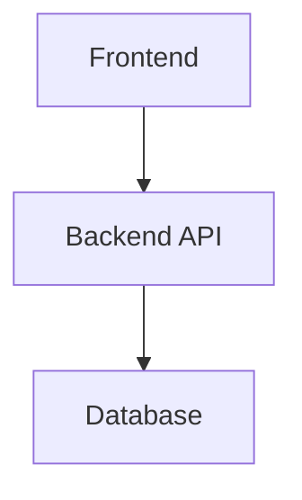

# Claude Code Configuration

This directory contains configuration and guidelines for Claude Code in this repository.

## Files

### commit-conventions.md
Defines the commit message standards that Claude Code must follow when creating commits.

**Key requirements:**
- Use Conventional Commits format (type(scope): description)
- All messages in English
- Include Claude Code attribution
- Use imperative mood in subject line

Claude Code will automatically reference these conventions when creating commits.

**Note:** These conventions only apply to commits created by Claude Code. Your manual commits are not affected and can follow your own style.

## Project Preferences

### Documentation Standards

**Diagrams:**
- **Always use Mermaid** for diagrams when possible (architecture, flows, sequences, ERDs, etc.)
- Mermaid diagrams are version-controllable, renderable in GitHub/IDEs, and easier to maintain
- Use appropriate Mermaid diagram types: `graph`, `flowchart`, `sequenceDiagram`, `classDiagram`, `erDiagram`, etc.
- Avoid ASCII art diagrams or external image files for technical diagrams

**Example:**
```markdown

```

## Settings Files

### settings.local.json (in subdirectories)
Project settings, committed to version control.

Example from `api/.claude/settings.json`:
```json
{
  "permissions": {
    "allow": [],
    "deny": ["Read(./api/.env.prod)"],
    "ask": []
  }
}
```

## References

- [Claude Code Documentation](https://code.claude.com/docs)
- [Conventional Commits](https://www.conventionalcommits.org/)
