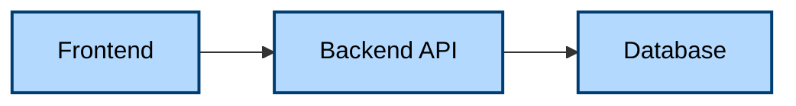

# Claude Code Configuration

This directory contains configuration and guidelines for Claude Code in this repository.

## Files

### commit-conventions.md
Defines the commit message standards that Claude Code must follow when creating commits.

**Key requirements:**
- Use Conventional Commits format (type(scope): description)
- All messages in English
- Include Claude Code attribution
- Use imperative mood in subject line

Claude Code will automatically reference these conventions when creating commits.

**Note:** These conventions only apply to commits created by Claude Code. Your manual commits are not affected and can follow your own style.

## Project Preferences

### Documentation Standards

**Diagrams:**
- **Always use Mermaid** for diagrams when possible (architecture, flows, sequences, ERDs, etc.)
- Mermaid diagrams are version-controllable, renderable in GitHub/IDEs, and easier to maintain
- Use appropriate Mermaid diagram types: `graph`, `flowchart`, `sequenceDiagram`, `classDiagram`, `erDiagram`, etc.
- Avoid ASCII art diagrams or external image files for technical diagrams

**Mermaid Diagram Quality Standards:**
- **High Contrast Colors**: Use light backgrounds with dark text and borders for readability
  - Example: `fill:#b3d9ff,stroke:#003d73,stroke-width:2px,color:#000`
  - Always set `color:#000` (black text) explicitly for maximum contrast
  - Use stroke-width of 2px for clear element separation
- **Readability & Layout**:
  - Use `flowchart LR` for left-to-right flows (more natural for reading)
  - Use `flowchart TB` for top-to-bottom hierarchies
  - For hexagonal architecture: nest subgraphs (Infrastructure → Application → Domain)
  - Include descriptive labels and clear relationship arrows
  - Add visual grouping with subgraphs for related components

**Example:**
```markdown

```

**Documentation Updates:**
- **Always update documentation in the same commit** as related code changes
- This includes:
  - README files when features change
  - API documentation when endpoints change
  - Architecture docs when design changes
  - BACKLOG.md when tasks are completed or requirements change
  - User guides when UI/functionality changes
  - Developer guides when development processes change
- Benefits:
  - Documentation stays in sync with code
  - Git history shows complete context of changes
  - No orphaned or outdated documentation
  - Easier code reviews with full context

**Documentation Consistency Checks:**
- **CRITICAL: After creating or updating documentation, ALWAYS check for cross-references that need updating**
- Common consistency checks required:
  - Remove "coming soon" labels from newly created documentation files
  - Update index/navigation pages (like `docs/en/README.md`) to link to new docs
  - Update related documentation that references the new content
  - Ensure all cross-references use correct file paths
  - Check that all examples and code snippets are up-to-date
- **How to check**: Use grep to search for references to the file you created/updated:
  ```bash
  grep -r "filename.md" docs/
  grep -r "coming soon" docs/
  ```
- This prevents broken links and outdated "coming soon" markers in the documentation

**BACKLOG.md Management:**
- **Remove completed tasks entirely** from BACKLOG.md (don't mark as completed, delete them)
- Renumber remaining tasks sequentially after removal
- This keeps the backlog focused on future work, not past accomplishments
- Completed work is tracked in git history and documentation itself

**CHANGELOG.md Maintenance:**
- **Always update CHANGELOG.md** in the same commit as related changes
- **CRITICAL: ALL new changes MUST go in the "Next Release" section**
  - **NEVER add entries to past release sections** (V1.x.x with dates) - those are final/immutable
  - Only add to "Next Release" at the top of the changelog
  - If "Next Release" section doesn't exist yet, create it
  - Past releases document what was already released, not work in progress
- **Release ordering:** "Next Release" first, then newest to oldest releases (V1.x.x)
- **Changes within a release:** Group by audience and scope, NOT by commit time
  - Audiences: Users, Administrators, Contributors
  - Scopes: Features, Bug Fixes, Technical Tasks, Documentation, Project Configuration, etc.
- **Format:**
  ```markdown
  ## Next Release

  ### [Audience]
  - **[Scope]:**
    - [Change description]
    - [Another change]

  ## V1.x.x (Month Day, Year)

  ### Users
  - **Features:**
    - [User-facing feature]
  - **Bug Fixes:**
    - [User-facing fix]

  ### Administrators
  - **Features:**
    - [Admin feature]

  ### Contributors
  - **Technical Tasks:**
    - [Technical change]
  - **Documentation:**
    - [Doc change]
  ```

**Markdown Tables:**
- **Always add proper indentation/spacing** to markdown tables for readability in raw markdown
- Align columns with spaces so tables are readable without rendering
- Example:
  ```markdown
  | Column 1     | Column 2                | Column 3        |
  |--------------|-------------------------|-----------------|
  | Short        | Longer content here     | Medium          |
  | Value        | Another value           | Third value     |
  ```

**Example commit:**
```
feat(api): add exclusion management endpoints

Add POST and GET routes for managing exclusions between participants.
Exclusions prevent specific users from drawing each other in the gift
exchange draw.

- Add CreateExclusionUtilisateurController
- Add ListExclusionUtilisateurController
- Update API reference documentation
- Update BACKLOG.md to mark task as completed
```

## Settings Files

### settings.local.json (in subdirectories)
Project settings, committed to version control.

Example from `api/.claude/settings.json`:
```json
{
  "permissions": {
    "allow": [],
    "deny": ["Read(./api/.env.prod)"],
    "ask": []
  }
}
```

## References

- [Claude Code Documentation](https://code.claude.com/docs)
- [Conventional Commits](https://www.conventionalcommits.org/)
