# UX Design Specification tkdo

**Author:** Mael
**Date:** 2026-01-23

---

## Executive Summary

### Project Vision

tkdo v2 transforms from an occasion-participation model to a **group-based sharing model**. Users maintain persistent wishlists, with key enhancements:

- **Groups replace occasion-based participation** as the sharing boundary
- **Per-idea visibility** lets users control which groups see which ideas
- **Comments** enable gift-giver coordination ("I'll get the blue one")
- **Invite links** let group admins onboard members (vs admin-created accounts)
- **"Being given" flag** (anonymous) prevents duplicate gifts

**The Privacy Promise:** Group A never knows Group B exists. Users can share context-appropriate ideas with each group independently.

### Target Users

| Persona | Context | Core Need |
|---------|---------|-----------|
| **Marie-Claire (67)** | Non-technical grandma, WhatsApp-only | "Don't make me repeat myself" - add ideas once, family coordinates |
| **Julien (34)** | Dev, family hero, instance operator | "Zero coordination messages" - deploy once, it just works |
| **Sophie (29)** | Cross-group power user with in-laws | "Be myself with each group" - context-dependent sharing |
| **Thomas (42)** | Remote uncle, occasional gift-giver | "Know what's already taken" - view list, mark "giving" |

**Technical comfort spectrum:** Marie-Claire (minimal) → Thomas (basic) → Sophie (comfortable) → Julien (developer)

### Key Design Challenges

1. **Group visibility without cognitive overload**
   - Sophie needs granular control; Marie-Claire must never see that complexity
   - Default must be "just works" with power features discoverable

2. **Mental model transition**
   - Current users expect occasions → participants → ideas
   - New model: my list → groups who can see it
   - Migration must feel natural, not jarring

3. **Admin UX gap**
   - Current admin is 100% CLI/curl commands
   - v2 needs a real admin UI (group management, invites, password resets)
   - Group admins (Sophie) need simpler subset of admin tools

4. **Mobile-first for the kitchen table**
   - Marie-Claire adds ideas from her phone while thinking of them
   - Touch-friendly, minimal input friction

5. **Comment threading without overwhelming**
   - Coordination needs discussion, but not a chat app
   - Per-group comment visibility adds complexity

### Design Opportunities

1. **"Smart defaults" with granular control**
   - New idea defaults to visible in current group context
   - Expand visibility by selecting specific additional groups (not just "all")
   - Power users can customize per-idea; simple users never need to

2. **Context switching clarity**
   - Clear visual indication of "viewing as Group X"
   - Cross-group hints ("3 more comments in Famille") with easy switch

3. **Progressive disclosure of admin**
   - Julien gets full admin panel
   - Sophie sees only "manage my group" tools
   - Marie-Claire never sees admin anything

4. **Invite flow as trust moment**
   - First impression of the app - must feel welcoming
   - Single-use links feel exclusive, not suspicious

## Core User Experience

### Defining Experience

The core tkdo experience is **list creation and consumption**. Users build detailed wishlists that others browse to find the perfect gift. The app succeeds when:
- List creators feel free to express exactly what they want
- Gift givers find clear, actionable ideas with easy coordination

**Core Loop:**
1. Occasion triggers list-filling (self + close relatives)
2. Draw reveals assignment
3. View assignee's list → ask questions → mark as giving

### Platform Strategy

- **Primary platform:** Mobile web (responsive SPA)
- **Primary context:** Quick adds from phone (kitchen, commute, inspiration strikes)
- **Secondary context:** Desktop for longer sessions (managing groups, browsing lists)
- **Offline:** Not MVP - requires connectivity
- **No native apps:** Web-first, PWA potential for future

### Effortless Interactions

| Interaction | Must Feel Like |
|-------------|----------------|
| Adding an idea | Texting a friend - type and done |
| Viewing a list | Scrolling Instagram - visual, scannable |
| Asking a question | Replying to a message |
| Marking "giving" | One tap, immediate feedback |
| Switching groups | Tab/swipe, instant context |

### Critical Success Moments

1. **First idea added:** User realizes "this is easier than my Notes app"
2. **First list viewed:** Giver thinks "I know exactly what to get"
3. **First comment answered:** Coordination happens without WhatsApp
4. **First "giving" marked:** No more duplicate gift anxiety

### Experience Principles

1. **List creation is sacred** - Zero friction to add ideas. Never make users fight the form.
2. **Structure serves, never constrains** - Optional fields, flexible format, rich when needed, minimal when not.
3. **Viewing is the payoff** - Beautiful, scannable lists that make gift-picking a pleasure.
4. **Questions before assumptions** - Comments let givers clarify before committing.
5. **One tap to commit** - "I'm giving this" must be instant and obvious.

## Desired Emotional Response

### Primary Emotional Goals

| Persona | Primary Emotion | Secondary Emotion |
|---------|-----------------|-------------------|
| Marie-Claire | **Confident** - "I can do this" | Relieved - "No more WhatsApp chaos" |
| Thomas | **Generous** - "I'm giving a thoughtful gift" | Confident - "Nobody else is buying this" |
| Sophie | **In control** - "My boundaries, my rules" | Connected - "Both families, one tool" |
| Julien | **Connected** - "Family spirit building" | Relieved - "It just works" |

**The Emotional North Star:** tkdo is a family space where Christmas spirit starts to build - where you reconnect with distant relatives through playful ideas and comments.

### Emotional Journey

| Stage | Emotion | Design Response |
|-------|---------|-----------------|
| First invite | Welcomed | Warm, personal, no friction |
| Creating list | Creative, free | No required fields, rich expression |
| Viewing lists | Generous, inspired | Beautiful, scannable, actionable |
| Marking "giving" | Confident, decisive | One tap, instant feedback |
| Reading comments | Connected, amused | Conversational, personality shines |
| Errors | Supported | Clear recovery, no blame |
| Returning | Nostalgic, familiar | Persistence, history, "welcome back" |

### Emotions to Prevent

- **Confusion** → Always-visible group context
- **Anxiety** → Real-time "being given" status
- **Embarrassment** → Visibility confirmation, clear labels
- **Frustration** → Minimal structure, optional fields

### Emotional Design Principles

1. **Confidence over complexity** - Every interaction confirms the user is doing it right
2. **Generosity is the reward** - The payoff is feeling like a thoughtful giver
3. **Family warmth, not sterile efficiency** - Personality shines through ideas and comments
4. **Trust through transparency** - Visibility is always obvious
5. **Zero embarrassment tolerance** - When in doubt, restrict visibility

### Future Emotional Enhancers (Post-MVP)

- **Occasion comments** - Chat about the upcoming gathering, not just coordinate gifts. Builds anticipation and reconnects distant relatives.

## UX Pattern Analysis & Inspiration

### Inspiring Products Analysis

**Signal/WhatsApp** - The gold standard for non-tech users
- Messaging-like simplicity that works for Marie-Claire
- Instant, familiar interactions
- *Adopt:* Conversation-style comments, quick-add feels like texting
- *Note:* WhatsApp's QR-code joining is nice but privacy comes first

**Trello** - Visual organization done right
- Quick visual access to important data
- Good "simple to use vs allows complexity" ratio
- *Adopt:* List view as scannable Kanban-style cards
- *Adapt:* Simpler than Trello - may be too tech for Sophie

**Google Apps** - Trust through competence
- Best "free" alternative feel
- Right mix of UX and security (commercial motivation, but still trust-building)
- *Adopt:* Professional, reliable, no-nonsense feel

**Signal Polls** - Interaction clarity
- Simple, obvious, one-tap interaction
- *Adopt:* "Mark as giving" should be this clear

### Transferable UX Patterns

**Navigation & Information:**
- Kanban-style visual scanning (Trello) → List cards with key info visible
- Messaging conversation flow (Signal) → Comment threads as natural chat

**Interaction Patterns:**
- Texting simplicity → Adding ideas as frictionless as sending a message
- Poll clarity → One-tap "giving" commitment
- Invite links → Thomas gets immediate access, no account setup burden

**Notification Strategy:**
- Email as central hub → Complete, timely notifications
- Never require daily visits → App works around user's life, not vice versa

### Anti-Patterns to Avoid

| Pattern | Why Toxic | tkdo Stance |
|---------|-----------|-------------|
| **E-commerce driver** | App serves the store | Zero commerce integration |
| **Social broadcasting** | Lists as identity performance | Family-only, never public |
| **Public by default** | Privacy erosion | Private by default, explicit opt-in |
| **Daily visit required** | Punishes casual users | Email-first notifications |
| **Account creation wall** | Thomas friction | Invite links, minimal onboarding |
| **Patronizing guidance** | "Feeling dumb" | Guided but respectful |
| **Storage bloat** | Device resource abuse | Lean data footprint |

### Design Inspiration Strategy

**Adopt Directly:**
- Messaging-style input for ideas and comments
- Email notifications as primary communication channel
- Invite links for frictionless onboarding
- Visual, scannable list presentation

**Adapt for tkdo:**
- Trello's visual organization → simplified for non-tech users
- Google's trust-through-competence → professional without being corporate

**Firmly Reject:**
- Any commerce integration or "buy here" prompts
- Social features that broadcast beyond family groups
- Patterns that require daily app engagement
- Account creation burden for occasional users

**The tkdo Philosophy:**
> A well-designed app is something you can use without reading a manual, efficiently and without frustration, without feeling that either the designer or yourself is dumb. Guided when needed, but not as a 5-year-old would be.

## Design System Foundation

### Design System Choice

**Bootstrap 5 + Custom Theme Layer** (evolutionary approach)

Keep the existing Bootstrap foundation for MVP stability, with a targeted theme layer to give tkdo warmth and personality.

### Rationale for Selection

| Factor | Decision Driver |
|--------|-----------------|
| **Existing foundation** | Bootstrap 5 + ng-bootstrap already in place - no migration risk |
| **Team capacity** | Solo dev, limited design bandwidth - leverage proven system |
| **MVP timeline** | Theme layer is incremental, not a rewrite |
| **Future flexibility** | CSS custom properties make future redesign easier |
| **Emotional goals** | Theme layer can deliver warmth without full custom system |

### Visual Identity Direction

**Primary Vibe: Warm & Cozy**
- Soft, inviting, like a living room at Christmas
- Warm neutrals, muted seasonal colors (not garish red/green)
- Cream/off-white backgrounds, gentle shadows
- Grandma-approved comfort

**Secondary Touch: Playful**
- Subtle whimsy in micro-interactions
- Friendly, not corporate
- Personality in copy and small details
- Family fun, not sterile efficiency

**Palette Direction (to be refined):**
- Warm off-white/cream base
- Muted warm accent (terracotta? dusty rose? warm gold?)
- Soft secondary for contrast (sage green? slate blue?)
- Avoiding: harsh primaries, cold grays, Bootstrap default blue

### Implementation Approach

**MVP Phase:**
1. Create CSS custom properties layer overriding Bootstrap defaults
2. Fix critical issues (mobile font sizes, touch targets)
3. Warm up color palette (replace default blue)
4. Improve card/list styling for idea presentation
5. Ensure consistent spacing and typography scale

**Post-MVP / Future Vision:**
- More distinctive component designs
- Custom illustrations or icons
- Animation/micro-interaction polish
- Potential full design system migration aligned with Vue/Symfony transition

### Customization Strategy

**What to Customize Now:**
- Color variables (primary, secondary, backgrounds)
- Typography scale (especially mobile)
- Card components (idea cards are core UX)
- Button styles (warmer, more inviting)
- Form inputs (friendly, not clinical)

**What to Defer:**
- Custom iconography
- Complex animations
- Full component redesign
- Dark mode (if ever)

### Technical Implementation (Party Mode Insights)

**Current State Assessment:**
- Very clean starting point - almost pure Bootstrap, minimal custom CSS
- 11 component SCSS files, all minimal
- No existing tech debt to untangle

**Issues to Address:**
- No design tokens (hardcoded values like `grey`, `white`, `5px`)
- Component imports Bootstrap partials directly (should centralize)
- Missing typography scale definition
- No CSS custom properties layer

**Recommended File Structure:**
```
front/src/
├── styles/
│   ├── _variables.scss      // Bootstrap overrides + tkdo tokens
│   ├── _components.scss     // Global component tweaks (cards, buttons)
│   └── _utilities.scss      // Custom utilities if needed
├── styles.scss              // Imports: variables → Bootstrap → components
```

**Token Architecture:**
```scss
// _variables.scss - dual token approach
$tkdo-primary: #B87333;       // SCSS variable for Bootstrap compilation
$primary: $tkdo-primary;       // Bootstrap override

:root {
  --tkdo-primary: #{$tkdo-primary};  // CSS custom property for runtime
}
```

**MVP Implementation Priority:**
1. Create `styles/_variables.scss` with color + typography tokens
2. Define mobile-friendly typography scale (fix font size issue)
3. Warm up color palette (replace Bootstrap blue)
4. Add card styling tokens (shadows, radius, backgrounds)
5. Refactor `liste-idees.component.scss` to use centralized variables

**Estimated Effort:** ~Half day for initial setup

## Defining Experience

### The Core Interaction

**tkdo's defining experience:** "Keep my wishlist where family can find exactly what to get me"

This is a two-sided experience:
- **For list creators:** Add ideas as easily as texting, with all the detail you want
- **For gift givers:** See exactly what they want, pick confidently

The list creation is foundational; the viewing experience is the payoff.

### User Mental Model

**Current (v1):** "I go to tkdo when Christmas is coming to see who I'm giving to"
- Event-triggered, occasional usage
- Gift-finding focused

**Target (v2):** "tkdo is where my wishlist lives"
- Continuous, year-round list maintenance
- Add ideas whenever inspiration strikes
- Family checks it when they need gift ideas

**The Shift:** From "Christmas coordination tool" → "My persistent wishlist that family can access"

### Unified Group-Scoped Model (PRD Refinement)

**Key insight:** Everything should be group-scoped for UX consistency.

**The Model:**

| View | What It Shows | Default Visibility for New Ideas |
|------|---------------|----------------------------------|
| **My List** | ALL my ideas (drafts + shared) | None (draft) |
| **Group View** | Ideas visible to that group | That group |

**Why this is better:**
- One mental model: "I'm always in a group context"
- One default pattern: new idea visible to current context
- WYSIWYG privacy: see exactly what each group sees
- Same UX for: creating ideas for self, creating for others, commenting

**Draft Ideas:**
- Ideas with visibility = none (empty set)
- Only visible in "My List" (personal inventory)
- Captured but not shared yet
- "Remove from group" gracefully returns idea to draft state

**Navigation:**
- First login: "My List" (or invited group context)
- Return visits: Most recently active group
- "My List" always one tap away

**Cross-group indicators:**
- "3 more ideas visible in other groups" with quick switch
- Same pattern on all list views (mine and others')

### Success Criteria

**List Creation Success:**

| Criteria | Target |
|----------|--------|
| Time to add simple idea | < 10 seconds |
| Required fields | Zero (description only) |
| Feel | Like texting a friend |
| Detail capacity | Unlimited when wanted |
| Friction points | None |

**List Viewing Success:**

| Criteria | Target |
|----------|--------|
| Time to find right gift | < 30 seconds scanning |
| Confidence level | "I know exactly what to get" |
| Duplicate anxiety | Zero - clear "being given" status |
| Clarification path | Comments visible, easy to ask |

### Experience Mechanics

**Adding an Idea (from My List):**
1. **Initiate:** Tap "+" - always visible
2. **Input:** Single expanding text field
3. **Enrich (optional):** Link, notes, image
4. **Visibility:** Default = draft (none)
5. **Complete:** Tap "Add" → appears in My List

**Adding an Idea (from Group View):**
1. **Initiate:** Tap "+" - context is clear
2. **Input:** Same single expanding field
3. **Enrich (optional):** Same options
4. **Visibility:** Default = this group (can expand)
5. **Complete:** Tap "Add" → appears in group view

**Sharing a Draft:**
1. **View:** Open idea in My List
2. **Share:** Tap "Share to groups"
3. **Select:** Choose one or more groups
4. **Confirm:** Idea now visible to selected groups

**Removing from Group:**
1. **View:** Open idea in group context
2. **Remove:** Tap "Remove from [Group]"
3. **Result:** Idea removed from this group's visibility
4. **Safety:** If last group, becomes draft (not deleted)

**Viewing Someone's List:**
1. **Navigate:** Tap member → their list (group-scoped)
2. **Scan:** Cards with title, image, "being given" badge
3. **Indicator:** "X more ideas in other groups" if applicable
4. **Detail:** Tap for full description, comments
5. **Commit:** One tap "I'm giving this"

### Novel vs. Established Patterns

**Established Patterns (adopt):**
- Card-based list view (Trello-like scanning)
- Messaging-style input (WhatsApp simplicity)
- One-tap actions (Signal poll clarity)

**Novel Patterns (tkdo-specific):**
- Unified group-scoped model (same UX everywhere)
- Draft ideas with explicit sharing
- Per-idea group visibility controls
- Cross-group hints with quick switch
- Anonymous "being given" flag

**Teaching Strategy:**
- Smart defaults mean most users never see complexity
- Progressive disclosure for power users
- Visibility always shown, never hidden

### API Design Principles

- One path per resource, querystring for filtering
- No `/me` aliases - use explicit user IDs
- French naming convention (utilisateur, idees, groupe, membres)

**Example patterns:**
```
GET /api/utilisateurs/{id}/idees                   → All ideas (My List)
GET /api/utilisateurs/{id}/idees?groupe={groupeId} → Ideas for group
```

## Visual Design Foundation

### Color System

**Primary Palette: Warm Terracotta**

| Role | Color | Hex | Usage |
|------|-------|-----|-------|
| **Base** | Warm cream | `#FDF8F3` | Page backgrounds |
| **Surface** | White | `#FFFFFF` | Cards, modals |
| **Primary** | Terracotta | `#C67B5C` | Actions, links, navigation |
| **Secondary** | Sage green | `#8FAE8B` | Success states, "giving" badge |
| **Text** | Warm charcoal | `#3D3531` | Body text, headings |
| **Muted** | Warm gray | `#9A918A` | Secondary text, placeholders |
| **Border** | Soft tan | `#E8E4E1` | Dividers, card borders |

**Semantic Colors:**

| State | Color | Hex | Usage |
|-------|-------|-----|-------|
| Success | Sage green | `#8FAE8B` | "Being given", confirmations |
| Warning | Warm amber | `#D4A84B` | Alerts, attention needed |
| Error | Muted coral | `#C97B7B` | Errors, destructive actions |
| Info | Slate blue | `#7A8FA8` | Informational, neutral badges |
| Draft | Light taupe | `#E8E4E1` | Draft/unpublished ideas |

**Accessibility:**
- Text on cream background: 7.2:1 contrast ratio (AAA)
- Primary on white: 4.6:1 contrast ratio (AA)
- All interactive elements meet WCAG 2.1 AA minimum

### Typography System

**Primary Font: Friendly Sans-Serif**

Recommended: **Nunito** (Google Fonts, free)
- Rounded terminals create warmth
- Excellent readability at all sizes
- Wide character set (French accents supported)

Fallback: `'Nunito', 'Quicksand', -apple-system, BlinkMacSystemFont, sans-serif`

**Type Scale:**

| Element | Size (Mobile) | Size (Desktop) | Weight | Line Height |
|---------|---------------|----------------|--------|-------------|
| H1 | 1.75rem | 2rem | 700 | 1.2 |
| H2 | 1.5rem | 1.75rem | 700 | 1.25 |
| H3 | 1.25rem | 1.5rem | 600 | 1.3 |
| Body | 1rem | 1rem | 400 | 1.5 |
| Body Large | 1.125rem | 1.125rem | 400 | 1.5 |
| Small | 0.875rem | 0.875rem | 400 | 1.4 |
| Caption | 0.75rem | 0.75rem | 400 | 1.4 |

**Typography Principles:**
- Mobile font sizes are generous (fixes current issue)
- Headings are bold but not shouty
- Body text prioritizes readability over density
- French accents render correctly (é, è, ê, ë, etc.)

### Spacing & Layout Foundation

**Spacing System: Airy**

Base unit: 8px

| Token | Value | Usage |
|-------|-------|-------|
| `--space-xs` | 4px | Tight inline spacing |
| `--space-sm` | 8px | Icon gaps, badge padding |
| `--space-md` | 16px | Card padding, form gaps |
| `--space-lg` | 24px | Section spacing |
| `--space-xl` | 32px | Page margins, major sections |
| `--space-2xl` | 48px | Hero spacing |

**Layout Principles:**
- Cards have generous padding (16-20px)
- List items have breathing room between them
- Touch targets minimum 44px (iOS guideline)
- Content doesn't feel cramped on mobile

**Border Radius:**

| Element | Radius |
|---------|--------|
| Buttons | 8px |
| Cards | 10-12px |
| Badges | 4px |
| Input fields | 6px |
| Modals | 12px |

**Shadows:**
```css
--shadow-sm: 0 1px 3px rgba(61, 53, 49, 0.08);
--shadow-md: 0 2px 6px rgba(61, 53, 49, 0.1);
--shadow-lg: 0 4px 12px rgba(61, 53, 49, 0.12);
```
Shadows use warm charcoal base, not cold black.

### Accessibility Considerations

**Color Accessibility:**
- All text meets WCAG 2.1 AA contrast requirements
- Interactive elements have visible focus states
- Color is never the only indicator (icons + color for status)

**Touch Accessibility:**
- Minimum tap target: 44x44px
- Adequate spacing between interactive elements
- Buttons have clear active/pressed states

**Readability:**
- Mobile font sizes generous by default
- Line length constrained for readability (max ~70 characters)
- Sufficient line height (1.5 for body text)

**Inclusive Design:**
- Works without color (screen readers, color blindness)
- Clear visual hierarchy
- Consistent interaction patterns

## Design Direction Decisions

### Navigation Pattern: Header Dropdown

**Choice:** Compact header with dropdown navigation

**Why This Works for tkdo:**
- Maximizes vertical content space for idea lists
- Single tap to any destination via dropdown menu
- Current group always visible in header
- Clean, uncluttered interface
- Works equally well on mobile and desktop

**Implementation Details:**
- Fixed header with: Logo | Current Group (dropdown) | User Menu
- Dropdown contains: My List, Group list, Settings
- Current group prominently displayed
- Quick switch between groups without page reload

### Occasions Integration: Within Groups

**Key Refinement (PRD Update):** Occasions are NOT a separate navigation destination. They live within group pages.

**The Model:**
- Each group page shows its first upcoming occasion as a section/banner
- "See more occasions" link reveals occasion history and future events
- "Create occasion" link always visible for group admins (even when occasion exists)
- Occasions are soft UI limit (display first only), not hard data constraint

**Why This Simplifies UX:**
- Groups are the primary mental model
- Occasions are context within groups, not parallel hierarchy
- Reduces navigation complexity
- Makes the relationship clear: "Groups have occasions"
- No separate "Occasions" tab needed

**Occasion Section on Group Page:**
```
┌─────────────────────────────────────────┐
│ 🎄 Noël 2025 · Draw: Dec 1              │
│ 12 participants · You're giving to: Mom │
│ [View assignments] [+ Create occasion]  │
│              [See history ↓]            │
└─────────────────────────────────────────┘
```

### Idea Cards: Expandable with Thumbnails

**Choice:** Compact cards that expand on tap, with icon-sized thumbnails

**Compact State (Default):**
- Title (truncated if needed)
- Icon-sized image thumbnail (when image exists)
- "Being given" badge (if applicable)

**Expanded State (On Tap):**
- Full title
- Full image (if exists)
- Complete description
- Link (if set)
- Comments section
- "I'm giving this" button
- Visibility indicator (creator's view only)

**Why Expandable Works:**
- Maximizes scanning efficiency (see many ideas at once)
- Full detail on demand
- Thumbnail gives visual cue without taking space
- Comments hidden until needed (reduces noise)
- Mobile-optimized touch interaction

**Card Layout (Compact):**
```
┌─────────────────────────────────────────┐
│ [📷] Blue wool scarf                 💚 │
└─────────────────────────────────────────┘
```

**Card Layout (Expanded):**
```
┌─────────────────────────────────────────┐
│ ┌─────────────┐ Blue wool scarf         │
│ │             │                         │
│ │   [image]   │ 💚 Being given          │
│ │             │                         │
│ └─────────────┘                         │
│                                         │
│ The one from Uniqlo, preferably in navy │
│ blue or forest green. Size M.           │
│                                         │
│ 🔗 uniqlo.com/scarf-123                 │
│                                         │
│ ─────────────────────────────────────── │
│ 💬 2 comments                           │
│   Sophie: "Is navy blue ok?"            │
│   You: "Yes perfect!"                   │
│ ─────────────────────────────────────── │
│                                         │
│ [I'm giving this]                       │
└─────────────────────────────────────────┘
```

### Add Flow: FAB (Floating Action Button)

**Choice:** Always-visible FAB for adding ideas

**Why FAB:**
- Always accessible, regardless of scroll position
- Clear, discoverable action
- Mobile-native pattern (familiar)
- One tap to start adding

**Context-Aware Behavior:**
- In "My List": New idea defaults to draft (visibility = none)
- In Group View: New idea defaults to visible in current group
- FAB always shows "+" with warm terracotta styling

**Styling:**
- Warm terracotta background (#C67B5C)
- White "+" icon
- Subtle shadow for depth
- Bottom-right positioning (thumb-friendly)
- Slightly rounded (not perfect circle) to match card aesthetic

**FAB Placement:**
```
┌─────────────────────────────────────────┐
│                                         │
│  [Idea cards...]                        │
│                                         │
│                                         │
│                                    [+]  │
└─────────────────────────────────────────┘
```

### Design Direction Summary

| Element | Decision | Key Rationale |
|---------|----------|---------------|
| **Navigation** | Header Dropdown | Maximum content space |
| **Occasions** | Integrated in groups | Simpler mental model |
| **Idea Cards** | Expandable + thumbnails | Scan efficiently, detail on demand |
| **Add Flow** | FAB button | Always accessible, context-aware |

These decisions prioritize:
1. **Content over chrome** - Maximize space for ideas
2. **Progressive disclosure** - Simple by default, detail when needed
3. **Context clarity** - Always know which group you're viewing
4. **Mobile-first** - Touch-friendly, thumb-reachable actions

## User Journey Flows

### Adding an Idea Flow

**Entry Points:** FAB button from any list view, empty list prompt, welcome screen "Add first idea" button

**Flow Summary:**
1. Tap FAB → Add sheet opens
2. Type title/description (title required)
3. Optionally add link, image
4. Visibility defaults to context (draft in My List, current group in Group View)
5. Optionally expand to more groups
6. Confirm → Idea appears in list

```mermaid
flowchart TD
    A[User views list] --> B{Which context?}
    B -->|My List| C[Tap FAB +]
    B -->|Group View| D[Tap FAB +]

    C --> E[Add Idea Sheet Opens]
    D --> E

    E --> F[Type title/description]
    F --> G{Add details?}

    G -->|Yes| H[Add link, image]
    G -->|No| I{Set visibility?}
    H --> I

    I -->|From My List| J[Default: Draft]
    I -->|From Group| K[Default: Current Group]

    J --> L{Share now?}
    L -->|Yes| M[Select groups]
    L -->|No| N[Save as draft]

    K --> O{Expand visibility?}
    O -->|Yes| M
    O -->|No| P[Save to group]

    M --> Q[Confirm visibility]
    Q --> R[Save idea]
    N --> R
    P --> R

    R --> S[Idea appears in list]
    S --> T[Toast: Idea added ✓]
```



**Key Decisions:**
- Progressive disclosure: Title only required, everything else optional
- Smart defaults: Context determines visibility default
- Visibility confirmation: Always show where idea will appear before saving
- Reliability: Never lose user input - optimistic UI + automatic retry on network failure

### Viewing & Marking "Giving" Flow

**Entry Points:** Group member list → Tap person, direct link to someone's list

**Flow Summary:**
1. Navigate to group → See members
2. Tap member → View their list (group-scoped)
3. Scan compact cards
4. Tap to expand interesting ideas (hint on first card for new users)
5. See full details + comments
6. Tap "I'm giving this" → Confirm
7. Badge updates, success toast


**Key Decisions:**
- Compact → Expanded two-tier cards optimize scanning
- "Tap for details" hint on first card for new users (progressive disclosure of the disclosure)
- Confirmation modal before commitment - copy should feel like a promise ("Je l'offre")
- Comments visible in expanded view with group visibility selection

### Cross-Group Visibility Flow (Sophie's Journey)

**Entry Points:** Creating/editing idea visibility, sharing draft to groups

**Flow Summary:**
1. Open idea in My List or group view
2. Tap "Share to groups" or visibility indicator
3. See eligible groups (where both author and beneficiary are members)
4. Select/deselect specific groups
5. Preview visibility before confirming
6. Confirm → Visibility updated


**Key Decisions:**
- Granular group selection (not "all or nothing")
- Safety: removing last group returns to draft, doesn't delete
- Clear preview of affected groups before confirming
- API returns `eligible_groups` per idea (server-side computation)

### Onboarding via Invite Flow

**Entry Points:** Click invite link from WhatsApp/email

**Flow Summary:**
1. Click invite link → tkdo opens with context
2. New user: Create account (email + password)
3. Existing user: Log in with credentials
4. Auto-join group from invite
5. Welcome screen with group info + member preview
6. **New users:** "Add your first idea" button + explore group
7. **Existing users with ideas:** Prompted to share existing ideas with new group
8. Multi-select ideas to share (pre-selected with context: "shared with Famille")
9. Confirm or skip → Explore group


**Key Decisions:**
- Separate welcome screen for progressive disclosure (one thing at a time for Marie-Claire)
- Welcome screen builds trust: see who's in the group before decisions
- New users: prominent "Add your first idea" button alongside group preview
- Existing users: share ideas prompt with context ("✓ Blue wool scarf *(shared with Famille)*")
- Pre-selected suggestions based on ideas already shared with other groups
- Skip option with reminder that sharing is possible anytime from My List
- Screen skipped if user has no shareable ideas
- Bulk share operation must be atomic (all or nothing)

### Journey Patterns

**Navigation Patterns:**

| Pattern | Usage |
|---------|-------|
| Header dropdown | Primary navigation between groups and My List |
| Tap to expand | Detail on demand for cards |
| Sheet/modal | Forms, confirmations, multi-step actions |
| Browser back | Supported throughout |

**Decision Patterns:**

| Pattern | Usage |
|---------|-------|
| Smart defaults | Context-appropriate visibility |
| Explicit confirmation | Destructive or commitment actions |
| Preview before commit | Visibility changes show affected groups |
| Granular selection | Multi-select for groups, not binary choices |

**Feedback Patterns:**

| Pattern | Usage |
|---------|-------|
| Toast notifications | Success confirmations, quick feedback |
| Badge updates | Real-time status changes on cards |
| Empty states | Encouraging prompts when lists are empty |
| Error messages | Clear, actionable, non-blaming |
| "Tap for details" hint | First-time discoverability for expandable cards |

### Flow Optimization Principles

1. **Minimize steps to value**
   - Add idea: 2 taps minimum (FAB → Save)
   - Mark giving: 2 taps (Tap card → Confirm)
   - Switch groups: 2 taps (Header dropdown → Select)

2. **Reduce cognitive load**
   - Smart defaults eliminate decisions for simple cases
   - Power features hidden until needed
   - One primary action per screen

3. **Clear progress indicators**
   - Toast confirms actions completed
   - Badges show current state
   - Visibility preview before save

4. **Moments of delight**
   - Welcome message on first join
   - "Add your first idea" encouragement
   - Success celebration on first idea

5. **Graceful error recovery**
   - Draft safety net (never lose ideas)
   - Optimistic UI + automatic retry on network failure
   - "Not synced" state with manual retry if needed
   - Clear explanation of what went wrong

## Component Strategy

### Design System Components (Bootstrap 5)

| Component | Usage | Customization |
|-----------|-------|---------------|
| Cards | Idea cards base | Heavy - expandable states |
| Buttons | Actions, FAB | Medium - warm styling |
| Forms | Add idea, auth | Light - input styling |
| Modals | Confirmations | Medium - bottom sheet |
| Dropdowns | Navigation, selectors | Light - multi-select |
| Badges | Status indicators | Light - semantic colors |
| Toasts | Feedback | Light - warm styling |
| List groups | Member lists | Light - avatar integration |
| Navbar | Header | Medium - dropdown pattern |

### Custom Components

#### Idea Card (Expandable)

**Purpose:** Compact scanning + full details on demand

**States:**
- **Compact:** Title + thumbnail + "being given" badge
- **Expanded:** Full image + description + link + comments + actions
- **Being given:** Sage green badge
- **Brouillon (Draft):** Muted styling, never shared with any group
- **Archivé:** Was shared with now-archived group(s), shows originating group name

**Status computation (server-side):**
- API returns computed `status: "active" | "draft" | "archived"` field
- Mixed visibility (active + archived groups) → status is "active"
- Frontend renders what it's told, no client-side computation

**Compact anatomy:**
```
[📷] Blue wool scarf                  💚
     Noël 2026, Famille                   ← Visibility (in My List view)
```

**Note:** No price display — gifts can be handmade, this is not a commercial app.

**Accessibility:** Keyboard expand/collapse, ARIA expanded state

**Discoverability:** "Tap for details" hint on first card for new users (localStorage flag `hasExpandedCard`, once per user not per card)

**Animation:** Two-phase expand — height transition (200-300ms) + lazy image fade-in with skeleton loader to avoid layout shift

#### FAB (Floating Action Button)

**Purpose:** Always-accessible "add idea" action

**Position:** Bottom-right, 16px from edges, safe area aware
```css
.fab {
  position: fixed;
  bottom: calc(16px + env(safe-area-inset-bottom));
  right: 16px;
}
```

**Styling:** Terracotta background (#C67B5C), white "+" icon

**Accessibility:** `aria-label="Ajouter une idée"`

#### Header Navigation with Group Selector

**Purpose:** Navigate between My List and groups

**Anatomy:**
```
tkdo    [Noël 2026 ▼]           [👤 ▼]
              ↓ (expanded)
┌─────────────────────────────────────────┐
│ ★ Ma liste                              │
│─────────────────────────────────────────│
│   Noël 2026                        ✓    │
│   Famille                               │
│   Les copains                           │
└─────────────────────────────────────────┘
```

**My List view:** Shows ALL user's ideas with visibility indicators, including drafts and archived ideas.

#### Welcome Screen

**Purpose:** Orientation + trust-building for new group members

**Variants:**
- **New user:** "Ajouter ma première idée" button + group preview
- **Existing user with ideas:** "Partager mes idées" button (opens Share Ideas Prompt)

Both include "Découvrir le groupe" to skip and go directly to group view.

#### Share Ideas Prompt (Bottom Sheet)

**Purpose:** Let existing users share ideas with new group

**Trigger:** "Partager mes idées" button on Welcome Screen

**Features:**
- Multi-select existing ideas
- Pre-checked: Ideas already shared with other groups (not archived)
- **Archived ideas:** Show unchecked with "(archivé - Noël 2024)" label — user consciously revives
- Context labels: "(partagé avec Famille)" or "(brouillon)" or "(archivé - Noël 2024)"
- Skip option with reminder toast
- Network failure: Retry option, preserve user's selections
- Bulk share operation must be atomic (all or nothing)

#### Group Selector (Multi-Select)

**Purpose:** Select visibility groups for ideas/comments

**Features:**
- Checkboxes for eligible groups (server-computed intersection)
- Live preview of selection
- Only groups where both author and beneficiary are members

#### Member Card

**Purpose:** Display group member with activity indicator

**Anatomy:**
```
👤  Marie-Claire
    8 idées · Activité récente: 2j      ← Has recent activity

👤  Grand-père
    3 idées                              ← No recent activity, just count
```

**"Activité récente"** includes both idea changes and comments. Omit indicator when no recent activity (avoid calling out inactive members).

**States:**
- Default: Name + idea count + activity (if recent)
- Self: "Ma liste" label
- No ideas: "Pas encore d'idées"

#### Occasion Section (Display Only — MVP)

**Purpose:** Show occasion info within group page

**Anatomy (with draw):**
```
🎄 Noël 2025
Tirage effectué · 12 participants
Tu offres à: Maman

                       [Historique ↓]
```

**MVP scope:**
- Display occasion info and draw assignment
- View past occasions (historique)

**Deferred (post-MVP):**
- "Créer une occasion" UI (curl for MVP)
- "Gérer le tirage" UI — complex operations: remove member, add member, reassign with batch apply + notifications (curl for MVP)

### Component Implementation Strategy

**Approach:**
- Extend Bootstrap base classes
- Use centralized design tokens
- Angular components (encapsulated, reusable)
- Mobile-first design

**Angular Component Pattern:**
```typescript
@Component({
  selector: 'app-idea-card',
  templateUrl: './idea-card.component.html'
})
export class IdeaCardComponent {
  @Input() idea: Idea;
  @Input() viewContext: 'my-list' | 'group';
  @Input() isFirstCard: boolean = false;  // for "tap to expand" hint

  expanded = false;

  get showVisibilityIndicator(): boolean {
    return this.viewContext === 'my-list';
  }
}
```

### Implementation Roadmap

**Phase 1 - Core (MVP):**
- Idea Card (Expandable) — core viewing
- FAB — core creation
- Header Navigation with Group Selector — navigation
- Member Card — group navigation
- Group Selector (Multi-Select) — visibility controls

**Phase 2 - Onboarding:**
- Welcome Screen — first impression
- Share Ideas Prompt — returning user activation

**Phase 3 - Enhancement:**
- Occasion Section (display only) — group context
- Comment thread styling — polish

**Phase 4 - Admin (Post-MVP):**
- Occasion creation UI
- Draw management UI (remove/add/reassign with batch + notifications)

## UX Consistency Patterns

Visual reference: `_bmad-output/planning-artifacts/tkdo-ux-patterns.html`

### Button Hierarchy

| Level | Style | Usage |
|-------|-------|-------|
| **Primary** | Terracotta fill (#C67B5C), white text | Main action: "Ajouter", "Partager", "Je l'offre" |
| **Secondary** | White fill, terracotta border + text | Alternative: "Plus tard", "Annuler" |
| **Destructive** | Muted coral fill (#C97B7B), white text | Delete, remove actions |

**Placement:** Primary right, secondary left. Full-width on mobile. Min height 44px.

**States:** Default, hover, pressed, disabled, loading (spinner replaces or follows text)

### Feedback Patterns

**Toast Notifications:**

| Type | Color | Position | Duration |
|------|-------|----------|----------|
| Success | Sage green (#8FAE8B) | Top | 3s auto-dismiss |
| Error | Muted coral (#C97B7B) | Bottom (near keyboard) | Manual dismiss |
| Warning | Warm amber (#D4A84B) | Top | 5s |
| Info | Slate blue (#7A8FA8) | Top | 4s |

**Toast behavior:**
- Stack max 3 visible
- Swipe to dismiss on mobile
- Include action button when relevant ("Réessayer")
- Dismiss on navigation (context is gone)

**Sync State Progression (5 stages):**

| Stage | Display | User sees |
|-------|---------|-----------|
| 1. Saving | Spinner on button | Normal feedback |
| 2. Saved | Brief "✓ Enregistré" toast | Confirmation |
| 3. Retrying | Subtle pulsing dot | Minimal (no panic) |
| 4. Failed 3x | "⟳ Non synchronisé" badge + retry button | Action available |
| 5. Failed 5x | "Connexion perdue" banner | Explanation + help |

Retry strategy: exponential backoff (1s, 2s, 4s, 8s, max 30s)

**Status Badges:**

| Badge | Color | Usage |
|-------|-------|-------|
| "💚 Quelqu'un offre" | Sage green | Idea being given |
| "Brouillon" | Light taupe | Draft idea |
| "Archivé (Noël 2024)" | Slate blue | Archived idea with source |

### Form Patterns

**Input styling:**
- Default: Soft tan border (#E8E4E1)
- Focus: Terracotta border + subtle shadow
- Error: Coral border + message below
- Disabled: Muted background, reduced opacity

**Validation behavior:**
- Validate on blur (not keystroke)
- Clear error when user starts typing
- Handle browser autofill gracefully
- On submit with errors: focus first error field
- Submit button disabled until valid

**Layout:**
- Labels above inputs (not floating — clearer for Marie-Claire)
- Non-required fields marked "(optionnel)"
- Single column on mobile
- Full-width submit button on mobile

### Modal/Overlay Patterns

| Pattern | Usage |
|---------|-------|
| **Bottom sheet** | Forms, multi-select, content-heavy actions |
| **Center modal** | Confirmations, simple decisions |
| **Full-screen** | Complex flows (signup, onboarding) |

**Bottom sheet behavior:**
- Drag handle at top
- Swipe down to dismiss
- Max height 90% viewport

**Confirmation rules:**
- Destructive actions always require confirmation
- Commitment actions ("Je l'offre") require confirmation
- Unsaved changes warn on dismiss

### Empty States

**Design principles:**
- Centered vertically
- Warm, friendly illustration
- Clear message + action when applicable
- Never guilt-trip users

**Examples:**

| Context | Message | Action |
|---------|---------|--------|
| My List (new) | "Ta liste est vide" | "Ajouter ta première idée" |
| My List (archived only) | "Tes idées sont archivées" | "Partager avec un groupe" |
| Other's list (empty) | "[Name] n'a pas encore d'idées. Tu as une idée pour lui ?" | "Suggérer une idée pour [Name]" |
| No groups | "Tu ne fais partie d'aucun groupe" | "Demande une invitation" |

### Loading States

**Skeleton loaders:**
- Match shape of expected content
- Subtle pulse animation
- Warm gray color (#E8E4E1)
- Reusable component: `<app-skeleton [type]="'card'" [count]="3">`

**Other loading states:**
- Button: spinner replaces or follows text
- Image: placeholder with subtle pulse
- Network retry: "Reconnexion..." with spinner

### Error Handling

**Error message principles:**
- Say what happened (no jargon)
- Say what to do next
- Never blame user
- Always offer recovery path

**Examples:**

| Bad ❌ | Good ✓ |
|--------|--------|
| "Error 500" | "Quelque chose s'est mal passé. Réessaye." |
| "Invalid input" | "Ce champ doit contenir au moins 3 caractères" |
| "Network error" | "Connexion perdue. Tes modifications seront enregistrées dès que possible." |

**Implementation:** Centralize messages in i18n file for consistency and future localization.

### Navigation Patterns

**Back navigation:**
- Browser back works everywhere
- Explicit back arrow in header for mobile
- Modal/sheet: swipe down or tap backdrop

**Context preservation:**
- Return to same scroll position
- Preserve form state if navigating away temporarily
- Group context maintained during session

**Deep linking:**
- Direct links to: group, member's list, specific idea
- Invite links preserve destination after signup

### Architecture Notes

**CSS Custom Properties (Dark Mode Prep):**
Use variables everywhere to enable future dark mode:
```scss
.btn-primary {
  background: var(--color-primary);  // Not $primary directly
}
```

**Post-MVP: Dark Mode**
- Swap variable values, not rewrite styles
- Lighter terracotta for dark backgrounds (#D4917A)
- Validate with HTML showcase dark mode toggle

## Responsive Design & Accessibility

Visual reference: `_bmad-output/planning-artifacts/tkdo-responsive-a11y.html`

### Responsive Strategy

**Mobile-first approach:** Base styles for mobile, enhance for larger screens with `min-width` queries.

| Breakpoint | Size | Layout |
|------------|------|--------|
| **Mobile** | < 768px | Single column, full-width cards, FAB |
| **Tablet** | ≥ 768px | Optional 2-column card grid |
| **Desktop** | ≥ 992px | Max-width containers, horizontal member bar |

**Desktop Enhancement: Horizontal Member Bar**

Instead of a full sidebar, add a horizontal member bar above cards for quick switching:

```
┌─────────────────────────────────────────────────────────┐
│ Header                                                  │
├─────────────────────────────────────────────────────────┤
│ [👤 Marie-Claire] [👤 Thomas] [👤 Sophie] [👤 +3]       │
├─────────────────────────────────────────────────────────┤
│     ┌─────────────────────────────────────────────┐     │
│     │ Idea card (wide, centered)                  │     │
│     └─────────────────────────────────────────────┘     │
```

- Simpler than sidebar, same benefit (quick member navigation)
- Horizontal scroll if many members
- Consider for MVP

### Breakpoint Implementation

Using Bootstrap 5 breakpoints. Mobile-first media queries.

```scss
// Base = mobile
.idea-card { width: 100%; }

// Tablet: 2-column grid
@media (min-width: 768px) {
  .idea-grid {
    display: grid;
    grid-template-columns: 1fr 1fr;
    gap: 12px;
  }
}

// Desktop: centered, max-width
@media (min-width: 992px) {
  .content-wrapper {
    max-width: 800px;
    margin: 0 auto;
  }
  .member-bar {
    display: flex;
    gap: 8px;
    overflow-x: auto;
  }
}
```

### Accessibility Strategy

**Target:** WCAG 2.1 Level AA (practical implementation, not formal audit)

| Area | Implementation |
|------|----------------|
| **Color contrast** | 7.2:1 text on cream (AAA), 4.6:1 interactive (AA) |
| **Touch targets** | Minimum 44×44px |
| **Keyboard** | Full navigation, Enter/Escape, focus trap in modals |
| **Screen readers** | Semantic HTML, ARIA labels, live regions |
| **Motion** | Respect `prefers-reduced-motion` |

**Focus States:**

```scss
// Use :focus-visible (keyboard only, not mouse)
:focus {
  outline: none;
}

:focus-visible {
  outline: 3px solid var(--primary);
  outline-offset: 2px;  // Visible gap for color-blind users
}
```

**Reduced Motion:**

```scss
@media (prefers-reduced-motion: reduce) {
  *, *::before, *::after {
    animation-duration: 0.01ms !important;
    transition-duration: 0.01ms !important;
  }
}
```

### Expandable Card Focus Behavior

| Action | Behavior |
|--------|----------|
| **Enter to expand** | Focus moves to first focusable element in content |
| **Tab within expanded** | Cycles through: description → link → comments → "Je l'offre" |
| **Escape** | Collapse card, return focus to card header |
| **Enter on expanded** | Toggle collapse |
| **Tab past last element** | Move to next card |

**Implementation:**

```typescript
@HostListener('keydown.escape')
onEscape() {
  if (this.expanded) {
    this.expanded = false;
    this.elementRef.nativeElement.focus();  // Return focus to card
  }
}
```

Card needs `tabindex="0"` to be focusable.

### Component Accessibility Checklist

For each component, verify:

- [ ] Keyboard: All actions accessible via keyboard
- [ ] Focus: Visible focus indicator (`:focus-visible`)
- [ ] Touch: All targets ≥ 44×44px
- [ ] Contrast: Text meets AA (4.5:1) or AAA (7:1)
- [ ] ARIA: Labels for icons, roles for regions
- [ ] Screen reader: Announces state changes
- [ ] Zoom: Usable at 200% zoom

### Testing Strategy

**Device Priority Matrix:**

| Priority | Devices |
|----------|---------|
| **P1** | iPhone SE (320px), iPhone 14, Android Chrome, MacBook Chrome |
| **P2** | iPad Safari, MacBook Safari, Windows Chrome |
| **P3** | Windows Edge |

**Accessibility Testing:**

| Test | Tool/Method | Frequency |
|------|-------------|-----------|
| Automated scan | axe-core in CI | Every PR |
| Keyboard navigation | Manual | Every feature |
| Screen reader | VoiceOver spot-check | Critical flows |
| Color contrast | Automated (build) | Always |
| Orientation change | Manual | Forms, modals |

**Critical Flows for A11y Testing:**

1. Complete signup (keyboard only)
2. Add idea (keyboard only)
3. Mark as giving (screen reader)
4. Navigate between groups (keyboard)
5. Expand/collapse card (keyboard + screen reader)

### Implementation Guidelines

**Responsive:**
- Mobile-first (`min-width` queries only)
- Relative units (rem, %, not px)
- Fluid typography where beneficial
- Test orientation changes

**Accessibility:**
- Semantic HTML (`<button>`, `<nav>`, `<main>`)
- ARIA only when HTML insufficient
- Focus management for modals and expandable content
- Centralized error messages (i18n ready)

**Post-MVP:**
- Dark mode (CSS custom properties ready)
- Full sidebar layout option for desktop
