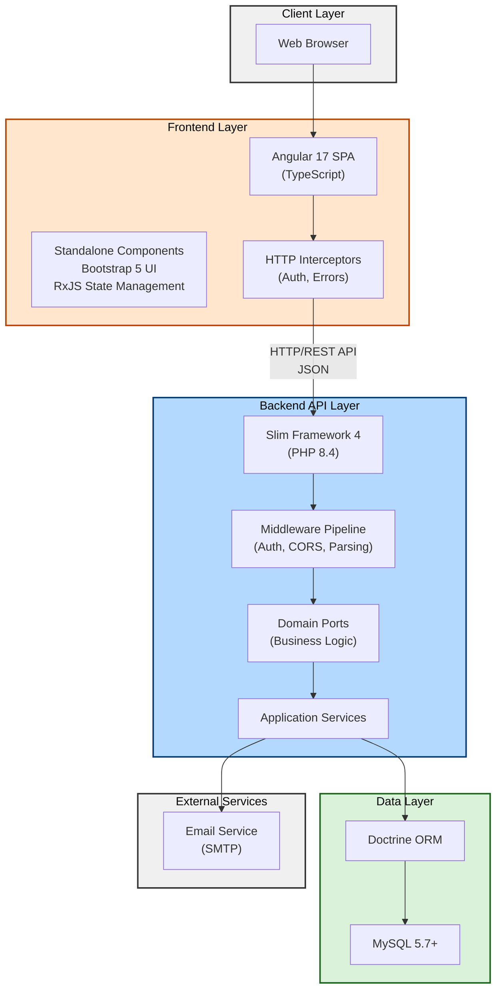
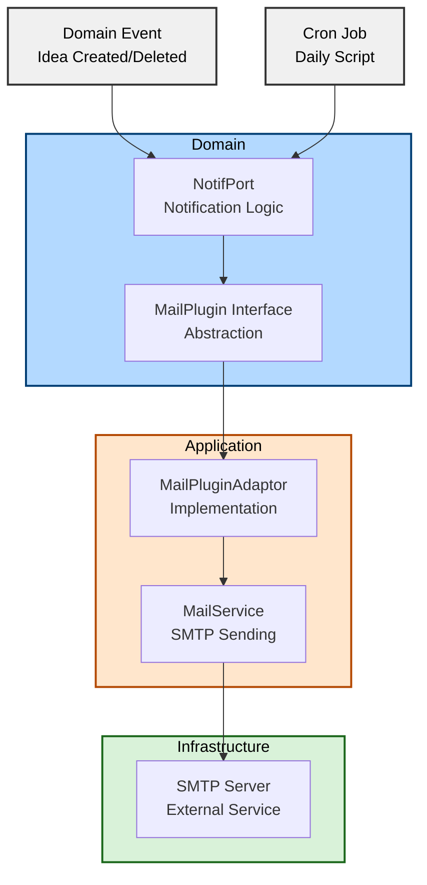

# Architecture and Design Decisions

This document provides a comprehensive overview of Tkdo's system architecture, design decisions, and the rationale behind key architectural choices.

## Table of Contents

- [System Architecture Overview](#system-architecture-overview)
- [Frontend Architecture](#frontend-architecture)
- [Backend Architecture](#backend-architecture)
- [Database Design Decisions](#database-design-decisions)
- [Authentication Strategy](#authentication-strategy)
- [Email Notification System](#email-notification-system)
- [Deployment Architecture](#deployment-architecture)
- [Future Architectural Considerations](#future-architectural-considerations)

## System Architecture Overview

Tkdo follows a modern **three-tier web architecture** with clear separation between presentation (frontend), business logic (backend API), and data persistence (database) layers.



### Architectural Principles

1. **Separation of Concerns** - Clear boundaries between frontend, backend, and data layers
2. **Single Page Application** - Fast, responsive user experience without full page reloads
3. **RESTful API** - Standard HTTP methods and JSON for communication
4. **Hexagonal Architecture** - Business logic independent of infrastructure
5. **Token-Based Authentication** - Stateless authentication using JWT
6. **Test-Driven Development** - Comprehensive testing at all layers

## Frontend Architecture

### Why Angular Standalone Components

**Decision:** Use Angular 17's standalone components instead of traditional NgModule-based architecture.

**Rationale:**
- **Simplified Dependency Management** - Components explicitly declare their dependencies
- **Better Tree-Shaking** - Unused components are more easily eliminated from production builds
- **Reduced Boilerplate** - No need for NgModule declarations
- **Future-Proof** - Angular's recommended approach for new applications
- **Lazy Loading Ready** - Easier to implement code splitting when needed

**Implementation:**
```typescript
// app.component.ts
@Component({
  selector: 'app-root',
  standalone: true,
  imports: [RouterOutlet, HeaderComponent],
  templateUrl: './app.component.html'
})
export class AppComponent { }
```

All components in Tkdo use the standalone API, declared in `front/src/app/**/*.component.ts` files.

### Routing Strategy

**Decision:** File-based routing with route guards for authentication and authorization.

**Routing Configuration:** `front/src/app/app.routes.ts`

```typescript
export const routes: Routes = [
  { path: '', redirectTo: '/occasion', pathMatch: 'full' },
  { path: 'admin', component: AdminComponent,
    canActivate: [ConnexionGuard, adminGuard],
    runGuardsAndResolvers: 'always' },
  { path: 'connexion', component: ConnexionComponent },
  { path: 'idee', component: PageIdeesComponent,
    canActivate: [ConnexionGuard],
    runGuardsAndResolvers: 'always' },
  // ... more routes
];
```

**Key Features:**
- **ConnexionGuard** (`front/src/app/connexion.guard.ts`) - Protects routes requiring authentication
- **adminGuard** (`front/src/app/admin.guard.ts`) - Restricts admin-only routes
- **runGuardsAndResolvers: 'always'** - Re-checks guards on same-URL navigation for state updates

**Why No Lazy Loading:**
- Small application size (~500KB compiled)
- All features needed immediately after login
- Simple routing structure with ~10 routes
- Future consideration if app grows significantly

### State Management Approach

**Decision:** Service-based reactive state management using RxJS instead of NgRx/Akita.

**Rationale:**
- **Simplicity** - Application state is relatively simple
- **RxJS Built-In** - Leverage Angular's built-in reactive programming capabilities
- **No Additional Dependencies** - Avoids heavyweight state management libraries
- **Suitable Scale** - Perfect for small to medium applications

**Implementation:** `front/src/app/backend.service.ts`

**State Structure:**
```typescript
export class BackendService {
  // Authentication state
  private _token: string | null = null;
  private _idUtilisateurConnecte$ = new BehaviorSubject<number | null>(null);

  // Derived state streams
  public readonly utilisateurConnecte$: Observable<UtilisateurPrive | null>;
  public readonly occasions$: Observable<Occasion[] | null>;

  // Error state
  private _erreur$ = new BehaviorSubject<string | undefined>(undefined);
  public readonly erreur$ = this._erreur$.asObservable();
}
```

**State Flow:**
1. User logs in → `connecte()` sets token and publishes `idUtilisateurConnecte$`
2. `utilisateurConnecte$` subscribes to `idUtilisateurConnecte$` and fetches user data
3. `occasions$` subscribes to `idUtilisateurConnecte$` and fetches occasions
4. Components subscribe to these observables for reactive updates

**Benefits:**
- Centralized state in `BackendService`
- Automatic propagation of changes via RxJS streams
- Type-safe with TypeScript interfaces
- Easy to test with observable mocking

### HTTP Interceptors

**Decision:** Use HTTP interceptors for cross-cutting concerns (authentication, error handling).

**Interceptor Pipeline:** `front/src/app/http-interceptors.ts`

```typescript
export const httpInterceptorProviders = [
  { provide: HTTP_INTERCEPTORS, useClass: ErreurBackendInterceptor, multi: true },
  { provide: HTTP_INTERCEPTORS, useClass: AuthBackendInterceptor, multi: true }
];
```

**Execution Order (Outside-In):**
1. **ErreurBackendInterceptor** - Outermost, handles HTTP errors globally
2. **AuthBackendInterceptor** - Adds JWT authentication tokens

#### Authentication Interceptor

**File:** `front/src/app/auth-backend.interceptor.ts`

**Purpose:** Automatically attach JWT tokens to API requests.

```typescript
intercept(request: HttpRequest<any>, next: HttpHandler): Observable<HttpEvent<any>> {
  if (request.url.startsWith('/api/') && this.backendService.token) {
    request = request.clone({
      setHeaders: {
        Authorization: `Bearer ${this.backendService.token}`
      }
    });
  }
  return next.handle(request);
}
```

**Why This Approach:**
- Centralized authentication logic
- No need to manually add headers in every service call
- Consistent token handling across all API requests

#### Error Handling Interceptor

**File:** `front/src/app/erreur-backend.interceptor.ts`

**Purpose:** Global HTTP error handling and user feedback.

```typescript
intercept(request: HttpRequest<any>, next: HttpHandler): Observable<HttpEvent<any>> {
  return next.handle(request).pipe(
    tap({
      next: () => this.backendService.erreur = undefined,
      error: (error: HttpErrorResponse) => {
        if (error.status === 401) {
          this.router.navigate(['/connexion'], {
            queryParams: { returnUrl: this.router.url }
          });
        } else {
          this.backendService.erreur = error.message;
        }
      }
    })
  );
}
```

**Behavior:**
- **401 Unauthorized** - Redirects to login with return URL
- **Other Errors** - Displays error message to user
- **Success** - Clears previous error messages

### Component Hierarchy and Communication Patterns

**Component Architecture:**

```
AppComponent (root)
├── HeaderComponent (navigation)
└── RouterOutlet
    ├── ConnexionComponent (login page)
    ├── ListeOccasionsComponent (occasions list page)
    ├── OccasionComponent (occasion details page)
    │   └── ListeIdeesComponent (display ideas list)
    │       └── IdeeComponent (display single idea)
    ├── PageIdeesComponent (my ideas page)
    │   └── ListeIdeesComponent (display ideas list)
    │       └── IdeeComponent (display single idea)
    ├── ProfilComponent (user profile page)
    └── AdminComponent (administration page)
```

**Communication Patterns:**

1. **Parent → Child (Input):** Data passed via `@Input()` properties
   ```typescript
   // ListeIdeesComponent receives ideas from parent
   @Input() ideesPour: IdeesPour[] = [];
   ```

2. **Child → Parent (Output):** Events emitted via `@Output()` EventEmitter
   ```typescript
   // IdeeComponent emits delete event to parent
   @Output() supprime = new EventEmitter<void>();
   ```

3. **Shared Service:** Components communicate via `BackendService` observables
   ```typescript
   // Multiple components subscribe to the same state
   constructor(public backendService: BackendService) { }
   ngOnInit() {
     this.backendService.utilisateurConnecte$.subscribe(user => { });
   }
   ```

**Why This Pattern:**
- Clear data flow from parent to child
- Event-driven communication upward
- Shared state for cross-component concerns
- Avoids tight coupling between unrelated components

## Backend Architecture

### Why Slim Framework

**Decision:** Use Slim Framework 4 for the REST API instead of full-stack frameworks like Symfony or Laravel.

**Rationale:**
- **Lightweight** - Minimal overhead, only includes what's needed
- **Microframework** - Perfect for API-only applications
- **PSR-7/PSR-15 Compliant** - Standard HTTP message interfaces
- **Flexible** - Easy to integrate with Doctrine, PHP-DI, and other libraries
- **Performance** - Fast routing and middleware execution
- **Learning Curve** - Simple and straightforward for small teams

**Trade-offs:**
- Less built-in functionality compared to Symfony/Laravel
- More manual wiring required (mitigated by PHP-DI)
- Smaller ecosystem and community

**For Tkdo:** The lightweight nature is ideal since the application has a focused scope and doesn't need extensive framework features.

### Why Doctrine ORM

**Decision:** Use Doctrine ORM 2.x for database persistence instead of raw SQL or active record patterns.

**Rationale:**
- **Object-Relational Mapping** - Work with objects instead of arrays
- **Database Abstraction** - Easy to switch databases if needed
- **Migrations** - Schema versioning with Doctrine Migrations
- **Lazy Loading** - Efficient loading of related entities
- **DQL (Doctrine Query Language)** - Type-safe queries
- **Unit of Work Pattern** - Automatic change tracking and batch persistence

**Implementation:**
- Entities: `api/src/Appli/ModelAdaptor/*Adaptor.php`
- Repositories: `api/src/Appli/RepositoryAdaptor/*RepositoryAdaptor.php`
- Migrations: `api/migrations/Version*.php`

**Trade-offs:**
- Learning curve for Doctrine concepts
- Additional abstraction layer
- Proxy class generation overhead

### Layered Architecture (Hexagonal/Ports & Adapters)

**Decision:** Implement hexagonal architecture with clear separation of domain, application, and infrastructure layers.

**Layers:**

```
api/src/
├── Dom/                   # Domain Layer (Business Logic)
│   ├── Model/             # Domain model interfaces
│   ├── Port/              # Use-case orchestration (business logic)
│   ├── Repository/        # Data access interfaces
│   ├── Plugin/            # External service interfaces
│   └── Exception/         # Domain exceptions
├── Appli/                 # Application Layer (Infrastructure Adapters)
│   ├── Controller/        # HTTP request handlers (Slim)
│   ├── ModelAdaptor/      # Doctrine entity implementations
│   ├── RepositoryAdaptor/ # Doctrine repository implementations
│   ├── PluginAdaptor/     # External service implementations
│   ├── Service/           # Infrastructure services
│   ├── Middleware/        # HTTP middleware
│   ├── Command/           # CLI commands
│   └── Handler/           # Error handlers
└── Bootstrap.php          # Application bootstrap and DI configuration
```

**Dependency Flow:**
```
Controllers → Ports → Domain Models
                ↓
          Repositories → Repository Adaptors → Doctrine Entities
                ↓
           Plugins → Plugin Adaptors → External Services
```

**Key Principles:**

1. **Domain Independence** - Business logic in `Dom/` has no infrastructure dependencies
2. **Dependency Inversion** - Domain defines interfaces, application implements them
3. **Port Pattern** - Use-case orchestration in `Port` classes (e.g., `IdeePort`, `OccasionPort`)
4. **Adapter Pattern** - Infrastructure implementations in `Appli/` adapters

**Example: Creating an Idea**

```php
// 1. HTTP Request → Controller (Appli layer)
class CreateIdeeController {
    public function __construct(private IdeePort $ideePort) {}

    public function __invoke(Request $req, Response $res): Response {
        $idee = $this->ideePort->creeIdee(
            $req->getAttribute('auth'),
            $utilisateur,
            $description,
            $auteur
        );
        return $jsonService->ok($res, $idee);
    }
}

// 2. Business Logic → Port (Dom layer)
class IdeePort {
    public function creeIdee(Auth $auth, Utilisateur $u,
                            string $desc, Utilisateur $auteur): Idee {
        // Validate authorization
        if (!$auth->isAuthorized($auteur) && !$auth->isAdmin()) {
            throw new AuteurNonAutoriseException();
        }

        // Create idea via repository
        $idee = $this->ideeRepository->create();
        $idee->setUtilisateur($u);
        $idee->setDescription($desc);
        $idee->setAuteur($auteur);
        $this->ideeRepository->update($idee);

        // Send notifications
        $this->notifPort->envoieNotifsInstantaneesCreation($auth, $idee);

        return $idee;
    }
}

// 3. Data Access → Repository Adaptor (Appli layer)
class IdeeRepositoryAdaptor implements IdeeRepository {
    public function create(): Idee {
        return new IdeeAdaptor();
    }

    public function update(Idee $idee): void {
        $this->entityManager->persist($idee);
        $this->entityManager->flush();
    }
}
```

**Benefits:**
- Business logic is testable without database
- Easy to swap infrastructure (e.g., change ORM, mailer)
- Clear boundaries and responsibilities
- Domain models express business concepts

### Dependency Injection Strategy

**Decision:** Use PHP-DI 7 for dependency injection instead of manual instantiation or service locator pattern.

**Configuration:** `api/src/Bootstrap.php`

```php
$containerBuilder = new ContainerBuilder();
$containerBuilder->useAttributes(true);
$containerBuilder->addDefinitions([
    Bootstrap::class => $this,
    EntityManager::class => $this->buildEntityManager(),

    // Wire domain interfaces to application implementations
    ExclusionRepository::class => \DI\autowire(ExclusionRepositoryAdaptor::class),
    IdeeRepository::class => \DI\autowire(IdeeRepositoryAdaptor::class),
    MailPlugin::class => \DI\autowire(MailPluginAdaptor::class),
    OccasionRepository::class => \DI\autowire(OccasionRepositoryAdaptor::class),
    PasswordPlugin::class => \DI\autowire(PasswordPluginAdaptor::class),
    ResultatRepository::class => \DI\autowire(ResultatRepositoryAdaptor::class),
    UtilisateurRepository::class => \DI\autowire(UtilisateurRepositoryAdaptor::class),
]);
```

**Controller Autowiring Example:**
```php
class CreateIdeeController {
    public function __construct(
        private IdeePort $ideePort,
        private JsonService $jsonService,
        private UtilisateurRepository $utilisateurRepository
    ) {}
}
```

**Benefits:**
- No manual instantiation in controllers
- Easy to mock dependencies for testing
- Clear declaration of dependencies
- Type-safe with constructor injection

### Middleware Pipeline

**Decision:** Use Slim's middleware stack for cross-cutting concerns.

**Middleware Stack:** `api/src/Bootstrap.php`

```php
$app->add(AuthMiddleware::class);           // Authentication
$app->addRoutingMiddleware();               // Routing (built-in)
$app->addBodyParsingMiddleware();           // JSON parsing (built-in)
$app->options('/{routes:.+}', CorsHandler); // CORS preflight
```

**Execution Order (Outside-In):**
1. **AuthMiddleware** - Validates JWT and sets `auth` request attribute
2. **RoutingMiddleware** - Matches route and sets route arguments
3. **BodyParsingMiddleware** - Parses JSON request body
4. **Controller** - Handles business logic

#### Authentication Middleware

**File:** `api/src/Appli/Middleware/AuthMiddleware.php`

```php
public function process(Request $request, RequestHandler $handler): Response {
    try {
        // Extract token from Authorization header
        $authHeader = $request->getHeaderLine('Authorization');
        if (preg_match('/Bearer\s+(.*)$/i', $authHeader, $matches)) {
            $token = $matches[1];
        } elseif (preg_match('/Basic\s+(.*)$/i', $authHeader, $matches)) {
            // Support Basic auth: base64(token:)
            [$token, ] = explode(':', base64_decode($matches[1]));
        }

        // Decode and validate JWT
        $auth = $this->authService->decode($token);
        $request = $request->withAttribute('auth', $auth);
    } catch (Exception $e) {
        $request = $request->withAttribute('authErr', $e);
    }

    return $handler->handle($request);
}
```

**Why This Approach:**
- Centralized authentication logic
- Supports both Bearer and Basic auth schemes
- Doesn't block request (sets error attribute instead)
- Allows public endpoints (e.g., `/connexion`)

## Database Design Decisions

### Soft Deletes for Gift Ideas

**Decision:** Mark gift ideas as deleted with a timestamp instead of physically removing them from the database.

**Implementation:** `dateSuppression` column in `tkdo_idee` table (see [Database Documentation](./database.md#table-tkdo_idee))

**Rationale:**
- **Preserve History** - Gift ideas are valuable data for understanding user behavior
- **Undo Capability** - Potential future feature to restore deleted ideas
- **Audit Trail** - Track when ideas were deleted
- **Notification Requirements** - Daily digest needs to report deletions

**Trade-offs:**
- Slightly more complex queries (need to filter by `dateSuppression`)
- Table grows over time (mitigated by relatively low idea volume)
- Database storage for deleted records

For complete schema details and entity relationships, see [Database Documentation](./database.md).

### Exclusions Modeling

**Decision:** Use a join table with composite primary key to represent exclusion rules.

**Rationale:**
- **Composite Primary Key** - Ensures one exclusion per (giver, receiver) pair
- **No Surrogate ID** - Natural key is sufficient
- **Prevents Duplicates** - Database-level constraint
- **Simple Queries** - Easy to check exclusions during draw generation

**Trade-offs:**
- Composite primary key requires both fields for updates
- No auto-increment ID (not needed for this use case)

**Usage:** Exclusions are checked during draw algorithm to ensure valid gift assignments that respect user preferences.

For complete schema details and entity structure, see [Database Documentation](./database.md#table-tkdo_exclusion).

### Draw Results Storage

**Decision:** Store draw assignments as individual records in a results table.

**Rationale:**
- **Simplicity** - One record per assignment
- **Immutability** - Draw results never change once created
- **Easy Lookup** - Find who someone should give to
- **Privacy** - Can query only what user is allowed to see
- **Future Flexibility** - Easy to add metadata (e.g., draw timestamp)

**Privacy Enforcement:** Repository layer enforces that regular users can only see who they give to, not who gives to them. Admins can view all assignments.

For complete schema details and relationships, see [Database Documentation](./database.md#table-tkdo_resultat).

## Authentication Strategy

### Token-Based Authentication

**Decision:** Use JWT (JSON Web Tokens) with RS256 algorithm for stateless authentication.

**Implementation:** `api/src/Appli/Service/AuthService.php`

**Rationale:**
- **RS256 Algorithm** - Asymmetric encryption for production security
- **Stateless** - No server-side session storage needed
- **Scalable** - Works across multiple servers without shared session store
- **Expiration** - Built-in token expiry for security

**Why JWT over Sessions:**
- No server-side session storage required
- Works well with SPA architecture
- Easy to implement and debug
- Standard format with library support

**Trade-offs:**
- Tokens cannot be revoked before expiration
- Slightly larger payload than session IDs
- Client must store token securely (localStorage XSS risk)

For complete details on token structure, obtaining tokens, and authentication usage, see the [API Reference Authentication section](./api-reference.md#authentication).

### Security Considerations

**Key Security Features:**
- **Signature Verification** - Ensures token not tampered with
- **Expiration Check** - Automatic with JWT library
- **User Existence** - Validates user ID exists in database
- **Admin Flag** - Double-checked for sensitive operations
- **HTTPS Enforcement** - Required in production
- **Authorization Header Passthrough** - Configured in Apache `.htaccess`

**Trade-offs and Mitigations:**
- localStorage XSS risk mitigated by token expiration and HTTPS
- No server-side revocation compensated by short validity period

**Future Improvements:**
- Refresh token mechanism
- Token blacklist for logout
- HttpOnly cookies instead of localStorage
- Short-lived access tokens with long-lived refresh tokens

For authentication security best practices and implementation details, see the [API Reference](./api-reference.md#authentication).

## Email Notification System

### Architecture Overview

**Decision:** Implement a plugin-based email system with support for instant and daily digest notifications.

For complete user-facing documentation on notification types, preferences, and troubleshooting, see the [Email Notifications Reference](./notifications.md).



### Instant vs Daily Digest

**User Preference Model:** `api/src/Dom/Model/PrefNotifIdees.php`

```php
class PrefNotifIdees {
    const Aucune = 'N';       // No notifications
    const Instantanee = 'I';  // Instant notifications
    const Quotidienne = 'Q';  // Daily digest
}
```

**Architectural Rationale:**
- **Instant notifications** - Immediate feedback for active users, real-time collaboration
- **Daily digest** - Reduces email fatigue, batch processing efficiency
- **User choice** - Flexibility to match user preferences and engagement levels

**Implementation Pattern:**
- Instant: Triggered immediately when ideas are created/deleted (`IdeePort`)
- Daily: Triggered by cron job executing console command with period flag
- Both: Filter recipients based on preference, occasion participation, and timing

For detailed notification types, configuration, and troubleshooting, see [Email Notifications Reference](./notifications.md). For administrator setup instructions (cron configuration, email settings), see [Email Notifications Reference - For Administrators](./notifications.md#for-administrators).

### Mailer Abstraction

**Plugin Interface:** `api/src/Dom/Plugin/MailPlugin.php`

```php
interface MailPlugin {
    public function envoieMailIdeeCreation(Utilisateur $destinataire, Idee $idee): bool;
    public function envoieMailIdeeSuppression(Utilisateur $destinataire, Idee $idee): bool;
    public function envoieMailNotifPeriodique(Utilisateur $destinataire, array $idees): bool;
    public function envoieMailAjoutParticipant(Utilisateur $destinataire, Occasion $occasion): bool;
    public function envoieMailTirageFait(Utilisateur $destinataire, Occasion $occasion): bool;
    public function envoieMailMdpCreation(Utilisateur $destinataire, string $mdp): bool;
    public function envoieMailMdpReinitialisation(Utilisateur $destinataire, string $mdp): bool;
}
```

**Adaptor Implementation:** `api/src/Appli/PluginAdaptor/MailPluginAdaptor.php`

```php
class MailPluginAdaptor implements MailPlugin {
    public function __construct(
        private MailService $mailService,
        private UriService $uriService
    ) {}

    public function envoieMailIdeeCreation(Utilisateur $destinataire, Idee $idee): bool {
        $subject = "Nouvelle idée pour {$idee->getUtilisateur()->getNom()}";
        $message = $this->buildHtmlMessage(
            "Une nouvelle idée a été proposée...",
            $this->uriService->buildOccasionUrl($occasion)
        );

        return $this->mailService->envoieMail(
            $destinataire->getEmail(),
            $subject,
            $message
        );
    }
}
```

**Low-Level Mail Service:** `api/src/Appli/Service/MailService.php`

```php
class MailService {
    public function envoieMail(string $to, string $subject, string $message): bool {
        $headers = "From: {$this->fromAddress}\r\n";
        $headers .= "MIME-Version: 1.0\r\n";
        $headers .= "Content-Type: text/html; charset=UTF-8\r\n";

        return mail($to, $subject, $message, $headers);
    }
}
```

**Why Plugin Pattern:**
- **Domain Independence** - Business logic doesn't depend on email implementation
- **Testability** - Easy to mock email sending in tests
- **Flexibility** - Can switch to SendGrid, AWS SES, etc. without changing domain
- **Environment-Specific** - Development uses MailHog, production uses SMTP

**Development Email Testing:**
- **MailHog** - Captures all emails in development
- **Web UI** - http://localhost:8025
- **No Real Sending** - Prevents accidental emails during development

### Daily Notification Script Scheduling

**Implementation:** Cron job executes console command with period flag.

**Key Considerations:**
- Choose time when users typically check email
- Avoid server maintenance windows
- Consider timezone of user base
- Monitor script execution time and success rate
- Log output for debugging

For detailed cron setup instructions and scheduling options, see [Email Notifications Reference - For Administrators](./notifications.md#for-administrators).

## Deployment Architecture

### Docker for Development

**Decision:** Use Docker Compose to create a consistent, reproducible development environment.

**Key Services:** Angular build, Apache frontend, MySQL database, MailHog email testing, PHP-FPM API, Nginx API routing

**Why Docker for Development:**
- **Consistency** - Same environment for all developers
- **No Local Dependencies** - No need to install PHP, MySQL, Node.js locally
- **Isolation** - Multiple projects don't conflict
- **Easy Onboarding** - Simple startup command
- **Match Production** - Similar to production environment

**Trade-offs:**
- Additional complexity for newcomers unfamiliar with Docker
- Resource overhead on development machines
- Potential performance issues on some platforms (mitigated by proper configuration)

For complete development setup instructions, service details, and troubleshooting, see [Development Setup Guide](./dev-setup.md).

### Apache for Production

**Decision:** Deploy to Apache web server with mod_rewrite for routing.

**Key Configuration:** `apache/.htaccess` handles HTTPS enforcement, API routing, SPA fallback, and JWT authorization header passthrough.

**Why Apache:**
- **Widely Available** - Supported by most hosting providers
- **Shared Hosting Compatible** - Works with .htaccess configuration
- **mod_rewrite** - Simple routing for SPA and API
- **HTTPS Support** - Easy SSL/TLS configuration
- **Stable** - Battle-tested web server

**Trade-offs:**
- **Apache vs Nginx** - Slightly lower performance than Nginx (negligible for Tkdo's scale) but broader hosting support and simpler shared hosting configuration
- **Docker vs Vagrant** - Docker is lighter weight, faster startup, better resource utilization, and industry standard

**Note:** Detailed deployment procedures documentation is planned (see BACKLOG Task 2: Apache deployment guide).

### Build and Packaging

**Strategy:** Single artifact deployment with pre-compiled assets.

**Build Process:**
1. Build Angular frontend in Docker
2. Install backend production dependencies (excludes dev tools)
3. Create versioned tarball with all necessary files

**Why This Packaging Strategy:**
- **Single Artifact** - One tarball contains everything needed
- **Reproducible** - Same build process every time
- **Version Tracking** - Filename includes git tag/hash
- **No Build on Server** - Pre-compiled assets reduce deployment complexity
- **Excludes Dev Dependencies** - Smaller package size

**Trade-offs:**
- Manual deployment process (no CI/CD automation yet)
- Requires SSH access to server
- Database migrations must be run manually

**Note:** Detailed build and packaging procedures documentation is planned (see BACKLOG Task 2: Apache deployment guide).

## Future Architectural Considerations

### AWS Serverless Support

**Current Status:** Planned (mentioned in backlog)

**Potential Architecture:**

```
Frontend:
- S3 + CloudFront for static assets
- Route53 for DNS

Backend API:
- API Gateway for HTTP routing
- Lambda functions for API endpoints
- RDS MySQL for database
- SES for email notifications

Development/Production Stacks:
- Separate AWS accounts or VPCs
- Infrastructure as Code with Ansible
```

**Benefits:**
- **Scalability** - Auto-scaling Lambda functions
- **Cost Efficiency** - Pay per request instead of always-on servers
- **High Availability** - Built-in redundancy
- **Managed Services** - Less infrastructure maintenance

**Challenges:**
- **Cold Start Latency** - Lambda warm-up time
- **Stateless Design** - Already compatible with current JWT approach
- **Database Connections** - Need RDS Proxy for connection pooling
- **Migration Effort** - Significant DevOps work

**Architectural Implications:**
- Current hexagonal architecture makes this transition easier
- Stateless authentication already compatible
- Domain layer can remain unchanged
- Infrastructure layer (deployment) would be completely replaced

### API Evolution: JSON+HAL

**Current Status:** Planned (backlog item)

**Current API Response:**
```json
{
  "id": 123,
  "titre": "Noël 2024",
  "date": "2024-12-25"
}
```

**JSON+HAL Response:**
```json
{
  "id": 123,
  "titre": "Noël 2024",
  "date": "2024-12-25",
  "_links": {
    "self": { "href": "/api/occasion/123" },
    "participants": { "href": "/api/occasion/123/participant" },
    "tirage": { "href": "/api/occasion/123/tirage", "method": "POST" }
  }
}
```

**Benefits:**
- **Hypermedia as the Engine of Application State (HATEOAS)**
- **Frontend Independence** - Frontend doesn't build URLs
- **Discoverability** - API tells frontend what actions are available
- **Versioning** - Easier API evolution without breaking changes

**Architectural Impact:**
- Frontend routing logic would be simplified
- Backend controllers return hypermedia links
- Decouples frontend from backend URL structure
- Enables API documentation auto-generation

### Other Considerations

**MySQL 8 Migration:**
- **Current:** MySQL 5.7
- **Future:** MySQL 8.0+
- **Benefits:** Better performance, window functions, improved JSON support
- **Impact:** Minor - Doctrine ORM abstracts most differences

**Angular Upgrade:**
- **Current:** Angular 17
- **Planned:** Angular 20+
- **Benefits:** Security fixes, performance improvements
- **Impact:** Moderate - may require dependency updates and testing

**API Versioning:**
- **Current:** No versioning (single version)
- **Future:** Consider `/api/v1/`, `/api/v2/` for breaking changes
- **Strategy:** Maintain backward compatibility when possible

**Caching Strategy:**
- **Current:** No caching layer
- **Future:** Consider Redis for session storage, API response caching
- **Benefits:** Faster response times, reduced database load

---

## Summary

Tkdo's architecture balances simplicity with best practices:

- **Frontend:** Modern Angular SPA with reactive state management
- **Backend:** Hexagonal architecture with Slim Framework and Doctrine ORM
- **Database:** Relational model with soft deletes and migration management
- **Authentication:** Stateless JWT with RS256 encryption
- **Notifications:** Plugin-based email system with instant and digest options
- **Deployment:** Docker for development, Apache for production

These architectural decisions provide a solid foundation for the current application while maintaining flexibility for future enhancements like serverless deployment and hypermedia APIs.

For more specific implementation details, see:
- [Frontend Development Guide](frontend-dev.md)
- [Backend/API Development Guide](backend-dev.md)
- [Database Documentation](database.md)
- [API Reference](api-reference.md)
