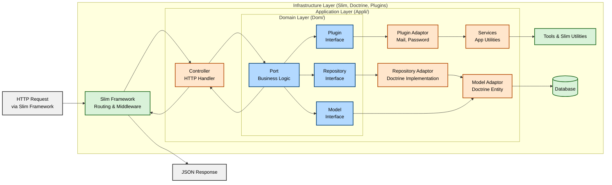
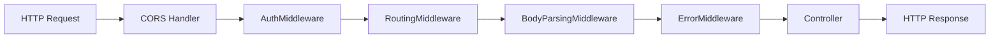
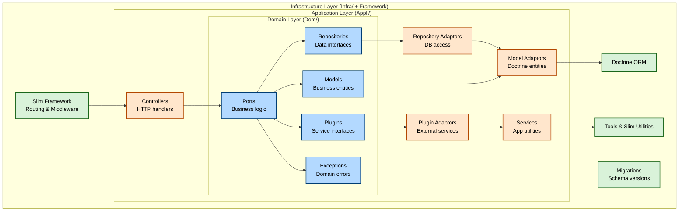
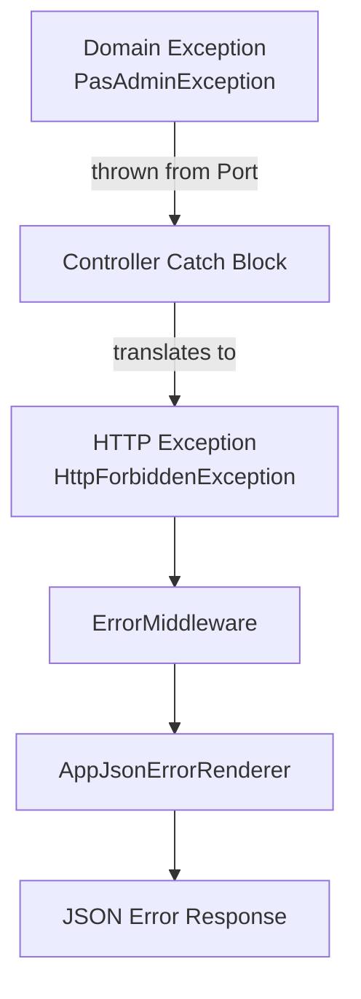

# Backend/API Development Guide

This guide provides comprehensive documentation for developing and working with the Tkdo backend API.

## Table of Contents

- [Architecture Overview](#architecture-overview)
- [Project Structure](#project-structure)
- [Technology Stack](#technology-stack)
- [Getting Started](#getting-started)
- [Dependency Injection Container](#dependency-injection-container)
- [Routing and Middleware](#routing-and-middleware)
- [Authentication and Authorization](#authentication-and-authorization)
- [Code Organization Patterns](#code-organization-patterns)
- [Working with the Database](#working-with-the-database)
- [Error Handling](#error-handling)
- [Testing](#testing)
- [Available Composer Scripts](#available-composer-scripts)
- [Code Style and Conventions](#code-style-and-conventions)
- [Development Workflow](#development-workflow)

## Architecture Overview

The backend follows **Hexagonal Architecture** (also known as Ports & Adapters), which provides clear separation between business logic and infrastructure concerns.



### Key Principles

1. **Domain-Driven Design**: Business logic is isolated in the domain layer
2. **Dependency Inversion**: High-level modules depend on abstractions, not implementations
3. **Testability**: Pure business logic can be tested without infrastructure
4. **Flexibility**: Infrastructure can be swapped without changing business logic

## Project Structure

```
api/
├── bin/                          # CLI executables
│   ├── console.php               # Application console commands
│   ├── doctrine.php              # Doctrine CLI tool
│   └── notif-quotidienne.php     # Daily notification script
├── public/                       # Web entry point
│   └── index.php                 # Front controller
├── src/                          # Application source code
│   ├── Bootstrap.php             # Application bootstrapper
│   ├── Appli/                    # Application layer (infrastructure)
│   │   ├── Command/              # CLI commands
│   │   ├── Controller/           # HTTP request handlers (20 controllers)
│   │   ├── Exception/            # Application-specific exceptions
│   │   ├── Fixture/              # Data fixtures
│   │   ├── Handler/              # Error handlers and logging
│   │   ├── Middleware/           # HTTP middleware
│   │   ├── ModelAdaptor/         # Doctrine ORM entities (6 adaptors)
│   │   ├── PluginAdaptor/        # Plugin implementations
│   │   ├── RepositoryAdaptor/    # Repository implementations
│   │   ├── Service/              # Application services
│   │   └── Settings/             # Configuration classes
│   ├── Dom/                      # Domain layer (business logic)
│   │   ├── Exception/            # Domain exceptions (23 exceptions)
│   │   ├── Model/                # Domain model interfaces
│   │   ├── Plugin/               # Plugin interfaces
│   │   ├── Port/                 # Business logic services (5 ports)
│   │   └── Repository/           # Repository interfaces
│   └── Infra/                    # Infrastructure layer
│       ├── Migrations/           # Database migrations
│       └── Tools/                # Utility tools
├── test/                         # Test suites
│   ├── Int/                      # Integration tests
│   └── Unit/                     # Unit tests
├── var/                          # Runtime data
│   ├── cache/                    # Container compilation cache
│   ├── doctrine/                 # Doctrine cache and proxies
│   └── log/                      # Application logs
├── vendor/                       # Composer dependencies
├── .env                          # Environment configuration (template)
├── composer.json                 # Dependencies and scripts
└── phpunit.xml                   # PHPUnit configuration
```

## Technology Stack

### Core Dependencies

| Package                  | Version | Purpose                          |
|--------------------------|---------|----------------------------------|
| PHP                      | 8.4     | Programming language             |
| slim/slim                | 4.10+   | Microframework for routing       |
| doctrine/orm             | 2.17+   | Object-relational mapper         |
| php-di/php-di            | 7.0+    | Dependency injection container   |
| firebase/php-jwt         | 6.4+    | JWT authentication               |
| monolog/monolog          | 2.9+    | Logging                          |
| symfony/cache            | 6.4+    | Caching framework                |
| doctrine/migrations      | 3.8+    | Database migrations              |

### Development Dependencies

| Package                  | Version | Purpose                          |
|--------------------------|---------|----------------------------------|
| phpunit/phpunit          | 11.5+   | Testing framework                |
| rector/rector            | 2.0+    | Automated refactoring            |
| phpstan/phpstan          | 2.1+    | Static analysis                  |
| squizlabs/php_codesniffer| 3.7+    | Code style checking              |
| guzzlehttp/guzzle        | 7.8+    | HTTP client (API & email testing)|

## Getting Started

### Prerequisites

Ensure you have completed the [development environment setup](./dev-setup.md).

### Running the Backend

Using Docker (recommended):
```bash
docker compose up -d
```

The API will be available at: `http://localhost:8080/api/`

### Development Mode

Set `TKDO_DEV_MODE=1` in your `.env` file to enable:
- Detailed error messages with stack traces
- Disabled container compilation cache
- Verbose logging

## Dependency Injection Container

The application uses **PHP-DI** for dependency injection, configured in `src/Bootstrap.php`.

### Container Configuration

```php
// src/Bootstrap.php
public static function initDiContainer(): Container
{
    $builder = new ContainerBuilder();

    // Enable compilation cache in production
    if (!getenv('TKDO_DEV_MODE')) {
        $builder->enableCompilation(__DIR__ . '/../var/cache');
    }

    // Define bindings
    $builder->addDefinitions([
        // Interface to implementation bindings
        EntityManager::class => /* ... */,
        LoggerInterface::class => DI\get(AppLogger::class),
        UtilisateurRepository::class => DI\get(UtilisateurRepositoryAdaptor::class),
        // ... more bindings
    ]);

    return $builder->build();
}
```

### Key Bindings

| Interface                   | Implementation                    |
|-----------------------------|-----------------------------------|
| `EntityManager`             | Doctrine EntityManager            |
| `LoggerInterface`           | `AppLogger`                       |
| `UtilisateurRepository`     | `UtilisateurRepositoryAdaptor`    |
| `OccasionRepository`        | `OccasionRepositoryAdaptor`       |
| `IdeeRepository`            | `IdeeRepositoryAdaptor`           |
| `ResultatRepository`        | `ResultatRepositoryAdaptor`       |
| `ExclusionRepository`       | `ExclusionRepositoryAdaptor`      |
| `MailPlugin`                | `MailPluginAdaptor`               |
| `PasswordPlugin`            | `PasswordPluginAdaptor`           |

### Autowiring

Most dependencies are automatically resolved:

```php
class MyService
{
    public function __construct(
        private UtilisateurRepository $utilisateurRepository,
        private OccasionPort $occasionPort
    ) {}
}
```

## Routing and Middleware

### Route Definitions

Routes are defined in `src/Bootstrap.php::initSlimApp()`:

```php
// Public routes (no authentication required)
$app->post('/connexion', CreateConnexionController::class);

// Protected routes (authentication required)
$app->get('/utilisateur', ListUtilisateurController::class);
$app->post('/utilisateur', CreateUtilisateurController::class);
$app->get('/utilisateur/{idUtilisateur}', ViewUtilisateurController::class);
$app->put('/utilisateur/{idUtilisateur}', EditUtilisateurController::class);
$app->post('/utilisateur/{idUtilisateur}/reinitmdp', CreateUtilisateurReinitMdpController::class);

$app->get('/occasion', ListOccasionController::class);
$app->post('/occasion', CreateOccasionController::class);
$app->get('/occasion/{idOccasion}', ViewOccasionController::class);
$app->put('/occasion/{idOccasion}', EditOccasionController::class);
$app->post('/occasion/{idOccasion}/participant', CreateParticipantOccasionController::class);
$app->post('/occasion/{idOccasion}/resultat', CreateResultatOccasionController::class);
$app->post('/occasion/{idOccasion}/tirage', CreateTirageOccasionController::class);

$app->get('/idee', ListIdeeController::class);
$app->post('/idee', CreateIdeeController::class);
$app->post('/idee/{idIdee}/suppression', CreateIdeeSuppressionController::class);

$app->get('/utilisateur/{idUtilisateur}/exclusion', ListExclusionUtilisateurController::class);
$app->post('/utilisateur/{idUtilisateur}/exclusion', CreateExclusionUtilisateurController::class);
```

### Middleware Stack

Middleware is applied in the following order (first to last):



#### 1. CORS Handler

Handles OPTIONS pre-flight requests:

```php
$app->options('/{routes:.+}', function ($request, $response) {
    return $response;
});
```

#### 2. AuthMiddleware

Extracts and validates JWT tokens from **HttpOnly cookies** (primary) or `Authorization` header (backward compatibility):

```php
// src/Appli/Middleware/AuthMiddleware.php
public function process(Request $request, RequestHandler $handler): Response
{
    $cookies = $request->getCookieParams();
    $serverParams = $request->getServerParams();

    // Try cookie FIRST (OAuth2 flow), then fall back to Authorization header
    $auth = $this->authentifieViaCookie($cookies)
        ?? $this->authentifieViaHeader($serverParams['HTTP_AUTHORIZATION'] ?? '');

    // Validate token
    try {
        $this->logger->info("Utilisateur {$auth->getIdUtilisateur()} authentifié");
        $request = $request->withAttribute('auth', $auth);
    } catch (AuthException $err) {
        $request = $request->withAttribute('authErr', $err);
    }

    return $handler->handle($request);
}
```

#### 3. RoutingMiddleware

Slim's built-in routing middleware.

#### 4. BodyParsingMiddleware

Parses JSON and form request bodies.

#### 5. ErrorMiddleware

Catches and formats exceptions.

### Adding a New Route

1. **Create Controller**: `src/Appli/Controller/MyNewController.php`
2. **Register Route**: Add to `initSlimApp()` in `Bootstrap.php`
3. **Implement Logic**: Delegate to a Port for business logic

Example:

```php
// 1. Create controller
class MyNewController extends AuthController
{
    public function __construct(
        private MyPort $myPort
    ) {}

    public function __invoke(Request $request, Response $response): Response
    {
        $auth = $this->getAuth($request);
        $result = $this->myPort->doSomething($auth);
        return $this->json($response, $result);
    }
}

// 2. Register route
$app->post('/my-new-endpoint', MyNewController::class);
```

## Authentication and Authorization

### OAuth2 + BFF Authentication (Current)

Tkdo uses **OAuth2 authorization code flow** with a **Backend-For-Frontend (BFF) pattern** to keep JWTs secure in HttpOnly cookies. This architecture enables switching between the temporary built-in authorization server and external Identity Providers (Google, Auth0, etc.) with only configuration changes.

#### Sequence Diagram

```
  Browser/Angular          Auth Server (TEMP)           BFF (PERMANENT)
       │                        │                            │
  1.   │──GET /oauth/authorize──▶                            │
       │  ?response_type=code   │                            │
       │  &client_id=tkdo       │                            │
       │  &redirect_uri=...     │                            │
       │  &state=abc            │                            │
       │                        │                            │
  2.   │◀─302 → /connexion─────│                            │
       │  (shows login form)    │                            │
       │                        │                            │
  3.   │──POST /oauth/authorize─▶                            │
       │  {identifiant, mdp,    │                            │
       │   client_id, state...} │                            │
       │                        │                            │
  4.   │◀─302 → /auth/callback──│                            │
       │  ?code=xxx&state=abc   │                            │
       │                        │                            │
  5.   │  (Angular reads code)  │                            │
       │──POST /api/auth/callback──────────────────────────▶│
       │  {code: "xxx"}         │                            │
       │                        │                            │
  6.   │                        │◀──POST /oauth/token────────│
       │                        │   {grant_type, code,       │
       │                        │    client_id, secret}      │
       │                        │                            │
  7.   │                        │──{access_token: JWT}──────▶│
       │                        │                            │
  8.   │                        │◀──GET /oauth/userinfo──────│
       │                        │   Authorization: Bearer JWT│
       │                        │                            │
  9.   │                        │──{sub, adm, groupe_ids}──▶│
       │                        │                            │
  10.  │◀─{utilisateur: {...}}──────────────────────────────│
       │  + Set-Cookie: tkdo_jwt=<app-jwt>; HttpOnly        │
       │                        │                            │
```

> Steps 6-9 are **back-channel** (server-to-server) — the browser never sees the access token.
> When switching to an external IdP, only the Auth Server column changes; the BFF column stays identical.

#### OAuth2 Flow (Step-by-Step)

**1. User initiates login**

```typescript
// Frontend: BackendService.connecte()
const state = crypto.randomBytes(32).toString('hex'); // CSRF protection
sessionStorage.setItem('oauth_state', state);

// Browser redirect to authorization endpoint
window.location.href = `/oauth/authorize?response_type=code&client_id=tkdo&redirect_uri=/auth/callback&state=${state}`;
```

**2. Authorization server validates credentials**

```php
// Backend: OAuthAuthorizeController (TEMPORARY)
POST /oauth/authorize
{
  "identifiant": "user@example.com",
  "mdp": "password",
  "client_id": "tkdo",
  "redirect_uri": "http://localhost:4200/auth/callback",
  "response_type": "code",
  "state": "csrf_token"
}

// Returns 302 redirect to: /auth/callback?code=xxx&state=xxx
```

**3. Frontend receives authorization code**

```typescript
// Angular: AuthCallbackComponent
const code = route.queryParams.code;
const state = route.queryParams.state;

// Validate CSRF state
if (state !== sessionStorage.getItem('oauth_state')) {
  throw new Error('Invalid state');
}

// Exchange code for session
await backendService.echangeCode(code, state);
```

**4. BFF exchanges code for JWT and sets cookie**

```php
// Backend: BffAuthCallbackController (PERMANENT)
POST /api/auth/callback
{ "code": "xxx" }

// Uses league/oauth2-client to call /oauth/token
$accessToken = $this->provider->getAccessToken('authorization_code', ['code' => $code]);

// Extracts user claims via /oauth/userinfo
$claims = $this->provider->getResourceOwner($accessToken)->toArray();

// Creates application JWT
$jwt = $this->authService->encode($claims);

// Sets HttpOnly cookie (JWT never exposed to JavaScript)
Set-Cookie: tkdo_jwt=<jwt>; HttpOnly; Secure; SameSite=Strict; Path=/api; Max-Age=3600

// Returns user info (NOT the JWT)
{ "utilisateur": { "id": 123, "nom": "John", "admin": false } }
```

> **User info persistence:** Only the user ID is stored in `localStorage` (see `BackendService`, line ~193). On page reload, the full user object is refetched from the API using the HttpOnly cookie — the JWT itself is never accessible to JavaScript.

**5. Subsequent requests use cookie automatically**

```typescript
// Frontend: All /api requests include withCredentials: true
http.get('/api/utilisateur/123', { withCredentials: true });

// Browser automatically sends cookie (no JavaScript access)
Cookie: tkdo_jwt=<jwt>
```

**6. AuthMiddleware validates cookie on every request**

```php
// Backend: AuthMiddleware
// Tries cookie FIRST, then Authorization header (backward compatibility)
$auth = $this->authentifieViaCookie($cookies)
    ?? $this->authentifieViaHeader($authHeader);

$request = $request->withAttribute('auth', $auth);
```

#### JWT Token Structure

JWTs contain user identity and permissions:

```json
{
  "sub": 123,           // User ID
  "adm": true,          // Is administrator
  "groupe_ids": [1, 5], // Group memberships
  "exp": 1672531200     // Expiration timestamp (1 hour)
}
```

#### Configuration

**JWT Settings** (`src/Appli/Settings/AuthSettings.php`):

```php
class AuthSettings
{
    public string $privateKeyFile = __DIR__ . '/../../var/auth/auth_rsa';
    public string $publicKeyFile = __DIR__ . '/../../var/auth/auth_rsa.pub';
    public string $algorithm = 'RS256';
    public int $validity = 3600; // 1 hour
}
```

**OAuth2 Settings** (`src/Appli/Settings/OAuth2Settings.php`):

```php
class OAuth2Settings
{
    public string $clientId;        // From OAUTH2_CLIENT_ID env
    public string $clientSecret;    // From OAUTH2_CLIENT_SECRET env
    public string $redirectUri;     // Built from TKDO_BASE_URI + /auth/callback
    public string $urlAuthorize;    // /oauth/authorize (temp) or IdP URL
    public string $urlAccessToken;  // /oauth/token (temp) or IdP URL
    public string $urlResourceOwner; // /oauth/userinfo (temp) or IdP URL
}
```

See [Environment Variables](environment-variables.md#oauth2-configuration) for configuration details.

#### Switching to External Identity Provider

To replace the temporary authorization server with Google, Auth0, etc.:

**1. Update environment variables:**

```bash
OAUTH2_CLIENT_ID=your-idp-client-id
OAUTH2_CLIENT_SECRET=your-idp-client-secret
```

**2. Update OAuth2Settings.php URLs** (one-time code change):

```php
// Example: Auth0
$this->urlAuthorize = 'https://your-tenant.auth0.com/authorize';
$this->urlAccessToken = 'https://your-tenant.auth0.com/oauth/token';
$this->urlResourceOwner = 'https://your-tenant.auth0.com/userinfo';
```

**3. Delete temporary authorization server code:**

- `OAuthAuthorizeController.php`
- `OAuthTokenController.php`
- `OAuthUserInfoController.php`

**No changes needed** to BFF layer (`BffAuthCallbackController`, `BffAuthService`) — works with any OAuth2 provider via `league/oauth2-client`.

#### Using Authentication in Controllers

Controllers extending `AuthController` can access the authenticated user:

```php
class MyController extends AuthController
{
    public function __invoke(Request $request, Response $response): Response
    {
        // Call parent to enforce authentication
        parent::__invoke($request, $response);

        // Get authenticated user (guaranteed to exist after parent::__invoke())
        $auth = $this->getAuth();

        // Use $auth->getIdUtilisateur() and $auth->estAdmin()
    }
}
```

### Authorization Patterns

Authorization is handled in the **Port layer** (business logic), not in controllers:

#### Pattern 1: Admin-Only Operations

```php
// src/Dom/Port/UtilisateurPort.php
public function creeUtilisateur(?Auth $auth, /* ... */): Utilisateur
{
    // Verify admin
    if (!$auth?->estAdmin()) {
        throw new PasAdminException();
    }

    // Business logic...
}
```

#### Pattern 2: User-Specific or Admin Operations

```php
// src/Dom/Port/UtilisateurPort.php
public function modifieUtilisateur(?Auth $auth, int $idUtilisateur, /* ... */): Utilisateur
{
    // User can modify own profile, admin can modify any
    if ($auth?->getId() !== $idUtilisateur && !$auth?->estAdmin()) {
        throw new PasUtilisateurNiAdminException();
    }

    // Business logic...
}
```

#### Pattern 3: Participant-Specific or Admin Operations

```php
// src/Dom/Port/IdeePort.php
public function listeIdees(?Auth $auth, int $idOccasion): array
{
    $occasion = $this->occasionRepository->trouve($idOccasion);

    // Verify user is participant or admin
    if (!$occasion->aParticipant($auth?->getId()) && !$auth?->estAdmin()) {
        throw new PasParticipantNiAdminException();
    }

    // Business logic...
}
```

#### Controller Exception Handling

Controllers translate domain exceptions to HTTP exceptions:

```php
// src/Appli/Controller/CreateOccasionController.php
public function __invoke(Request $request, Response $response): Response
{
    try {
        $occasion = $this->occasionPort->creeOccasion($this->getAuth($request), /* ... */);
        return $this->json($response, $occasion, 201);
    } catch (PasAdminException $err) {
        throw new HttpForbiddenException($request, $err->getMessage());
    }
}
```

### API Token Usage

For command-line access (administrators):

```bash
# Using Bearer token
curl -H "Authorization: Bearer YOUR_TOKEN" \
  http://localhost:8080/api/utilisateur

# Using Basic auth (token as username)
curl -u YOUR_TOKEN: \
  http://localhost:8080/api/utilisateur
```

## Code Organization Patterns

### Three-Layer Architecture



### Domain Layer (Dom/)

The domain layer contains pure business logic with **no infrastructure dependencies**.

#### Models (`Dom/Model/`)

Domain model interfaces defining business entities:

```php
// src/Dom/Model/Utilisateur.php
interface Utilisateur
{
    public function getId(): int;
    public function getIdentifiant(): string;
    public function estAdmin(): bool;
    public function getEmail(): ?string;
    // ... more business methods
}
```

**Key models:**
- `Utilisateur` - User entity
- `Occasion` - Event/occasion entity
- `Idee` - Gift idea entity
- `Resultat` - Draw result entity
- `Exclusion` - User exclusion entity
- `Auth` - Authentication context
- `Genre` - Gender enum
- `PrefNotifIdees` - Notification preference enum

#### Ports (`Dom/Port/`)

Business logic services containing all business rules:

```php
// src/Dom/Port/OccasionPort.php
class OccasionPort
{
    public function __construct(
        private OccasionRepository $occasionRepository,
        private UtilisateurRepository $utilisateurRepository,
        private MailPlugin $mailPlugin
    ) {}

    public function creeOccasion(?Auth $auth, string $nom, ?string $date): Occasion
    {
        // Authorization
        if (!$auth?->estAdmin()) {
            throw new PasAdminException();
        }

        // Validation
        if (empty($nom)) {
            throw new OccasionNomVideException();
        }

        // Business logic
        $occasion = $this->occasionRepository->nouveau();
        $occasion->setNom($nom);
        $occasion->setDate($date);

        $this->occasionRepository->persiste($occasion);

        return $occasion;
    }
}
```

**Key ports:**
- `UtilisateurPort` - User management logic
- `OccasionPort` - Occasion management logic
- `IdeePort` - Gift idea management logic
- `ExclusionPort` - Exclusion management logic
- `NotifPort` - Notification logic

#### Repositories (`Dom/Repository/`)

Data access interfaces (no implementation details):

```php
// src/Dom/Repository/OccasionRepository.php
interface OccasionRepository
{
    public function nouveau(): Occasion;
    public function trouve(int $id): Occasion;
    public function trouveParUtilisateur(Utilisateur $utilisateur): array;
    public function listeTout(): array;
    public function persiste(Occasion $occasion): void;
}
```

#### Plugins (`Dom/Plugin/`)

External service interfaces:

```php
// src/Dom/Plugin/MailPlugin.php
interface MailPlugin
{
    public function envoieMail(
        string $to,
        string $subject,
        string $message,
        ?string $replyTo = null
    ): void;
}
```

#### Exceptions (`Dom/Exception/`)

Domain-specific exceptions for business rule violations:

```php
// src/Dom/Exception/PasAdminException.php
class PasAdminException extends DomException
{
    public $message = "l'utilisateur authentifié n'est pas un administrateur";
}
```

**Common exceptions:**
- `PasAdminException` - User is not an administrator
- `PasUtilisateurNiAdminException` - Not the user nor an admin
- `PasParticipantNiAdminException` - Not a participant nor an admin
- `OccasionInexistanteException` - Occasion does not exist
- `UtilisateurInexistantException` - User does not exist
- `IdeeDejaSupprimeeException` - Idea already deleted
- And 18 more specific exceptions...

### Application Layer (Appli/)

The application layer adapts infrastructure to the domain layer.

#### Controllers (`Appli/Controller/`)

HTTP request handlers that:
1. Parse request data
2. Validate input format
3. Call port methods
4. Handle domain exceptions
5. Format responses

```php
// src/Appli/Controller/CreateOccasionController.php
class CreateOccasionController extends AuthController
{
    public function __construct(
        private OccasionPort $occasionPort
    ) {}

    public function __invoke(Request $request, Response $response): Response
    {
        // Parse request
        $data = $this->parseBody($request);

        try {
            // Call business logic
            $occasion = $this->occasionPort->creeOccasion(
                $this->getAuth($request),
                $data['nom'] ?? null,
                $data['date'] ?? null
            );

            // Format response
            return $this->json($response, $occasion, 201);

        } catch (PasAdminException $err) {
            throw new HttpForbiddenException($request, $err->getMessage());
        } catch (OccasionNomVideException $err) {
            throw new HttpBadRequestException($request, $err->getMessage());
        }
    }
}
```

**Controller naming convention:**
- `Create*Controller` - POST endpoints creating resources
- `Edit*Controller` - PUT endpoints updating resources
- `View*Controller` - GET endpoints for single resource
- `List*Controller` - GET endpoints for multiple resources

**Base classes:**
- `AuthController` - For authenticated routes (extends RouteController)
- `RouteController` - Base with JSON helpers

#### Model Adaptors (`Appli/ModelAdaptor/`)

Doctrine entities implementing domain model interfaces:

```php
// src/Appli/ModelAdaptor/UtilisateurAdaptor.php
/**
 * @Entity
 * @Table(name="tkdo_utilisateur")
 */
class UtilisateurAdaptor implements Utilisateur
{
    /**
     * @Id
     * @Column(type="integer")
     * @GeneratedValue
     */
    protected $id;

    /**
     * @Column(unique=true)
     */
    private $identifiant;

    /**
     * @Column
     */
    private $admin;

    /**
     * @ManyToMany(targetEntity="OccasionAdaptor", mappedBy="participants")
     */
    private $occasions;

    // Implement Utilisateur interface methods
    public function getId(): int { return $this->id; }
    public function getIdentifiant(): string { return $this->identifiant; }
    public function estAdmin(): bool { return $this->admin; }
}
```

**Entity adaptors:**
- `UtilisateurAdaptor` - User entity
- `OccasionAdaptor` - Occasion entity
- `IdeeAdaptor` - Gift idea entity
- `ResultatAdaptor` - Draw result entity
- `ExclusionAdaptor` - Exclusion entity
- `AuthAdaptor` - Authentication context (not persisted)

#### Repository Adaptors (`Appli/RepositoryAdaptor/`)

Doctrine repositories implementing domain repository interfaces:

```php
// src/Appli/RepositoryAdaptor/OccasionRepositoryAdaptor.php
class OccasionRepositoryAdaptor implements OccasionRepository
{
    public function __construct(
        private EntityManager $em
    ) {}

    public function nouveau(): Occasion
    {
        return new OccasionAdaptor();
    }

    public function trouve(int $id): Occasion
    {
        $occasion = $this->em->find(OccasionAdaptor::class, $id);
        if (!$occasion) {
            throw new OccasionInexistanteException();
        }
        return $occasion;
    }

    public function trouveParUtilisateur(Utilisateur $utilisateur): array
    {
        $qb = $this->em->createQueryBuilder();
        $qb->select('o')
           ->from(OccasionAdaptor::class, 'o')
           ->join('o.participants', 'p')
           ->where('p.id = :userId')
           ->setParameter('userId', $utilisateur->getId());

        return $qb->getQuery()->getResult();
    }

    public function persiste(Occasion $occasion): void
    {
        $this->em->persist($occasion);
        $this->em->flush();
    }
}
```

#### Services (`Appli/Service/`)

Application-level utilities:

- **AuthService** - JWT encoding/decoding
- **JsonService** - JSON serialization with custom rules
- **RouteService** - Request/response helpers
- **MailService** - Email composition
- **DateService** - Date formatting
- **UriService** - URI generation

```php
// src/Appli/Service/AuthService.php
class AuthService
{
    public function encode(AuthAdaptor $auth): string { /* ... */ }
    public function decode(string $token): AuthAdaptor { /* ... */ }
}
```

#### Settings (`Appli/Settings/`)

Type-safe configuration classes loaded from environment variables:

```php
// src/Appli/Settings/DoctrineSettings.php
class DoctrineSettings
{
    public array $connection = [
        'driver' => 'pdo_mysql',
        'host' => getenv('MYSQL_HOST') ?: '127.0.0.1',
        'port' => getenv('MYSQL_PORT') ?: 3306,
        'dbname' => getenv('MYSQL_DATABASE') ?: 'tkdo',
        'user' => getenv('MYSQL_USER') ?: 'tkdo',
        'password' => getenv('MYSQL_PASSWORD') ?: 'mdptkdo',
        'charset' => 'utf8'
    ];
}
```

**Available settings:**
- `AuthSettings` - JWT configuration
- `DoctrineSettings` - Database connection
- `ErrorSettings` - Error handling
- `LogSettings` - Logging configuration
- `MailSettings` - Email configuration
- `MigrationSettings` - Database migrations
- `UriSettings` - Base URI

### Request Flow Example

Complete flow for creating an occasion:

```
1. HTTP POST /api/occasion
   ↓
2. RoutingMiddleware routes to CreateOccasionController
   ↓
3. AuthMiddleware validates JWT and sets request auth attribute
   ↓
4. CreateOccasionController->__invoke()
   - Extracts auth from request
   - Parses request body
   ↓
5. OccasionPort->creeOccasion($auth, $nom, $date)
   - Checks if $auth->estAdmin() (throws PasAdminException if not)
   - Validates $nom (throws OccasionNomVideException if empty)
   - Creates new Occasion via OccasionRepository->nouveau()
   - Sets occasion properties
   - Persists via OccasionRepository->persiste()
   ↓
6. OccasionRepositoryAdaptor->nouveau()
   - Returns new OccasionAdaptor instance
   ↓
7. OccasionRepositoryAdaptor->persiste($occasion)
   - Calls EntityManager->persist($occasion)
   - Calls EntityManager->flush()
   ↓
8. Controller formats response as JSON with status 201
   ↓
9. HTTP Response with created occasion
```

## Working with the Database

### Doctrine ORM Configuration

Configuration is in `src/Appli/Settings/DoctrineSettings.php` and initialized in `src/Bootstrap.php`.

#### Entity Manager

The `EntityManager` is the main interface to Doctrine:

```php
use Doctrine\ORM\EntityManager;

class MyService
{
    public function __construct(
        private EntityManager $em
    ) {}

    public function doSomething()
    {
        // Find entity
        $user = $this->em->find(UtilisateurAdaptor::class, 123);

        // Query with DQL
        $qb = $this->em->createQueryBuilder();
        $qb->select('u')->from(UtilisateurAdaptor::class, 'u');
        $users = $qb->getQuery()->getResult();

        // Persist changes
        $user->setEmail('new@example.com');
        $this->em->flush();
    }
}
```

### Database Entities

Entities use **Doctrine annotations** for mapping:

```php
/**
 * @Entity
 * @Table(name="tkdo_idee")
 */
class IdeeAdaptor implements Idee
{
    /**
     * @Id
     * @Column(type="integer")
     * @GeneratedValue
     */
    protected $id;

    /**
     * @Column
     */
    private $titre;

    /**
     * @Column(nullable=true)
     */
    private $suppression;

    /**
     * @ManyToOne(targetEntity="UtilisateurAdaptor")
     * @JoinColumn(name="auteur_id", referencedColumnName="id")
     */
    private $auteur;

    /**
     * @ManyToOne(targetEntity="UtilisateurAdaptor")
     * @JoinColumn(name="destinataire_id", referencedColumnName="id")
     */
    private $destinataire;
}
```

### Database Schema

The database schema includes:

| Table                              | Description                      |
|------------------------------------|----------------------------------|
| `tkdo_utilisateur`                 | Users                            |
| `tkdo_occasion`                    | Events/occasions                 |
| `tkdo_participation`               | Many-to-many: occasions ↔ users  |
| `tkdo_idee`                        | Gift ideas                       |
| `tkdo_resultat`                    | Draw results                     |
| `tkdo_exclusion`                   | User exclusions for draws        |
| `tkdo_doctrine_migration_versions` | Migration tracking               |

### Migrations

Migrations are located in `src/Infra/Migrations/`.

#### Creating a Migration

After modifying entities, generate a migration:

```bash
# Using Docker
./doctrine migrations:diff

# Without Docker
cd api
./doctrine migrations:diff
```

This creates a new migration file in `src/Infra/Migrations/`.

#### Running Migrations

Apply pending migrations:

```bash
# Using Docker
./doctrine migrations:migrate

# Without Docker
cd api
./doctrine migrations:migrate
```

#### Migration Commands

```bash
# Check migration status
./doctrine migrations:status

# Execute a specific version
./doctrine migrations:execute --up VERSION

# Rollback last migration
./doctrine migrations:execute --down VERSION
```

### Doctrine Proxies

Doctrine generates proxy classes for lazy loading. Generate them with:

```bash
# Using Docker
./doctrine orm:generate-proxies

# Without Docker
cd api
./doctrine orm:generate-proxies
```

Proxies are stored in `var/doctrine/proxy/`.

### Soft Deletes

Gift ideas use **soft deletes** - they are marked as deleted but remain in the database:

```php
// src/Appli/ModelAdaptor/IdeeAdaptor.php
class IdeeAdaptor implements Idee
{
    /**
     * @Column(nullable=true)
     */
    private $suppression; // Deletion timestamp

    public function estSupprimee(): bool
    {
        return $this->suppression !== null;
    }

    public function setSuppression(?string $suppression): void
    {
        $this->suppression = $suppression;
    }
}
```

When querying ideas, filter out soft-deleted ones:

```php
$qb->select('i')
   ->from(IdeeAdaptor::class, 'i')
   ->where('i.suppression IS NULL'); // Exclude soft-deleted
```

## Error Handling

The application uses a layered error handling strategy.

### Error Flow



### Domain Exceptions

Business rule violations throw domain exceptions:

```php
// src/Dom/Exception/PasAdminException.php
class PasAdminException extends DomException
{
    public $message = "l'utilisateur authentifié n'est pas un administrateur";
}
```

All domain exceptions extend `DomException`.

### Controller Exception Translation

Controllers catch domain exceptions and translate them to HTTP exceptions:

```php
use Slim\Exception\HttpBadRequestException;
use Slim\Exception\HttpForbiddenException;
use Slim\Exception\HttpNotFoundException;

class MyController
{
    public function __invoke(Request $request, Response $response): Response
    {
        try {
            $result = $this->myPort->doSomething();
            return $this->json($response, $result);

        } catch (PasAdminException $err) {
            // 403 Forbidden
            throw new HttpForbiddenException($request, $err->getMessage());

        } catch (ResourceInexistanteException $err) {
            // 404 Not Found
            throw new HttpNotFoundException($request, $err->getMessage());

        } catch (ValidationException $err) {
            // 400 Bad Request
            throw new HttpBadRequestException($request, $err->getMessage());
        }
    }
}
```

### Error Response Format

The `AppJsonErrorRenderer` formats all errors as JSON:

```json
{
  "message": "l'utilisateur authentifié n'est pas un administrateur"
}
```

### HTTP Status Code Mapping

| Exception Type             | HTTP Status | Description                  |
|----------------------------|-------------|------------------------------|
| `HttpBadRequestException`  | 400         | Invalid request data         |
| `HttpUnauthorizedException`| 401         | Missing/invalid token        |
| `HttpForbiddenException`   | 403         | Insufficient permissions     |
| `HttpNotFoundException`    | 404         | Resource not found           |
| All other exceptions       | 500         | Internal server error        |

### Error Settings

Error handling configuration in `src/Appli/Settings/ErrorSettings.php`:

```php
class ErrorSettings
{
    public bool $displayErrorDetails = (bool)getenv('TKDO_DEV_MODE');
    public bool $logErrors = true;
    public bool $logErrorDetails = true;
}
```

- `displayErrorDetails`: Shows stack traces (dev mode only)
- `logErrors`: Logs exceptions to stderr
- `logErrorDetails`: Includes full exception details in logs

### Logging

Logs are written to `var/log/api.log` (or stdout in Docker):

```php
use Psr\Log\LoggerInterface;

class MyService
{
    public function __construct(
        private LoggerInterface $logger
    ) {}

    public function doSomething()
    {
        $this->logger->debug('Debug message');
        $this->logger->info('Info message');
        $this->logger->warning('Warning message');
        $this->logger->error('Error message');
    }
}
```

Log level is set to `DEBUG` in `src/Appli/Settings/LogSettings.php`.

## Testing

The backend has two types of tests: **Unit Tests** and **Integration Tests**.

### Test Structure

```
test/
├── Int/                              # Integration tests
│   ├── IntTestCase.php               # Base class for integration tests
│   ├── UtilisateurIntTest.php        # User API tests
│   ├── OccasionIntTest.php           # Occasion API tests
│   ├── IdeeIntTest.php               # Idea API tests
│   └── ...
└── Unit/                             # Unit tests
    ├── UnitTestCase.php              # Base class for unit tests
    └── Dom/
        └── Port/
            ├── UtilisateurPortTest.php
            ├── OccasionPortTest.php
            └── ...
```

### Unit Tests

Unit tests test **business logic in isolation** using mocks for dependencies.

**Location:** `test/Unit/Dom/Port/`

**Example:**

```php
// test/Unit/Dom/Port/UtilisateurPortTest.php
class UtilisateurPortTest extends UnitTestCase
{
    private UtilisateurPort $utilisateurPort;
    private UtilisateurRepository $utilisateurRepo;
    private PasswordPlugin $passwordPlugin;

    protected function setUp(): void
    {
        parent::setUp();

        // Create mocks using Prophecy
        $this->utilisateurRepo = $this->prophesize(UtilisateurRepository::class);
        $this->passwordPlugin = $this->prophesize(PasswordPlugin::class);

        // Create port with mocked dependencies
        $this->utilisateurPort = new UtilisateurPort(
            $this->utilisateurRepo->reveal(),
            $this->passwordPlugin->reveal()
        );
    }

    public function testCreeUtilisateurRequiresAdmin(): void
    {
        // Arrange
        $auth = $this->createAuth(isAdmin: false);

        // Act & Assert
        $this->expectException(PasAdminException::class);
        $this->utilisateurPort->creeUtilisateur($auth, 'user', 'email@example.com');
    }
}
```

**Running unit tests:**

```bash
# All unit tests
./composer test -- --filter '/Test\\Unit/'

# Specific test class
./composer test -- test/Unit/Dom/Port/UtilisateurPortTest.php

# Specific test method
./composer test -- --filter testCreeUtilisateurRequiresAdmin
```

### Integration Tests

Integration tests test **full API endpoints** with a real database and HTTP requests.

**Location:** `test/Int/`

**Example:**

```php
// test/Int/UtilisateurIntTest.php
class UtilisateurIntTest extends IntTestCase
{
    public function testCreateUtilisateur(): void
    {
        // Arrange: Create admin user and get token
        $admin = $this->creeUtilisateurEnBase(admin: true);
        $token = $this->creeToken($admin);

        // Act: Make POST request
        $response = $this->post('/utilisateur', [
            'identifiant' => 'newuser',
            'email' => 'new@example.com',
            'admin' => false
        ], $token);

        // Assert: Check response
        $this->assertEquals(201, $response->getStatusCode());
        $data = json_decode((string)$response->getBody(), true);
        $this->assertEquals('newuser', $data['identifiant']);

        // Assert: Check email was sent
        $emailsRecus = $this->depileDerniersEmailsRecus();
        $this->assertCount(1, $emailsRecus);
        $this->assertMessageRecipientsContains('new@example.com', $emailsRecus[0]);
    }

    public function testCreateUtilisateurRequiresAdmin(): void
    {
        // Arrange: Non-admin user
        $user = $this->creeUtilisateurEnBase(admin: false);
        $token = $this->creeToken($user);

        // Act: Make POST request
        $response = $this->post('/utilisateur', [
            'identifiant' => 'newuser'
        ], $token);

        // Assert: Should return 403
        $this->assertEquals(403, $response->getStatusCode());
    }
}
```

**Integration Test Base Class:**

`IntTestCase` provides helper methods:

```php
// Create test users
$user = $this->creeUtilisateurEnBase(
    identifiant: 'testuser',
    admin: false
);

// Create occasions
$occasion = $this->creeOccasionEnBase(
    nom: 'Test Occasion',
    participants: [$user1, $user2]
);

// Create ideas
$idee = $this->creeIdeeEnBase(
    titre: 'Test Idea',
    auteur: $user1,
    destinataire: $user2
);

// Get auth token
$token = $this->creeToken($user);

// Make HTTP requests
$response = $this->get('/utilisateur/123', $token);
$response = $this->post('/occasion', ['nom' => 'Test'], $token);
$response = $this->put('/utilisateur/123', ['email' => 'new@example.com'], $token);
$response = $this->delete('/connexion', $token);

// Check emails
$emailsRecus = $this->depileDerniersEmailsRecus();
$this->assertMessageRecipientsContains('user@example.com', $emailsRecus[0]);
```

**Running integration tests:**

```bash
# All integration tests
./composer test -- --filter '/Test\\Int/'

# Specific test class
./composer test -- test/Int/UtilisateurIntTest.php

# Specific test method
./composer test -- --filter testCreateUtilisateur
```

### Running All Tests

```bash
# All tests (unit + integration)
./composer test

# With coverage report (requires xdebug)
./composer test -- --coverage-html coverage/
```

### Test Database

Integration tests use a separate test database that is automatically:
1. Created before tests run
2. Reset between test classes
3. Cleaned up after each test method

**Configuration:** `test/bootstrap.php` and `IntTestCase::setUp()`

### Email Testing

Integration tests use **MailDev** to capture and verify sent emails via direct HTTP calls:

```php
// Fetch and purge all emails
$emailsRecus = $this->depileDerniersEmailsRecus();
$this->assertCount(1, $emailsRecus);

// Check email content (MailDev returns JSON arrays)
$this->assertMessageRecipientsContains('user@example.com', $emailsRecus[0]);
$this->assertEquals('Welcome', $emailsRecus[0]['subject']);
$this->assertStringContainsString('Your account', $emailsRecus[0]['text']);
```

MailDev UI is available at `http://localhost:1080` when using Docker.

### Test Data Builders

The test suite includes **fluent builder pattern** classes for creating test entities with readable, expressive syntax.

#### Using Builders in Integration Tests

**Location:** `test/Builder/`

**Available builders:**
- `UtilisateurBuilder` - Create user entities
- `OccasionBuilder` - Create occasion entities
- `IdeeBuilder` - Create gift idea entities
- `ResultatBuilder` - Create gift exchange result entities

**Basic usage:**

```php
// Create user with defaults
$user = $this->utilisateur()->persist(self::$em);

// Create user with customization
$admin = $this->utilisateur()
    ->withIdentifiant('alice')
    ->withEmail('alice@example.com')
    ->withAdmin()
    ->withGenre(Genre::Feminin)
    ->persist(self::$em);

// Create occasion with participants
$occasion = $this->occasion()
    ->withTitre('Noël 2024')
    ->withDate(new DateTime('2024-12-25'))
    ->withParticipants([$user1, $user2])
    ->persist(self::$em);

// Create idea with explicit relationships
$idee = $this->idee()
    ->forUtilisateur($recipient)
    ->byAuteur($author)
    ->withDescription('Un livre')
    ->persist(self::$em);

// Create gift exchange result
$resultat = $this->resultat()
    ->forOccasion($occasion)
    ->withQuiOffre($giver)
    ->withQuiRecoit($receiver)
    ->persist(self::$em);
```

#### Builder Methods

**UtilisateurBuilder:**

```php
UtilisateurBuilder::aUser()
    ->withIdentifiant(string $identifiant)
    ->withEmail(string $email)
    ->withAdmin(bool $admin = true)
    ->withGenre(string $genre)
    ->withNom(string $nom)
    ->withDateDerniereNotifPeriodique(DateTime $date)
    ->withPrefNotifIdees(string $prefNotifIdees)
    ->withMdpClair(string $mdpClair)
    ->build();                    // Returns entity (not persisted)
    // OR
    ->persist(EntityManager $em); // Returns persisted entity
```

**OccasionBuilder:**

```php
OccasionBuilder::anOccasion()
    ->withTitre(string $titre)
    ->withDate(DateTime $date)
    ->withParticipants(array $participants)
    ->withParticipant(UtilisateurAdaptor $participant)
    ->build();
    // OR
    ->persist(EntityManager $em);
```

**IdeeBuilder:**

```php
IdeeBuilder::anIdee()
    ->forUtilisateur(UtilisateurAdaptor $utilisateur)
    ->byAuteur(UtilisateurAdaptor $auteur)
    ->withDescription(string $description)
    ->withDateProposition(DateTime $dateProposition)
    ->withDateSuppression(?DateTime $dateSuppression)
    ->deleted()  // Convenience method for soft delete
    ->build();
    // OR
    ->persist(EntityManager $em);
```

**ResultatBuilder:**

```php
ResultatBuilder::aResultat()
    ->forOccasion(OccasionAdaptor $occasion)
    ->withQuiOffre(UtilisateurAdaptor $quiOffre)
    ->withQuiRecoit(UtilisateurAdaptor $quiRecoit)
    ->build();
    // OR
    ->persist(EntityManager $em);
```

#### Builder Best Practices

1. **Use method chaining** - Builders are designed for fluent syntax
2. **Call persist() when needed** - Use `build()` for in-memory entities, `persist()` for database entities
3. **Explicit over implicit** - Use builders when configuration makes test intent clearer
4. **Defaults where possible** - UtilisateurBuilder and OccasionBuilder work without configuration, while IdeeBuilder and ResultatBuilder require explicit relationship parameters
5. **Test isolation** - Builders use counters for unique defaults across tests

### Test Data Reset

To reset test data between test runs:

```bash
# Reset database and run migrations
./composer run reset-doctrine

# Load fixtures
./console fixtures
```

## Available Composer Scripts

Composer scripts provide shortcuts for common tasks.

### Script Reference

| Script             | Usage                             | Description                                 |
| ------------------ | --------------------------------- | ------------------------------------------- |
| `console`          | `./console`                       | Run console commands (helper script)        |
| `doctrine`         | `./doctrine`                      | Run Doctrine CLI (helper script)            |
| `phpstan`          | `./composer run phpstan`          | Run PHPStan static analysis (256M memory) |
| `reset-doctrine`   | `./composer run reset-doctrine`   | Full database reset                         |
| `install-fixtures` | `./composer run install-fixtures` | Reset DB and load fixtures                  |
| `test`             | `./composer test`                 | Run all tests                               |
| `rector`           | `./composer run rector`           | Run Rector for automated refactoring        |

### Common Commands

#### Console Commands

```bash
# Load data fixtures
./console fixtures --admin-email admin@example.com

# Send periodic notifications (normally run via cron)
./console notif
```

#### Doctrine Commands

```bash
# Generate proxy classes
./doctrine orm:generate-proxies

# Run migrations
./doctrine migrations:migrate

# Check migration status
./doctrine migrations:status

# Generate a new migration
./doctrine migrations:diff

# Validate schema
./doctrine orm:validate-schema

# Drop and recreate database (DESTRUCTIVE!)
./doctrine orm:schema-tool:drop --force --full-database
./doctrine orm:schema-tool:create
```

#### Database Reset

```bash
# Complete database reset (DESTRUCTIVE!)
./composer run reset-doctrine

# Reset and load fixtures (DESTRUCTIVE!)
./composer run install-fixtures
```

#### Testing

```bash
# Run all tests
./composer test

# Run only unit tests
./composer test -- --testsuite Unit

# Run only integration tests
./composer test -- --testsuite Int

# Run specific test file
./composer test -- test/Unit/Dom/Port/UtilisateurPortTest.php

# Run tests matching pattern
./composer test -- --filter testCreeUtilisateur
```

#### Code Quality

```bash
# Run PHPStan (includes --memory-limit=256M automatically)
./composer run phpstan

# Run Rector for automated refactoring
./composer run rector

# Run PHP_CodeSniffer for code style
docker compose exec api vendor/bin/phpcs src/
```

## Code Style and Conventions

### PHP Standards

The project follows **PSR-12** coding standards with some customizations.

### Naming Conventions

#### Files and Classes

- **One class per file**
- **File name matches class name** (e.g., `UtilisateurPort.php` contains `class UtilisateurPort`)
- **PascalCase** for class names
- **Suffix indicates type:**
  - `*Controller` - Controllers
  - `*Port` - Business logic ports
  - `*Adaptor` - Infrastructure adaptors
  - `*Repository` - Repository interfaces and implementations
  - `*Plugin` - Plugin interfaces and implementations
  - `*Service` - Application services
  - `*Settings` - Configuration classes
  - `*Exception` - Exceptions
  - `*Test` - Test classes

#### Methods and Variables

- **camelCase** for method and variable names
- **French names** for domain concepts (e.g., `creeUtilisateur`, `listeIdees`)
- **Boolean methods** start with `est*` (e.g., `estAdmin()`, `estSupprimee()`)

#### Constants

- **UPPER_SNAKE_CASE** for constants

### Code Organization

#### Strict Types

All PHP files use strict types:

```php
<?php

declare(strict_types=1);

namespace Tkdo\Appli\Controller;

class MyController
{
    // ...
}
```

#### Type Declarations

Always declare parameter and return types:

```php
public function creeUtilisateur(
    ?Auth $auth,
    string $identifiant,
    ?string $email = null
): Utilisateur {
    // ...
}
```

#### Constructor Property Promotion

Use PHP 8 constructor property promotion:

```php
class MyService
{
    public function __construct(
        private UtilisateurRepository $utilisateurRepository,
        private MailPlugin $mailPlugin
    ) {}
}
```

#### Visibility

- **Always declare visibility** (`public`, `protected`, `private`)
- **Prefer `private`** for internal implementation details
- **Use `protected`** only when inheritance requires it

### Documentation

#### PHPDoc

Use PHPDoc for:
- Doctrine annotations (required)
- Complex logic explanation
- Public API documentation

```php
/**
 * @Entity
 * @Table(name="tkdo_utilisateur")
 */
class UtilisateurAdaptor implements Utilisateur
{
    /**
     * @Id
     * @Column(type="integer")
     * @GeneratedValue
     */
    protected $id;

    /**
     * Creates a new user account.
     *
     * @throws PasAdminException If not authenticated as admin
     * @throws UtilisateurIdentifiantVideException If identifiant is empty
     */
    public function creeUtilisateur(?Auth $auth, string $identifiant): Utilisateur
    {
        // ...
    }
}
```

### Error Handling Best Practices

1. **Throw domain exceptions** for business rule violations
2. **Let exceptions bubble up** to controllers
3. **Don't catch exceptions** unless you can handle them meaningfully
4. **Use specific exceptions** rather than generic ones

### Dependency Injection Best Practices

1. **Inject dependencies** via constructor
2. **Depend on interfaces**, not implementations
3. **Don't use static methods** or global state
4. **Use property promotion** for cleaner constructors

### Testing Best Practices

1. **Test behavior, not implementation**
2. **One assertion per test** when possible
3. **Clear test names** describing what is tested
4. **Arrange-Act-Assert** pattern
5. **Use mocks for unit tests**, real dependencies for integration tests

## Development Workflow

### Making Changes

1. **Read relevant code** before making changes
2. **Write tests first** when adding new features
3. **Run tests** after making changes
4. **Check code style** with phpcs
5. **Commit with descriptive messages**

### Adding a New Feature

Example: Adding a new "Comment" feature

#### 1. Create Domain Model Interface

```php
// src/Dom/Model/Commentaire.php
interface Commentaire
{
    public function getId(): int;
    public function getTexte(): string;
    public function getAuteur(): Utilisateur;
    public function getIdee(): Idee;
    public function getDateCreation(): string;
}
```

#### 2. Create Repository Interface

```php
// src/Dom/Repository/CommentaireRepository.php
interface CommentaireRepository
{
    public function nouveau(): Commentaire;
    public function trouve(int $id): Commentaire;
    public function trouveParIdee(Idee $idee): array;
    public function persiste(Commentaire $commentaire): void;
}
```

#### 3. Create Business Logic Port

```php
// src/Dom/Port/CommentairePort.php
class CommentairePort
{
    public function __construct(
        private CommentaireRepository $commentaireRepository,
        private IdeeRepository $ideeRepository
    ) {}

    public function creeCommentaire(
        ?Auth $auth,
        int $idIdee,
        string $texte
    ): Commentaire {
        if (!$auth) {
            throw new PasAuthentifieException();
        }

        if (empty($texte)) {
            throw new CommentaireTexteVideException();
        }

        $idee = $this->ideeRepository->trouve($idIdee);

        $commentaire = $this->commentaireRepository->nouveau();
        $commentaire->setTexte($texte);
        $commentaire->setAuteur($auth->getId());
        $commentaire->setIdee($idee);
        $commentaire->setDateCreation(date('Y-m-d H:i:s'));

        $this->commentaireRepository->persiste($commentaire);

        return $commentaire;
    }
}
```

#### 4. Create Entity Adaptor

```php
// src/Appli/ModelAdaptor/CommentaireAdaptor.php
/**
 * @Entity
 * @Table(name="tkdo_commentaire")
 */
class CommentaireAdaptor implements Commentaire
{
    /**
     * @Id
     * @Column(type="integer")
     * @GeneratedValue
     */
    protected $id;

    /**
     * @Column
     */
    private $texte;

    /**
     * @ManyToOne(targetEntity="UtilisateurAdaptor")
     */
    private $auteur;

    /**
     * @ManyToOne(targetEntity="IdeeAdaptor")
     */
    private $idee;

    /**
     * @Column(name="date_creation")
     */
    private $dateCreation;

    // Getters and setters...
}
```

#### 5. Create Repository Adaptor

```php
// src/Appli/RepositoryAdaptor/CommentaireRepositoryAdaptor.php
class CommentaireRepositoryAdaptor implements CommentaireRepository
{
    public function __construct(
        private EntityManager $em
    ) {}

    public function nouveau(): Commentaire
    {
        return new CommentaireAdaptor();
    }

    public function trouve(int $id): Commentaire
    {
        $commentaire = $this->em->find(CommentaireAdaptor::class, $id);
        if (!$commentaire) {
            throw new CommentaireInexistantException();
        }
        return $commentaire;
    }

    public function persiste(Commentaire $commentaire): void
    {
        $this->em->persist($commentaire);
        $this->em->flush();
    }
}
```

#### 6. Create Controller

```php
// src/Appli/Controller/CreateCommentaireController.php
class CreateCommentaireController extends AuthController
{
    public function __construct(
        private CommentairePort $commentairePort
    ) {}

    public function __invoke(Request $request, Response $response): Response
    {
        $data = $this->parseBody($request);

        try {
            $commentaire = $this->commentairePort->creeCommentaire(
                $this->getAuth($request),
                (int)($data['idIdee'] ?? 0),
                $data['texte'] ?? ''
            );

            return $this->json($response, $commentaire, 201);

        } catch (CommentaireTexteVideException $err) {
            throw new HttpBadRequestException($request, $err->getMessage());
        }
    }
}
```

#### 7. Register Route

```php
// src/Bootstrap.php
$app->post('/commentaire', CreateCommentaireController::class);
```

#### 8. Add DI Binding

```php
// src/Bootstrap.php
CommentaireRepository::class => DI\get(CommentaireRepositoryAdaptor::class),
```

#### 9. Create Migration

```bash
./doctrine migrations:diff
```

Review and edit the generated migration if needed.

#### 10. Write Tests

```php
// test/Unit/Dom/Port/CommentairePortTest.php
class CommentairePortTest extends UnitTestCase
{
    public function testCreeCommentaire(): void
    {
        // Test business logic
    }
}

// test/Int/CommentaireIntTest.php
class CommentaireIntTest extends IntTestCase
{
    public function testCreateCommentaire(): void
    {
        // Test full endpoint
    }
}
```

### Debugging

#### Enable Debug Mode

Set `TKDO_DEV_MODE=1` in `.env` to see detailed errors.

#### Check Logs

```bash
# View API logs
docker compose exec api tail -f var/log/api.log

# View container logs
docker compose logs -f api
```

#### Inspect Database

```bash
# Connect to MySQL
docker compose exec mysql mysql -u tkdo -pmdptkdo tkdo

# Show tables
SHOW TABLES;

# Query data
SELECT * FROM tkdo_utilisateur;
```

#### Test API Endpoints

```bash
# Using curl
curl -X POST http://localhost:8080/api/connexion \
  -H "Content-Type: application/json" \
  -d '{"identifiant":"admin","mdp":"admin"}'

# Using HTTPie
http POST localhost:8080/api/connexion identifiant=admin mdp=admin
```

### Performance Optimization

#### Enable Container Compilation

In production, ensure `TKDO_DEV_MODE` is not set to enable container compilation cache.

#### Optimize Doctrine

```bash
# Generate proxies ahead of time
./doctrine orm:generate-proxies

# Clear Doctrine cache
rm -rf var/doctrine/cache/*
```

#### Database Query Optimization

Use Doctrine Query Language (DQL) efficiently:

```php
// Eager loading to avoid N+1 queries
$qb->select('o', 'p')
   ->from(OccasionAdaptor::class, 'o')
   ->leftJoin('o.participants', 'p');

// Fetch single column instead of full entities
$qb->select('COUNT(i.id)')
   ->from(IdeeAdaptor::class, 'i');
```

## Related Documentation

- [Development Environment Setup](./dev-setup.md) - Setting up your development environment
- [Frontend Development Guide](./frontend-dev.md) - Frontend development documentation
- [User Guide](./user-guide.md) - End-user documentation
- [Administrator Guide](./admin-guide.md) - API reference and admin operations
- [Email Notifications](./notifications.md) - Email notification system

---

**Need Help?**

- Check existing code for examples of similar features
- Review unit and integration tests for usage patterns
- Consult the [CONTRIBUTING guide](../CONTRIBUTING.md) for contribution guidelines
