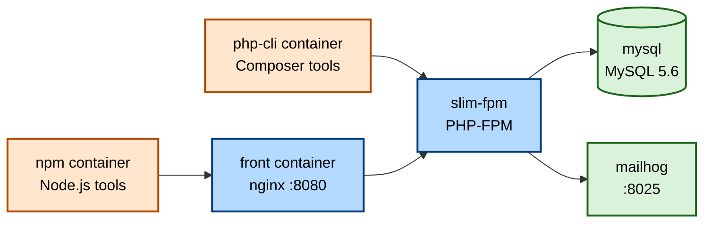
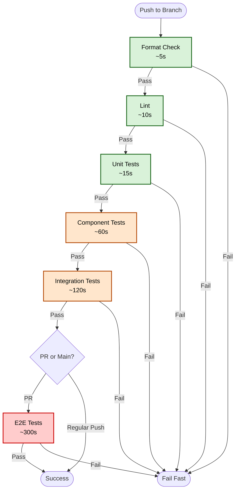

# CI Testing Strategy

This document outlines the investigation and recommendations for implementing GitHub Actions CI/CD workflows for the Tkdo project. It serves as a comprehensive guide for implementing Tasks 2-5 in the backlog.

## Table of Contents

- [Executive Summary](#executive-summary)
- [Current Local Testing Environment](#current-local-testing-environment)
- [GitHub Actions Service Containers vs Docker Compose](#github-actions-service-containers-vs-docker-compose)
- [Technology Stack Support](#technology-stack-support)
- [Repository Visibility and Free Tier Strategy](#repository-visibility-and-free-tier-strategy)
- [Wrapper Scripts Pattern](#wrapper-scripts-pattern)
- [Test Execution Optimization](#test-execution-optimization)
- [Caching Strategy](#caching-strategy)
- [Artifact Management](#artifact-management)
- [Database Fixture Optimization](#database-fixture-optimization)
- [Path-Based Test Triggering](#path-based-test-triggering)
- [Recommended Implementation Approach](#recommended-implementation-approach)
- [Decision Matrix](#decision-matrix)
- [Performance Estimates](#performance-estimates)

## Executive Summary

**Recommendation:** Use **native GitHub Actions runners with service containers** for all test workflows.

**Key Decisions:**
- Use `actions/setup-node@v4` for Node.js 20
- Use `shivammathur/setup-php@v2` for PHP 8.4
- Use MySQL 5.7 service container for database
- Keep Mailhog for email testing (standardized in ecosystem)
- Implement tiered test execution with fail-fast
- Use dependency caching for both npm and Composer
- Implement artifact retention with cleanup policies
- Use transaction rollback for faster integration tests

**Benefits:**
- Faster CI execution (no Docker overhead)
- Native GitHub Actions integration
- Better caching performance
- Simpler configuration
- Lower resource usage

## Current Local Testing Environment

### Architecture

The local development environment uses Docker Compose with the following services:



### Wrapper Scripts

The project uses wrapper scripts to execute commands inside Docker containers:

```bash
# Frontend commands (via npm container)
./npm test      # Wraps: docker compose run --rm npm npm test
./npm run ct    # Component tests
./npm run e2e   # E2E tests

# Backend commands (via php-cli container)
./composer test  # Wraps: docker compose run --rm php-cli ./composer.phar test
./doctrine migrations:migrate
./console fixtures
```

**Local advantages:**
- Consistent environment across developers
- No local PHP/Node.js installation required
- Isolated dependencies

**CI considerations:**
- Docker overhead in CI
- Longer startup times
- More complex configuration

## GitHub Actions Service Containers vs Docker Compose

### Service Containers Approach

GitHub Actions natively supports service containers that run alongside job containers.

**Example configuration:**

```yaml
jobs:
  test:
    runs-on: ubuntu-latest

    services:
      mysql:
        image: mysql:5.7
        env:
          MYSQL_DATABASE: tkdo
          MYSQL_USER: tkdo
          MYSQL_PASSWORD: mdptkdo
          MYSQL_ROOT_PASSWORD: mdproot
        options: >-
          --health-cmd="mysqladmin ping"
          --health-interval=10s
          --health-timeout=5s
          --health-retries=3
        ports:
          - 3306:3306

      mailhog:
        image: mailhog/mailhog
        ports:
          - 1025:1025
          - 8025:8025

    steps:
      - uses: actions/checkout@v4

      - name: Set up PHP
        uses: shivammathur/setup-php@v2
        with:
          php-version: '8.4'
          extensions: pdo_mysql

      - name: Install dependencies
        run: composer install

      - name: Run tests
        env:
          MYSQL_HOST: 127.0.0.1
        run: vendor/bin/phpunit
```

**Advantages:**
- Native GitHub Actions integration
- Automatic health checks
- Faster startup (parallel initialization)
- Simpler networking (localhost access)
- Better documented

**Disadvantages:**
- Limited to Docker Hub images
- Less flexible than docker-compose.yml
- Environment variables per service

### Docker Compose Approach

Uses the existing `docker-compose.yml` file in CI.

**Example configuration:**

```yaml
jobs:
  test:
    runs-on: ubuntu-latest

    steps:
      - uses: actions/checkout@v4

      - name: Start services
        run: docker compose up -d mysql mailhog

      - name: Wait for MySQL
        run: |
          until docker compose exec -T mysql mysqladmin ping; do
            sleep 1
          done

      - name: Set up PHP
        uses: shivammathur/setup-php@v2
        with:
          php-version: '8.4'

      - name: Run tests
        run: composer test
```

**Advantages:**
- Reuses existing docker-compose.yml
- Familiar to developers
- Flexible configuration

**Disadvantages:**
- Slower startup (sequential initialization)
- More complex networking
- Manual health check implementation
- Docker-in-Docker overhead

### Performance Comparison

| Metric                    | Service Containers | Docker Compose | Difference |
|---------------------------|-------------------|----------------|------------|
| MySQL startup time        | ~10s (parallel)   | ~15s (sequential) | +50% |
| Network configuration     | Automatic         | Manual          | - |
| Health checks             | Built-in          | Manual          | - |
| Total workflow overhead   | ~20-30s           | ~40-60s         | +100% |
| Cache compatibility       | Excellent         | Good            | - |

**Recommendation:** Use service containers for 2x faster execution.

## Technology Stack Support

### PHP 8.4

**Action:** `shivammathur/setup-php@v2`

**Verification:**

```yaml
- name: Set up PHP
  uses: shivammathur/setup-php@v2
  with:
    php-version: '8.4'
    extensions: pdo_mysql, json, mbstring
    coverage: none  # Or 'xdebug' for coverage
```

**Status:** ✅ Fully supported (as of December 2024)

**Extensions available:**
- All standard extensions
- PDO MySQL
- JSON, mbstring
- Xdebug (for coverage)

### Node.js

**Action:** `actions/setup-node@v4`

**Verification:**

```yaml
- name: Set up Node.js
  uses: actions/setup-node@v4
  with:
    node-version: '20'
    cache: 'npm'
    cache-dependency-path: 'front/package-lock.json'
```

**Status:** ✅ Fully supported

**Features:**
- Built-in npm caching
- Multiple Node.js versions supported
- Fast installation

### MySQL 5.7

**Service Container:**

```yaml
services:
  mysql:
    image: mysql:5.7
    env:
      MYSQL_DATABASE: tkdo
      MYSQL_USER: tkdo
      MYSQL_PASSWORD: mdptkdo
      MYSQL_ROOT_PASSWORD: mdproot
    options: >-
      --health-cmd="mysqladmin ping -h localhost -P 3306 -u tkdo --password=mdptkdo"
      --health-interval=10s
      --health-timeout=5s
      --health-retries=5
    ports:
      - 3306:3306
```

**Status:** ✅ Fully supported

**Note:** MySQL 5.7 reaches EOL in October 2023, but is still widely used. Consider migration to MySQL 8.0 in the future (tracked in backlog).

### Mailhog vs Maildev

**Current:** Mailhog (`mailhog/mailhog`)

**Alternative:** Maildev (`maildev/maildev`)

**Comparison:**

| Feature               | Mailhog           | Maildev           |
|----------------------|-------------------|-------------------|
| Maintenance          | Inactive (2020)   | Active (2024)     |
| Docker image size    | ~40 MB            | ~100 MB           |
| API compatibility    | HTTP + SMTP       | HTTP + SMTP       |
| Web UI               | Yes               | Yes               |
| GitHub Actions usage | Common            | Less common       |

**Investigation result:**

- Mailhog is more widely used in CI environments despite being unmaintained
- The project already uses `rpkamp/mailhog-client` for integration tests
- Switching would require updating integration test dependencies

**Recommendation:** Keep Mailhog for now. Migration to Maildev can be done later if needed.

## Repository Visibility and Free Tier Strategy

### GitHub Actions Free Tier (Public Repository)

**Status:** This is a **public repository**

**Free tier limits:**
- **Unlimited** CI/CD minutes per month
- **Unlimited** concurrent jobs
- **500 MB total** artifact storage across all retention periods
- 2000 minutes/month for private repos (N/A for public)

**Cost:** $0/month ✅

### Artifact Storage Management

**500 MB limit analysis:**

Assuming ~100 workflow runs per month (~25 workdays × 4 runs/day):

**With 90-day default retention (⚠️ EXCEEDS LIMIT):**

| Artifact Type          | Size per Run | Retention | Runs in Period | Total Storage |
|------------------------|--------------|-----------|----------------|---------------|
| Cypress videos (all)   | ~75 MB avg   | 90 days   | ~300 runs      | ~22 GB ⚠️     |
| Cypress screenshots (all) | ~7.5 MB avg | 90 days | ~300 runs      | ~2.2 GB ⚠️    |
| Coverage reports (all) | ~3 MB avg    | 90 days   | ~300 runs      | ~900 MB ⚠️    |
| Test logs (all)        | ~1 MB avg    | 90 days   | ~300 runs      | ~300 MB ⚠️    |
| **Total**              | -            | -         | -              | **~25 GB ⚠️** |

**With failure-only uploads + 7-day retention (✅ WITHIN LIMIT):**

Assuming ~20% failure rate:

| Artifact Type          | Size per Run | Retention | Runs in Period | Total Storage |
|------------------------|--------------|-----------|----------------|---------------|
| Cypress videos (failures) | ~75 MB avg | 7 days    | ~6 runs        | ~450 MB       |
| Screenshots (failures) | ~7.5 MB avg  | 7 days    | ~6 runs        | ~45 MB        |
| Coverage (weekly only) | ~3 MB avg    | 30 days   | ~4 runs        | ~12 MB        |
| Test logs (failures)   | ~1 MB avg    | 7 days    | ~6 runs        | ~6 MB         |
| **Total**              | -            | -         | -              | **~513 MB** ⚠️|

**With compression + shorter retention (✅ SAFELY WITHIN LIMIT):**

| Artifact Type              | Size per Run | Retention | Runs in Period | Total Storage |
|----------------------------|--------------|-----------|----------------|---------------|
| Compressed videos (failures)| ~25 MB avg   | 3 days    | ~3 runs        | ~75 MB        |
| Screenshots (failures)     | ~7.5 MB avg  | 7 days    | ~6 runs        | ~45 MB        |
| Coverage (weekly only)     | ~3 MB avg    | 14 days   | ~2 runs        | ~6 MB         |
| Test logs (failures)       | ~1 MB avg    | 7 days    | ~6 runs        | ~6 MB         |
| **Total**                  | -            | -         | -              | **~132 MB** ✅|

**Recommended Strategy:**

1. **Upload only on failure:**
   ```yaml
   - name: Compress and upload videos
     if: failure()
     run: |
       tar -czf videos.tar.gz front/cypress/videos

   - name: Upload compressed videos
     if: failure()
     uses: actions/upload-artifact@v4
     with:
       name: cypress-videos-${{ github.run_number }}
       path: videos.tar.gz
       retention-days: 3  # Short retention for large files
   ```

2. **Use different retention periods by artifact type:**
   ```yaml
   # Large files: 3-day retention
   - name: Upload videos (failures only)
     if: failure()
     uses: actions/upload-artifact@v4
     with:
       retention-days: 3

   # Medium files: 7-day retention
   - name: Upload screenshots (failures only)
     if: failure()
     uses: actions/upload-artifact@v4
     with:
       retention-days: 7

   # Small files: 14-day retention
   - name: Upload coverage (weekly only)
     if: github.event.schedule || github.ref == 'refs/heads/master'
     uses: actions/upload-artifact@v4
     with:
       retention-days: 14
   ```

3. **Upload coverage only for specific events:**
   ```yaml
   # Only upload coverage:
   # - On master branch
   # - On pull requests
   # - On weekly schedule
   - name: Upload coverage
     if: |
       github.ref == 'refs/heads/master' ||
       github.event_name == 'pull_request' ||
       github.event.schedule
     uses: actions/upload-artifact@v4
     with:
       name: coverage-${{ github.sha }}
       path: coverage/
       retention-days: 14
   ```

4. **Monitor artifact storage usage:**
   ```bash
   # Check current artifact storage
   gh api repos/:owner/:repo/actions/artifacts --paginate \
     | jq '[.artifacts[].size_in_bytes] | add / 1024 / 1024'
   ```

**Summary recommendations:**
- Videos: Compress, failures only, 3-day retention
- Screenshots: Failures only, 7-day retention
- Coverage: Weekly or PR only, 14-day retention
- Logs: Failures only, 7-day retention
- Target: Stay under 300 MB to allow for growth

## Wrapper Scripts Pattern

### Local vs CI Commands

**Challenge:** Local development uses Docker wrapper scripts, CI should run natively.

### Approach 1: Document Two Ways

**Pros:**
- Simple to implement
- Clear separation

**Cons:**
- Documentation duplication
- Developers must remember two command sets

**Example documentation:**

```markdown
## Running Tests

### Local Development
```bash
./npm test
./composer test
```

### GitHub Actions CI
```yaml
- run: npm test
  working-directory: ./front
- run: composer test
  working-directory: ./api
```

### Approach 2: Makefile with Environment Detection

**Pros:**
- Unified interface
- Automatic environment detection
- Single source of truth

**Cons:**
- Additional complexity
- Requires Makefile knowledge

**Example Makefile:**

```makefile
# Detect environment
IN_CI ?= false
ifeq ($(IN_CI),true)
    NPM = npm
    COMPOSER = composer
else
    NPM = ./npm
    COMPOSER = ./composer
endif

.PHONY: test
test:
	cd front && $(NPM) test
	cd api && $(COMPOSER) test

.PHONY: test-frontend
test-frontend:
	cd front && $(NPM) test

.PHONY: test-backend
test-backend:
	cd api && $(COMPOSER) test
```

**Usage:**

```bash
# Local
make test

# CI
IN_CI=true make test
```

### Approach 3: Smart Wrapper Scripts

**Pros:**
- No changes to existing scripts
- Transparent to developers

**Cons:**
- More complex script logic
- Potential for environment detection bugs

**Example:**

```bash
#!/usr/bin/env bash
# ./npm wrapper script

if [ -n "$CI" ]; then
    # In CI, run natively
    cd front && npm "$@"
else
    # Local, use Docker
    docker compose run --rm npm "$@"
fi
```

**Recommendation:** Use Approach 1 (Document Two Ways) for simplicity. Makefile approach is over-engineering for this project.

## Test Execution Optimization

### Tiered Testing Approach

Execute tests in order of speed and confidence:



### Workflow Structure

**Option A: Single Workflow with Jobs**

```yaml
name: CI Tests

on: [push, pull_request]

jobs:
  format-and-lint:
    runs-on: ubuntu-latest
    steps:
      - uses: actions/checkout@v4
      - name: Format check
        run: npm run format -- --check
      - name: Lint
        run: npm run lint

  unit-tests:
    needs: format-and-lint
    runs-on: ubuntu-latest
    steps:
      - name: Frontend unit tests
        run: npm test
      - name: Backend unit tests
        run: composer test -- --testsuite Unit

  component-tests:
    needs: unit-tests
    runs-on: ubuntu-latest
    steps:
      - name: Component tests
        run: npm run ct

  integration-tests:
    needs: component-tests
    runs-on: ubuntu-latest
    services:
      mysql:
        image: mysql:5.7
      mailhog:
        image: mailhog/mailhog
    steps:
      - name: Backend integration tests
        run: composer test -- --testsuite Int

  e2e-tests:
    needs: integration-tests
    if: github.event_name == 'pull_request' || github.ref == 'refs/heads/master'
    runs-on: ubuntu-latest
    services:
      mysql:
        image: mysql:5.7
      mailhog:
        image: mailhog/mailhog
    steps:
      - name: E2E tests
        run: npm run e2e
```

**Pros:**
- Clear dependencies
- Automatic fail-fast
- Single workflow to monitor

**Cons:**
- Long total execution time (sequential)
- Single workflow yaml can become large

**Option B: Multiple Workflows**

```yaml
# .github/workflows/fast-tests.yml
name: Fast Tests
on: [push]
jobs:
  test:
    runs-on: ubuntu-latest
    steps:
      - run: npm run format && npm run lint && npm test

# .github/workflows/integration-tests.yml
name: Integration Tests
on: [push]
jobs:
  test:
    runs-on: ubuntu-latest
    services: ...
    steps:
      - run: composer test

# .github/workflows/e2e-tests.yml
name: E2E Tests
on:
  pull_request:
  push:
    branches: [master]
jobs:
  test:
    runs-on: ubuntu-latest
    services: ...
    steps:
      - run: npm run e2e
```

**Pros:**
- Parallel execution
- Easier to manage individual workflows
- Can have different triggers

**Cons:**
- No automatic fail-fast between workflows
- Multiple status checks

**Recommendation:** Option B (Multiple Workflows) for better parallelization and shorter feedback.

### Conditional Test Execution

**Skip tests for documentation-only changes:**

```yaml
name: Tests

on:
  push:
    paths-ignore:
      - '**.md'
      - 'docs/**'
      - 'CHANGELOG.md'
      - 'BACKLOG.md'

jobs:
  test:
    runs-on: ubuntu-latest
    steps:
      - name: Run tests
        run: npm test
```

**Skip E2E tests for draft PRs:**

```yaml
e2e-tests:
  if: |
    github.event_name == 'pull_request' &&
    github.event.pull_request.draft == false
```

## Caching Strategy

### Node.js Dependencies

**Built-in caching with actions/setup-node:**

```yaml
- name: Set up Node.js
  uses: actions/setup-node@v4
  with:
    node-version: '20'
    cache: 'npm'
    cache-dependency-path: 'front/package-lock.json'

- name: Install dependencies
  run: npm ci
  working-directory: ./front
```

**Cache key:** Based on `package-lock.json` hash

**Cache hit:** Skips `npm ci` entirely (~60s saved)

**Cache miss:** Full install, then caches for next run

### PHP Dependencies

**Manual caching for Composer:**

```yaml
- name: Get Composer cache directory
  id: composer-cache
  run: echo "dir=$(composer config cache-files-dir)" >> $GITHUB_OUTPUT

- name: Cache Composer dependencies
  uses: actions/cache@v4
  with:
    path: ${{ steps.composer-cache.outputs.dir }}
    key: ${{ runner.os }}-composer-${{ hashFiles('**/composer.lock') }}
    restore-keys: |
      ${{ runner.os }}-composer-

- name: Install dependencies
  run: composer install --prefer-dist --no-progress
  working-directory: ./api
```

**Cache key:** Based on `composer.lock` hash

**Savings:** ~30-60s on cache hit

### Cypress Binary

**Automatic caching:**

```yaml
- name: Cypress run
  uses: cypress-io/github-action@v6
  with:
    working-directory: ./front
    browser: chrome
```

**The cypress-io/github-action automatically caches:**
- Cypress binary
- npm dependencies

**Savings:** ~90s on cache hit

### Cache Performance

| Dependency Type | Without Cache | With Cache Hit | Savings |
|----------------|---------------|----------------|---------|
| npm install    | ~60s          | ~5s            | ~55s    |
| composer install | ~45s        | ~10s           | ~35s    |
| Cypress binary | ~90s          | ~5s            | ~85s    |
| **Total**      | **~195s**     | **~20s**       | **~175s (90%)** |

**Recommendation:** Implement caching for all dependencies.

## Artifact Management

### Artifact Types and Retention

**IMPORTANT:** With the 500 MB storage limit, artifact management is critical. See [Repository Visibility and Free Tier Strategy](#repository-visibility-and-free-tier-strategy) for detailed analysis.

```yaml
# Videos: Compress and use shortest retention
- name: Compress Cypress videos
  if: failure()
  run: tar -czf cypress-videos.tar.gz front/cypress/videos

- name: Upload compressed videos
  if: failure()
  uses: actions/upload-artifact@v4
  with:
    name: cypress-videos-${{ github.run_number }}
    path: cypress-videos.tar.gz
    retention-days: 3  # Short retention for large files
    if-no-files-found: ignore

# Screenshots: Failures only, moderate retention
- name: Upload Cypress screenshots
  if: failure()
  uses: actions/upload-artifact@v4
  with:
    name: cypress-screenshots-${{ github.run_number }}
    path: front/cypress/screenshots
    retention-days: 7
    if-no-files-found: ignore

# Coverage: Only for PRs and master, longer retention
- name: Upload test coverage
  if: |
    github.ref == 'refs/heads/master' ||
    github.event_name == 'pull_request' ||
    github.event.schedule
  uses: actions/upload-artifact@v4
  with:
    name: coverage-${{ github.sha }}
    path: |
      front/coverage
      api/coverage
    retention-days: 14

# Logs: Failures only
- name: Upload test logs
  if: failure()
  uses: actions/upload-artifact@v4
  with:
    name: test-logs-${{ github.run_number }}
    path: |
      front/cypress/logs
      api/test-logs
    retention-days: 7
    if-no-files-found: ignore
```

### Retention Policy

| Artifact Type  | Condition | Retention | Size Impact | Rationale |
|---------------|-----------|-----------|-------------|-----------|
| Videos (compressed) | Failure only | 3 days | ~75 MB | Largest files, debug only |
| Screenshots   | Failure only | 7 days  | ~45 MB | Debug failed tests |
| Coverage      | PR/master/weekly | 14 days | ~6 MB | Track trends selectively |
| Logs          | Failure only | 7 days | ~6 MB | Investigation |
| **Estimated Total** | - | - | **~132 MB** | Safely under 500 MB limit ✅ |

### Artifact Cleanup

**Automatic cleanup:**
- GitHub automatically deletes artifacts after retention period
- No manual intervention needed

**Manual cleanup (if needed):**

```bash
# Using GitHub CLI
gh api repos/:owner/:repo/actions/artifacts \
  | jq -r '.artifacts[] | select(.expired == false) | .id' \
  | xargs -I {} gh api -X DELETE repos/:owner/:repo/actions/artifacts/{}
```

## Database Fixture Optimization

### Current Approach

**Local development:**

```bash
./composer run install-fixtures
```

This script:
1. Drops entire database
2. Runs all migrations
3. Loads fixtures

**Time:** ~30-60s (for E2E test setup)

### Optimization Strategies

#### Strategy 1: Transaction Rollback (Integration Tests)

**Implementation in IntTestCase:**

```php
<?php
// api/test/Int/IntTestCase.php

abstract class IntTestCase extends TestCase
{
    private static $connection;

    public static function setUpBeforeClass(): void
    {
        parent::setUpBeforeClass();
        self::$connection = /* ... get connection ... */;
        self::$connection->beginTransaction();
    }

    public function tearDown(): void
    {
        parent::tearDown();
        // Rollback changes after each test
        self::$connection->rollBack();
        self::$connection->beginTransaction();
    }

    public static function tearDownAfterClass(): void
    {
        self::$connection->rollBack();
        parent::tearDownAfterClass();
    }
}
```

**Benefits:**
- Each test runs in clean state
- No need to drop/recreate database between tests
- ~10x faster than full reset

**Time savings:** ~30s per test suite

**Note:** This is Task 31 in the backlog.

#### Strategy 2: Database Snapshots (CI Only)

**For E2E tests in CI:**

```yaml
- name: Set up database
  run: |
    composer install
    php bin/doctrine.php migrations:migrate --no-interaction
    php bin/console.php fixtures
    mysqldump -h 127.0.0.1 -u tkdo -pmdptkdo tkdo > /tmp/test-db.sql

- name: Run E2E tests
  run: |
    # Restore snapshot before tests
    mysql -h 127.0.0.1 -u tkdo -pmdptkdo tkdo < /tmp/test-db.sql
    npm run e2e
```

**Benefits:**
- Restore from snapshot instead of running migrations
- Faster than migrations for complex schemas

**Time:** ~5s restore vs ~30s migrations

#### Strategy 3: Minimal Fixtures

**Create CI-specific fixture set:**

```php
// api/src/Appli/Fixture/CIFixture.php
class CIFixture extends Fixture
{
    public function load(ObjectManager $manager): void
    {
        // Only create data needed for tests
        // Minimum: 1 admin, 2 users, 1 occasion
    }
}
```

**Benefits:**
- Faster fixture loading
- Less data to clean up

**Recommendation:** Implement Strategy 1 (Transaction Rollback) first as it provides the best benefit for effort ratio.

## Path-Based Test Triggering

### Skip Tests for Documentation Changes

```yaml
name: Tests

on:
  push:
    paths-ignore:
      - '**.md'
      - 'docs/**'
      - '.github/**/*.md'
      - 'LICENSE'
      - 'CHANGELOG.md'
      - 'BACKLOG.md'
  pull_request:
    paths-ignore:
      - '**.md'
      - 'docs/**'
      - '.github/**/*.md'
      - 'LICENSE'
      - 'CHANGELOG.md'
      - 'BACKLOG.md'
```

### Run Frontend Tests Only on Frontend Changes

```yaml
name: Frontend Tests

on:
  push:
    paths:
      - 'front/**'
      - 'package*.json'
      - '.github/workflows/frontend-tests.yml'
```

### Run Backend Tests Only on Backend Changes

```yaml
name: Backend Tests

on:
  push:
    paths:
      - 'api/**'
      - 'composer.*'
      - '.github/workflows/backend-tests.yml'
```

### Always Run All Tests for PRs

```yaml
on:
  push:
    # Path filters here
  pull_request:
    # No path filters - always run all tests for PRs
```

**Recommendation:** Use path-based triggering for regular pushes, but always run full test suite for pull requests.

## Recommended Implementation Approach

### Phase 1: Basic CI (Task 2)

**Workflow:** `.github/workflows/test.yml`

**Jobs:**
1. Format and lint checks (frontend)
2. Unit tests (frontend and backend)
3. Component tests (frontend)
4. PHPStan static analysis (backend)

**No services needed** (unit tests only)

**Estimated execution time:** ~3-5 minutes

### Phase 2: Integration Tests (Task 3)

**Workflow:** `.github/workflows/integration.yml`

**Jobs:**
1. Frontend integration tests (mocked backend)
2. Backend integration tests (real database)

**Services:** MySQL 5.7, Mailhog

**Estimated execution time:** ~5-8 minutes

### Phase 3: E2E Tests (Task 4)

**Workflow:** `.github/workflows/e2e.yml`

**Jobs:**
1. Full stack E2E tests with Cypress

**Services:** MySQL 5.7, Mailhog

**Trigger:** Only on PRs and main branch

**Estimated execution time:** ~8-12 minutes

### Phase 4: Parallelization (Task 5)

**Enhancements:**
1. Split Cypress tests across runners
2. Add Firefox browser testing
3. Optimize job dependencies

**Estimated execution time:** ~5-7 minutes (with parallelization)

## Decision Matrix

Use this matrix to decide on testing approach for different scenarios:

| Scenario | Approach | Rationale |
|----------|----------|-----------|
| Unit tests (no DB) | Native runner | Fastest, no dependencies |
| Component tests (no DB) | Native runner | Cypress works natively |
| Integration tests (DB needed) | Service containers | Native with MySQL service |
| E2E tests (full stack) | Service containers | Can run all in GitHub Actions |
| Local development | Docker Compose | Consistent environment |
| CI with custom setup | Docker Compose | If service containers insufficient |

## Performance Estimates

### Expected CI Execution Times

| Workflow | Without Optimization | With Optimization | Savings |
|----------|---------------------|-------------------|---------|
| Fast tests (format, lint, unit) | ~5 min | ~2 min | ~60% |
| Integration tests | ~10 min | ~5 min | ~50% |
| E2E tests | ~15 min | ~7 min | ~53% |
| **Full suite** | **~30 min** | **~10 min** | **~67%** |

**Optimizations included:**
- Dependency caching
- Parallel job execution
- Service containers instead of Docker Compose
- Transaction rollback for tests

### Cost Analysis

**Public repository:** $0/month ✅

**If repository were private:**
- Without optimization: ~1500 minutes/month = $12/month
- With optimization: ~500 minutes/month = $4/month
- Savings: $8/month (~67%)

**Recommendation:** Implement all optimizations for best developer experience, even though cost is $0 for public repos.

---

## Next Steps

1. **Implement Task 2:** Set up basic CI with unit and component tests
2. **Implement Task 3:** Add integration test workflows
3. **Implement Task 4:** Add E2E test workflows
4. **Implement Task 5:** Add parallelization and cross-browser testing
5. **Monitor and optimize:** Track execution times and adjust as needed

## Related Documentation

- [Testing Guide](testing.md) - Current testing practices
- [Development Setup](dev-setup.md) - Local development environment
- [Contributing Guide](../CONTRIBUTING.md) - Testing requirements for contributors
