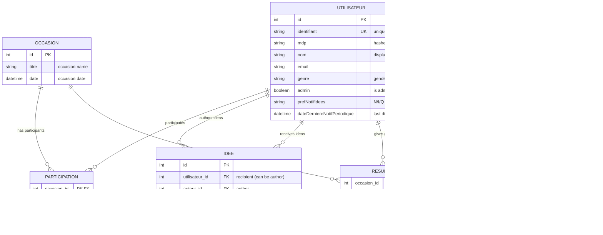

# Database Documentation

This guide provides comprehensive documentation for the Tkdo database schema, entities, and operations.

## Table of Contents

- [Database Overview](#database-overview)
- [Entity Relationship Diagram](#entity-relationship-diagram)
- [Database Schema](#database-schema)
- [Entity Descriptions](#entity-descriptions)
- [Understanding Soft Deletes](#understanding-soft-deletes)
- [Database Operations](#database-operations)
- [Migration Workflow](#migration-workflow)
- [Doctrine Proxy Generation](#doctrine-proxy-generation)
- [Database Initialization](#database-initialization)
- [Common Database Tasks](#common-database-tasks)

## Database Overview

Tkdo uses **MySQL 5.7+** as its relational database management system with **Doctrine ORM 2.17+** for object-relational mapping.

### Key Characteristics

- **Relational Model**: Normalized schema with foreign key constraints
- **UTF-8 Encoding**: All tables use `utf8` character set with `utf8_unicode_ci` collation
- **InnoDB Engine**: ACID-compliant transactions with foreign key support
- **Doctrine Migrations**: Version-controlled schema changes
- **Soft Deletes**: Gift ideas are marked as deleted but preserved in the database
- **Composite Keys**: Some entities use composite primary keys (Resultat, Exclusion)

### Database Tables

| Table                              | Description                                  | Records                     |
|------------------------------------|----------------------------------------------|-----------------------------|
| `tkdo_utilisateur`                 | User accounts                                | Users and administrators    |
| `tkdo_occasion`                    | Events/occasions for gift exchanges          | Birthdays, holidays, etc.   |
| `tkdo_participation`               | Many-to-many: users ↔ occasions              | Participation relationships |
| `tkdo_idee`                        | Gift ideas                                   | Suggested gifts             |
| `tkdo_resultat`                    | Draw results (who gives to whom)             | Draw assignments            |
| `tkdo_exclusion`                   | User exclusions for draws                    | Couples, siblings, etc.     |
| `tkdo_doctrine_migration_versions` | Migration tracking (managed by Doctrine)     | Applied migrations          |

## Entity Relationship Diagram



## Database Schema

### Table: `tkdo_utilisateur`

User accounts for the application.

```sql
CREATE TABLE tkdo_utilisateur (
    id INT AUTO_INCREMENT PRIMARY KEY,
    identifiant VARCHAR(255) NOT NULL UNIQUE,
    mdp VARCHAR(255) NOT NULL,
    nom VARCHAR(255) NOT NULL,
    email VARCHAR(255) NOT NULL,
    genre VARCHAR(255) NOT NULL,
    admin BOOLEAN NOT NULL DEFAULT 0,
    prefNotifIdees VARCHAR(255) NOT NULL DEFAULT 'aucune',
    dateDerniereNotifPeriodique DATETIME NOT NULL,
    INDEX idx_identifiant (identifiant)
) ENGINE=InnoDB DEFAULT CHARSET=utf8 COLLATE=utf8_unicode_ci;
```

**Indexes:**
- Primary key on `id`
- Unique index on `identifiant`

### Table: `tkdo_occasion`

Events or occasions for gift exchanges.

```sql
CREATE TABLE tkdo_occasion (
    id INT AUTO_INCREMENT PRIMARY KEY,
    titre VARCHAR(255) NOT NULL,
    date DATETIME NOT NULL
) ENGINE=InnoDB DEFAULT CHARSET=utf8 COLLATE=utf8_unicode_ci;
```

**Indexes:**
- Primary key on `id`

### Table: `tkdo_participation`

Many-to-many relationship between users and occasions.

```sql
CREATE TABLE tkdo_participation (
    occasion_id INT NOT NULL,
    utilisateur_id INT NOT NULL,
    PRIMARY KEY (occasion_id, utilisateur_id),
    FOREIGN KEY (occasion_id) REFERENCES tkdo_occasion(id) ON DELETE CASCADE,
    FOREIGN KEY (utilisateur_id) REFERENCES tkdo_utilisateur(id) ON DELETE CASCADE,
    INDEX idx_occasion (occasion_id),
    INDEX idx_utilisateur (utilisateur_id)
) ENGINE=InnoDB DEFAULT CHARSET=utf8 COLLATE=utf8_unicode_ci;
```

**Indexes:**
- Composite primary key on `(occasion_id, utilisateur_id)`
- Index on `occasion_id`
- Index on `utilisateur_id`

**Constraints:**
- Cascade delete: when an occasion or user is deleted, participation records are automatically removed

### Table: `tkdo_idee`

Gift ideas suggested by users for other users.

```sql
CREATE TABLE tkdo_idee (
    id INT AUTO_INCREMENT PRIMARY KEY,
    utilisateur_id INT NOT NULL,
    auteur_id INT NOT NULL,
    description VARCHAR(255) NOT NULL,
    dateProposition DATETIME NOT NULL,
    dateSuppression DATETIME NULL,
    FOREIGN KEY (utilisateur_id) REFERENCES tkdo_utilisateur(id),
    FOREIGN KEY (auteur_id) REFERENCES tkdo_utilisateur(id),
    INDEX idx_utilisateur (utilisateur_id),
    INDEX idx_auteur (auteur_id),
    INDEX idx_dateSuppression (dateSuppression)
) ENGINE=InnoDB DEFAULT CHARSET=utf8 COLLATE=utf8_unicode_ci;
```

**Indexes:**
- Primary key on `id`
- Index on `utilisateur_id` (recipient)
- Index on `auteur_id` (author)
- Index on `dateSuppression` (for filtering soft-deleted ideas)

**Special Feature:**
- **Soft Deletes**: `dateSuppression` is NULL for active ideas, set to deletion timestamp when deleted

### Table: `tkdo_resultat`

Draw results indicating who should give a gift to whom.

```sql
CREATE TABLE tkdo_resultat (
    occasion_id INT NOT NULL,
    quiOffre_id INT NOT NULL,
    quiRecoit_id INT NOT NULL,
    PRIMARY KEY (occasion_id, quiOffre_id),
    UNIQUE KEY unique_quiRecoit_idx (occasion_id, quiRecoit_id),
    FOREIGN KEY (occasion_id) REFERENCES tkdo_occasion(id),
    FOREIGN KEY (quiOffre_id) REFERENCES tkdo_utilisateur(id),
    FOREIGN KEY (quiRecoit_id) REFERENCES tkdo_utilisateur(id),
    INDEX idx_occasion (occasion_id),
    INDEX idx_quiOffre (quiOffre_id),
    INDEX idx_quiRecoit (quiRecoit_id)
) ENGINE=InnoDB DEFAULT CHARSET=utf8 COLLATE=utf8_unicode_ci;
```

**Indexes:**
- Composite primary key on `(occasion_id, quiOffre_id)`
- Unique constraint on `(occasion_id, quiRecoit_id)` - each person can only receive from one person per occasion
- Indexes on all foreign keys

**Constraints:**
- Each giver can only give to one person per occasion (primary key)
- Each receiver can only receive from one person per occasion (unique constraint)

### Table: `tkdo_exclusion`

Exclusion rules preventing certain users from being matched together in draws.

```sql
CREATE TABLE tkdo_exclusion (
    quiOffre_id INT NOT NULL,
    quiNeDoitPasRecevoir_id INT NOT NULL,
    PRIMARY KEY (quiOffre_id, quiNeDoitPasRecevoir_id),
    FOREIGN KEY (quiOffre_id) REFERENCES tkdo_utilisateur(id),
    FOREIGN KEY (quiNeDoitPasRecevoir_id) REFERENCES tkdo_utilisateur(id),
    INDEX idx_quiOffre (quiOffre_id),
    INDEX idx_quiNeDoitPasRecevoir (quiNeDoitPasRecevoir_id)
) ENGINE=InnoDB DEFAULT CHARSET=utf8 COLLATE=utf8_unicode_ci;
```

**Indexes:**
- Composite primary key on `(quiOffre_id, quiNeDoitPasRecevoir_id)`
- Indexes on both foreign keys

**Use Cases:**
- Prevent spouses from drawing each other
- Prevent siblings from drawing each other
- Custom exclusion rules based on user preferences

## Entity Descriptions

### Utilisateur (User)

Represents a user account in the application.

**Doctrine Entity:** `App\Appli\ModelAdaptor\UtilisateurAdaptor`

**Domain Interface:** `App\Dom\Model\Utilisateur`

**Fields:**

| Field                          | Type     | Nullable | Description                                                |
|--------------------------------|----------|----------|------------------------------------------------------------|
| `id`                           | int      | No       | Primary key (auto-generated)                               |
| `identifiant`                  | string   | No       | Unique username for login                                  |
| `mdp`                          | string   | No       | Hashed password (using `PASSWORD_DEFAULT`)                 |
| `nom`                          | string   | No       | Display name                                               |
| `email`                        | string   | No       | Email address for notifications                            |
| `genre`                        | string   | No       | Gender (M for Masculin/F for Feminin) - used for notifications |
| `admin`                        | boolean  | No       | Administrator flag (default: false)                        |
| `prefNotifIdees`               | string   | No       | Notification preference: 'N', 'I', or 'Q' (default: 'N')  |
| `dateDerniereNotifPeriodique`  | DateTime | No       | Timestamp of last daily digest notification                |

**Relationships:**
- **occasions** (Many-to-Many): Occasions the user participates in
- **ideas_authored**: Gift ideas the user has suggested for others
- **ideas_received**: Gift ideas others have suggested for the user
- **draw_results_giver**: Draw results where the user is the giver
- **draw_results_receiver**: Draw results where the user is the receiver
- **exclusions_as_giver**: Exclusions where the user cannot give to certain people
- **exclusions_as_excluded**: Exclusions where certain people cannot give to the user

**Notification Preferences (prefNotifIdees):**
- `'N'` (Aucune) - No notifications for gift ideas
- `'Q'` (Quotidienne) - Daily digest of gift ideas
- `'I'` (Instantanee) - Instant notification for each gift idea

**Special Methods:**
- `setMdpClair(string $mdpClair)` - Sets password and automatically hashes it
- `verifieMdp(string $mdpClair)` - Verifies a plain-text password against the hash
- `estUtilisateur(Utilisateur $utilisateur)` - Checks if this is the same user

### Occasion

Represents an event or occasion for gift exchanges.

**Doctrine Entity:** `App\Appli\ModelAdaptor\OccasionAdaptor`

**Domain Interface:** `App\Dom\Model\Occasion`

**Fields:**

| Field   | Type     | Nullable | Description                                    |
|---------|----------|----------|------------------------------------------------|
| `id`    | int      | No       | Primary key (auto-generated)                   |
| `titre` | string   | No       | Occasion name (e.g., "Christmas 2025")         |
| `date`  | DateTime | No       | Occasion date                                  |

**Relationships:**
- **participants** (Many-to-Many): Users participating in this occasion
- **results**: Draw results for this occasion

**Special Methods:**
- `addParticipant(Utilisateur $participant)` - Adds a participant to the occasion

### Idee (Gift Idea)

Represents a gift idea suggested by one user for another user (or for themselves).

**Doctrine Entity:** `App\Appli\ModelAdaptor\IdeeAdaptor`

**Domain Interface:** `App\Dom\Model\Idee`

**Fields:**

| Field              | Type        | Nullable | Description                                          |
|--------------------|-------------|----------|------------------------------------------------------|
| `id`               | int         | No       | Primary key (auto-generated)                         |
| `utilisateur_id`   | Utilisateur | No       | Recipient (who the idea is for - can be same as author) |
| `auteur_id`        | Utilisateur | No       | Author (who suggested the idea)                      |
| `description`      | string      | No       | Gift idea description                                |
| `dateProposition`  | DateTime    | No       | Creation timestamp                                   |
| `dateSuppression`  | DateTime    | Yes      | Deletion timestamp (NULL if active, set if deleted)  |

**Relationships:**
- **utilisateur** (Many-to-One): The recipient user
- **auteur** (Many-to-One): The author user

**Special Methods:**
- `hasDateSuppression()` - Returns true if the idea has been soft-deleted
- `setDateSuppression(DateTime $dateSuppression)` - Marks the idea as deleted

**Business Rules:**
- Users can suggest gift ideas for themselves or for others
- Users cannot see ideas others suggested for them (enforced in the Port layer)
- Users can see and delete their own ideas (including ideas they suggested for themselves)
- Ideas are soft-deleted (preserved in database) to maintain history

### Resultat (Draw Result)

Represents a draw result indicating who should give a gift to whom.

**Doctrine Entity:** `App\Appli\ModelAdaptor\ResultatAdaptor`

**Domain Interface:** `App\Dom\Model\Resultat`

**Fields:**

| Field         | Type        | Nullable | Description                        |
|---------------|-------------|----------|------------------------------------|
| `occasion_id` | Occasion    | No       | Occasion (part of composite PK)    |
| `quiOffre_id` | Utilisateur | No       | Giver (part of composite PK)       |
| `quiRecoit_id`| Utilisateur | No       | Receiver                           |

**Relationships:**
- **occasion** (Many-to-One): The occasion this result belongs to
- **quiOffre** (Many-to-One): The user who will give a gift
- **quiRecoit** (Many-to-One): The user who will receive a gift

**Composite Primary Key:**
- `(occasion_id, quiOffre_id)` - Each giver can only give to one person per occasion

**Unique Constraint:**
- `(occasion_id, quiRecoit_id)` - Each receiver can only receive from one person per occasion

**Business Rules:**
- Draw results respect exclusion rules
- Users can see who they should give to, but not who will give to them
- Draw algorithm ensures valid assignments (everyone gives to exactly one person, everyone receives from exactly one person)

### Exclusion

Represents an exclusion rule preventing two users from being matched in a draw.

**Doctrine Entity:** `App\Appli\ModelAdaptor\ExclusionAdaptor`

**Domain Interface:** `App\Dom\Model\Exclusion`

**Fields:**

| Field                        | Type        | Nullable | Description                              |
|------------------------------|-------------|----------|------------------------------------------|
| `quiOffre_id`                | Utilisateur | No       | Giver (part of composite PK)             |
| `quiNeDoitPasRecevoir_id`    | Utilisateur | No       | Excluded receiver (part of composite PK) |

**Relationships:**
- **quiOffre** (Many-to-One): The user who cannot give to the excluded person
- **quiNeDoitPasRecevoir** (Many-to-One): The user who cannot receive from the giver

**Composite Primary Key:**
- `(quiOffre_id, quiNeDoitPasRecevoir_id)` - Unique exclusion pair

**Use Cases:**
- Couples: Alice cannot draw Bob (and vice versa)
- Siblings: Charlie cannot draw David
- Custom rules based on user preferences

**Business Rules:**
- Exclusions are bidirectional in practice (if A excludes B, typically B excludes A)
- Draw algorithm must respect all exclusions when generating results
- Exclusions apply across all occasions

## Understanding Soft Deletes

Gift ideas use **soft deletes** - they are marked as deleted but remain in the database for historical purposes.

### Why Soft Deletes?

1. **Audit Trail**: Maintain a history of all gift ideas ever suggested
2. **Data Integrity**: Preserve relationships and references
3. **User Experience**: Allow "undelete" functionality (not currently implemented)
4. **Notifications**: Track what ideas were suggested before deletion

### Implementation

The `tkdo_idee` table has a `dateSuppression` column:

```php
// IdeeAdaptor.php
/**
 * @Column(type="datetime", nullable=true)
 */
private $dateSuppression;

public function hasDateSuppression(): bool
{
    return isset($this->dateSuppression);
}

public function setDateSuppression(DateTime $dateSuppression): Idee
{
    $this->dateSuppression = $dateSuppression;
    return $this;
}
```

### Querying Active Ideas

Always filter out soft-deleted ideas when querying:

```php
// Good: Filter out deleted ideas
$qb->select('i')
   ->from(IdeeAdaptor::class, 'i')
   ->where('i.dateSuppression IS NULL');

// Bad: Returns all ideas including deleted ones
$qb->select('i')
   ->from(IdeeAdaptor::class, 'i');
```

### Deleting an Idea

To delete an idea, set the `dateSuppression` timestamp:

```php
$idee->setDateSuppression(new DateTime());
$entityManager->flush();
```

### Database-Level Considerations

- Soft-deleted ideas still count toward storage
- Index on `dateSuppression` improves query performance
- Consider periodic cleanup of very old soft-deleted ideas (not currently implemented)

## Database Operations

### Connecting to the Database

#### Development (Docker)

```bash
# Connect to MySQL
docker compose exec mysql mysql -u tkdo -pmdptkdo tkdo

# Show tables
SHOW TABLES;

# Query users
SELECT id, identifiant, nom, admin FROM tkdo_utilisateur;

# Query occasions
SELECT id, titre, date FROM tkdo_occasion;
```

#### Production

Connection details are configured in `api/.env.prod`:

```bash
MYSQL_HOST=127.0.0.1
MYSQL_PORT=3306
MYSQL_DATABASE=tkdo
MYSQL_USER=tkdo
MYSQL_PASSWORD=your_password_here
```

### Database Backup

#### Using mysqldump

```bash
# Full backup
mysqldump -u tkdo -p tkdo > tkdo_backup_$(date +%Y%m%d).sql

# Backup with Docker
docker compose exec mysql mysqldump -u tkdo -pmdptkdo tkdo > tkdo_backup_$(date +%Y%m%d).sql

# Restore backup
mysql -u tkdo -p tkdo < tkdo_backup_20251209.sql
```

#### Recommended Backup Strategy

- **Frequency**: Daily automated backups
- **Retention**: Keep last 7 daily, 4 weekly, 12 monthly backups
- **Location**: Off-site storage (separate from application server)
- **Testing**: Regularly test restore procedures

## Migration Workflow

Tkdo uses **Doctrine Migrations** for version-controlled database schema changes.

### Migration Structure

Migrations are PHP classes in `api/src/Infra/Migrations/`:

```php
<?php

declare(strict_types=1);

namespace App\Infra\Migrations;

use Doctrine\DBAL\Schema\Schema;
use Doctrine\Migrations\AbstractMigration;

final class Version20201025220841 extends AbstractMigration
{
    public function getDescription(): string
    {
        return 'Version initiale';
    }

    public function up(Schema $schema): void
    {
        $this->addSql('CREATE TABLE tkdo_utilisateur (...)');
        // More SQL statements...
    }

    public function down(Schema $schema): void
    {
        $this->addSql('DROP TABLE tkdo_utilisateur');
        // Rollback SQL statements...
    }
}
```

### Creating a New Migration

#### Step 1: Modify Entities

Make changes to Doctrine entity annotations:

```php
// Add new field to UtilisateurAdaptor
/**
 * @Column(nullable=true)
 */
private $telephone;
```

#### Step 2: Clear Doctrine Cache

```bash
# From project root
./doctrine orm:clear-cache:metadata
./doctrine orm:clear-cache:query
./doctrine orm:clear-cache:result

# Or clear cache directory
rm -rf api/var/doctrine/cache/*
```

#### Step 3: Generate Migration

```bash
# From project root (uses Docker via composer)
./doctrine migrations:diff
```

This generates a new migration file like `Version20251209143000.php`.

#### Step 4: Review and Edit Migration

**IMPORTANT**: Always review the generated migration before applying it!

```bash
# View the generated migration
cat api/src/Infra/Migrations/Version20251209143000.php
```

Check for:
- Correct column types and constraints
- Proper indexes
- Foreign key relationships
- Data migration needs (if modifying existing data)

Edit the migration if needed:

```php
public function up(Schema $schema): void
{
    // Generated SQL
    $this->addSql('ALTER TABLE tkdo_utilisateur ADD telephone VARCHAR(255) DEFAULT NULL');

    // Add custom data migration if needed
    $this->addSql('UPDATE tkdo_utilisateur SET telephone = \'\' WHERE telephone IS NULL');
}
```

#### Step 5: Test Migration

```bash
# From project root - check migration status
./doctrine migrations:status

# Execute migration (dry-run first)
./doctrine migrations:migrate --dry-run

# Apply migration
./doctrine migrations:migrate
```

#### Step 6: Update Fixtures (if needed)

If you added required fields, update fixtures:

```php
// api/src/Appli/Fixture/UtilisateurFixture.php
$utilisateur->setTelephone('555-0100');
```

### Running Migrations

#### Check Migration Status

```bash
./doctrine migrations:status
```

Output:
```
+----------------------+----------------------+--------+
| Configuration        | Value                |        |
+----------------------+----------------------+--------+
| Storage              | Table Storage        |        |
| Database             | tkdo                 |        |
| Executed Migrations  | 12                   |        |
| Available Migrations | 12                   |        |
| New Migrations       | 0                    |        |
+----------------------+----------------------+--------+
```

#### Execute Pending Migrations

```bash
# From project root (interactive confirmation)
./doctrine migrations:migrate

# Non-interactive (for scripts)
./doctrine migrations:migrate --no-interaction

# Dry run (see SQL without executing)
./doctrine migrations:migrate --dry-run
```

#### Execute Specific Migration

```bash
# From project root - Migrate up to specific version
./doctrine migrations:migrate Version20201025220841

# Execute specific migration (up)
./doctrine migrations:execute --up Version20201025220841

# Rollback specific migration (down)
./doctrine migrations:execute --down Version20201025220841
```

### Migration Rollback

Migrations support rollback via the `down()` method. Each migration has both `up()` and `down()` methods:

```php
public function up(Schema $schema): void
{
    // Forward migration
    $this->addSql('ALTER TABLE tkdo_utilisateur ADD telephone VARCHAR(255)');
}

public function down(Schema $schema): void
{
    // Rollback migration
    $this->addSql('ALTER TABLE tkdo_utilisateur DROP telephone');
}
```

#### Rolling Back Migrations

```bash
# Rollback to a specific version (rolls back all migrations after that version)
./doctrine migrations:migrate Version20201025220841

# Rollback a specific migration
./doctrine migrations:execute --down Version20201210201133

# Rollback the most recent migration
./doctrine migrations:migrate prev
```

#### Important Notes on Rollback

- **Data Loss Risk**: Rolling back migrations can result in data loss if the migration involved data transformations or deletions
- **Backup First**: Always backup your database before rolling back migrations in production
- **Test Rollbacks**: Test rollback procedures in development before using them in production
- **Down Methods**: Ensure all migrations have properly implemented `down()` methods that correctly reverse the `up()` changes
- **Irreversible Changes**: Some changes (like data deletions) cannot be reversed - document these in migration comments

### Migration Best Practices

1. **Always review generated migrations** - Doctrine may not always generate perfect SQL
2. **Test in development first** - Never run untested migrations in production
3. **Backup before migrating** - Always backup production database before applying migrations
4. **Write reversible migrations** - Implement both `up()` and `down()` methods
5. **Keep migrations small** - One logical change per migration
6. **Document complex changes** - Use `getDescription()` to explain the migration
7. **Version control migrations** - Commit migration files to git
8. **Never edit applied migrations** - Create a new migration to fix issues

## Doctrine Proxy Generation

Doctrine uses **proxy classes** for lazy loading of entities. These are generated based on entity definitions.

### What are Proxies?

Proxies are PHP classes that extend your entities and add lazy-loading functionality:

```php
// Your entity: UtilisateurAdaptor
$utilisateur = $entityManager->find(UtilisateurAdaptor::class, 123);

// Doctrine returns: Proxy\__CG__\UtilisateurAdaptor
// which extends UtilisateurAdaptor and loads data on access
```

### When to Generate Proxies

Proxies should be generated:
- After modifying entity classes
- Before deploying to production
- After updating Doctrine version

### Generating Proxies

#### Development

In development mode (`TKDO_DEV_MODE=1`), proxies are auto-generated when needed.

#### Production

Pre-generate proxies for better performance:

```bash
# From project root (uses Docker via composer)
./doctrine orm:generate-proxies
```

Proxies are stored in `api/var/doctrine/proxy/`.

### Clearing Proxies

If you encounter proxy-related issues:

```bash
# Remove all generated proxies
rm -rf api/var/doctrine/proxy/*

# Regenerate
./doctrine orm:generate-proxies
```

## Database Initialization

### Loading Fixtures

Fixtures provide initial data for development and testing, including a default admin account.

#### Load Fixtures

```bash
# From project root (uses Docker via composer)
./console fixtures --admin-email admin@example.com
```

#### Default Credentials

Fixtures behavior depends on the environment mode (`TKDO_DEV_MODE`):

**Production Mode (TKDO_DEV_MODE not set):**
- Creates only one admin user:
  - **Username**: `admin`
  - **Password**: `admin`
  - **Email**: Uses `--admin-email` parameter or defaults to `admin@{host}`

**Development Mode (TKDO_DEV_MODE=1):**
- Creates multiple test users: alice (admin), bob, charlie, david, eve
- Each with their own credentials (e.g., alice/mdpalice, bob/mdpbob, etc.)
- Useful for testing multi-user scenarios

**IMPORTANT**: In production, change the default admin password immediately after first login!

### Full Database Reset

To completely reset the database:

```bash
# From project root (uses Docker via composer)
./composer run reset-doctrine

# This executes:
# 1. Drop database schema
# 2. Create database schema
# 3. Run all migrations
# 4. Generate proxies
```

### Reset and Load Fixtures

```bash
# From project root (uses Docker via composer)
./composer run install-fixtures

# This executes:
# 1. Reset database (as above)
# 2. Load fixtures with default admin
```

**WARNING**: These commands are **DESTRUCTIVE** and will delete all data!

## Common Database Tasks

### Add a New User Manually

```sql
-- Insert user
INSERT INTO tkdo_utilisateur (identifiant, mdp, nom, email, genre, admin, prefNotifIdees, dateDerniereNotifPeriodique)
VALUES ('johndoe', '$2y$10$hash...', 'John Doe', 'john@example.com', 'M', 0, 'aucune', NOW());
```

**Note**: Use the API to create users instead - it handles password hashing correctly.

### Query Gift Ideas for a User

```sql
-- Active ideas for user ID 5
SELECT
    i.id,
    i.description,
    a.nom AS author,
    i.dateProposition
FROM tkdo_idee i
JOIN tkdo_utilisateur a ON i.auteur_id = a.id
WHERE i.utilisateur_id = 5
  AND i.dateSuppression IS NULL
ORDER BY i.dateProposition DESC;
```

### Check Draw Results for an Occasion

```sql
-- Draw results for occasion ID 1
SELECT
    giver.nom AS giver,
    receiver.nom AS receiver
FROM tkdo_resultat r
JOIN tkdo_utilisateur giver ON r.quiOffre_id = giver.id
JOIN tkdo_utilisateur receiver ON r.quiRecoit_id = receiver.id
WHERE r.occasion_id = 1
ORDER BY giver.nom;
```

### Find Users Without Email

```sql
SELECT id, identifiant, nom
FROM tkdo_utilisateur
WHERE email IS NULL OR email = '';
```

### List Exclusions

```sql
SELECT
    giver.nom AS cannot_give,
    excluded.nom AS cannot_receive
FROM tkdo_exclusion e
JOIN tkdo_utilisateur giver ON e.quiOffre_id = giver.id
JOIN tkdo_utilisateur excluded ON e.quiNeDoitPasRecevoir_id = excluded.id
ORDER BY giver.nom, excluded.nom;
```

### Find Occasions Without Draw Results

```sql
SELECT o.id, o.titre, o.date
FROM tkdo_occasion o
LEFT JOIN tkdo_resultat r ON o.id = r.occasion_id
WHERE r.occasion_id IS NULL
ORDER BY o.date DESC;
```

### Database Size and Statistics

```sql
-- Table sizes
SELECT
    table_name,
    table_rows,
    ROUND(((data_length + index_length) / 1024 / 1024), 2) AS size_mb
FROM information_schema.TABLES
WHERE table_schema = 'tkdo'
ORDER BY (data_length + index_length) DESC;

-- Count records per table
SELECT 'utilisateur' AS table_name, COUNT(*) AS count FROM tkdo_utilisateur
UNION ALL
SELECT 'occasion', COUNT(*) FROM tkdo_occasion
UNION ALL
SELECT 'participation', COUNT(*) FROM tkdo_participation
UNION ALL
SELECT 'idee', COUNT(*) FROM tkdo_idee
UNION ALL
SELECT 'idee (active)', COUNT(*) FROM tkdo_idee WHERE dateSuppression IS NULL
UNION ALL
SELECT 'idee (deleted)', COUNT(*) FROM tkdo_idee WHERE dateSuppression IS NOT NULL
UNION ALL
SELECT 'resultat', COUNT(*) FROM tkdo_resultat
UNION ALL
SELECT 'exclusion', COUNT(*) FROM tkdo_exclusion;
```

## Related Documentation

- [Backend/API Development Guide](./backend-dev.md) - Working with Doctrine ORM and entities
- [Testing Guide](./testing.md) - Database testing strategies
- [Troubleshooting Guide](./troubleshooting.md) - Resolving database issues

---

**Questions or Issues?**

- Check the [Backend Development Guide](./backend-dev.md) for Doctrine ORM usage
- Review [Doctrine Documentation](https://www.doctrine-project.org/projects/doctrine-orm/en/current/index.html)
- Consult the [CONTRIBUTING guide](../../CONTRIBUTING.md) for contribution guidelines
