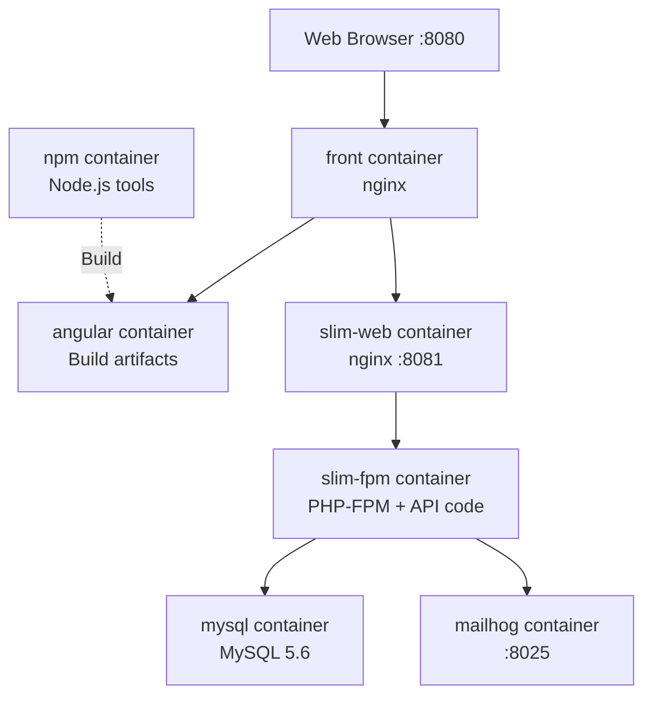

# Development Environment Setup

This guide will help you set up your local development environment for Tkdo.

## Table of Contents

- [Prerequisites](#prerequisites)
- [Environment Configuration](#environment-configuration)
- [Starting the Development Environment](#starting-the-development-environment)
- [Accessing the Application](#accessing-the-application)
- [Viewing Logs](#viewing-logs)
- [Docker Services Overview](#docker-services-overview)
- [Stopping the Environment](#stopping-the-environment)
- [Troubleshooting](#troubleshooting)

## Prerequisites

Before setting up the development environment, ensure you have the following installed:

### Required Software

| Software               | Version  | Purpose                                          |
|------------------------|----------|--------------------------------------------------|
| **Docker**             | Latest   | Containerization platform                        |
| **Docker Compose**     | Plugin   | Multi-container Docker applications              |

### User Permissions

Your user account must be a member of the `docker` group to run Docker commands without `sudo`:

```bash
# Check if you're in the docker group
groups | grep docker

# If not, add yourself (requires admin rights)
sudo usermod -aG docker $USER

# Log out and log back in for changes to take effect
```

**Verification:**

```bash
# This should work without sudo
docker ps
```

## Environment Configuration

The development environment uses environment variables to configure services. These are defined in a `.env` file at the project root.

### User and Group IDs

If your user ID (`id -u`) and group ID (`id -g`) are different from 1000, you need to configure them in `.env`:

**Check your IDs:**

```bash
id -u  # User ID
id -g  # Group ID
```

**If different from 1000, create/edit `.env` at project root:**

```bash
# .env file at project root
DEV_UID=YOUR_USER_ID
DEV_GID=YOUR_GROUP_ID
```

**Why this matters:** Docker containers need to run with your user/group IDs to ensure file permissions are correct. Without this, files created by containers might not be accessible to you, or vice versa.

### Port Configuration

By default, the Docker Compose environment uses ports 8080 (frontend), 8081 (API), 8025 (MailHog), and 4200 (Angular dev server). These ports can be customized via environment variables to run multiple instances simultaneously.

**For running multiple instances** (e.g., in different git worktrees), see [Environment Variables Reference - Docker Development Variables](environment-variables.md#docker-development-variables).

### API Environment Variables

The API uses environment variables defined in `api/.env`. The defaults are suitable for development, but you can override them if needed.

**Key variables:**

```bash
# Database configuration (handled by docker-compose)
MYSQL_DATABASE=tkdo
MYSQL_HOST=mysql
MYSQL_USER=tkdo
MYSQL_PASSWORD=mdptkdo
MYSQL_PORT=3306

# Application URLs
TKDO_BASE_URI=http://localhost:8080
TKDO_MAILER_FROM=noreply@localhost

# Development mode flag
TKDO_DEV_MODE=1
```

**Note:** In development, MySQL runs in a Docker container. The connection details are automatically configured in `docker-compose.yml`.

## Starting the Development Environment

The development environment uses Docker Compose to orchestrate multiple services (frontend, backend, database, mailserver).

### Initial Setup

**1. Start the environment:**

```bash
docker compose up -d front
```

**What this does:**
- Downloads and builds all Docker images (first time only)
- Starts MySQL database
- Starts MailHog (email testing tool)
- Starts PHP-FPM backend
- Starts nginx web server for API
- Builds Angular frontend
- Starts nginx web server for full application

The `-d` flag runs containers in detached mode (background).

**2. Install frontend dependencies:**

```bash
./npm install
```

**3. Install backend dependencies:**

```bash
./composer install
```

**4. Build the frontend:**

```bash
./npm run build
```

**Wait for completion:** The initial build can take several minutes. You'll see output indicating compilation progress.

**5. Initialize the database (first time only):**

First, create the database schema:

```bash
./doctrine migrations:migrate
```

Then populate with initial data:

```bash
./console fixtures
```

**What these commands do:**
- `migrations:migrate` - Creates all database tables and schema
- `fixtures` - Populates database with test data and test user accounts

**Development test accounts created:**
- `alice` / `mdpalice` (administrator)
- `bob` / `mdpbob`
- `charlie` / `mdpcharlie`
- `david` / `mdpdavid`
- `eve` / `mdpeve`

**Note:** These are development-only credentials. In production mode, fixtures creates a single `admin` / `admin` account instead.

### Subsequent Starts

After the initial setup, you only need:

```bash
docker compose up -d front
```

Dependencies and builds are preserved between sessions.

## Accessing the Application

Once the environment is running:

**Full application (frontend + API):**
- URL: http://localhost:8080
- This is the main development URL

**API only:**
- URL: http://localhost:8081
- Direct access to the backend API

**Email testing (MailHog):**
- URL: http://localhost:8025
- View all emails sent by the application
- Useful for testing notifications

**Note:** If you configured custom ports via environment variables, use those ports instead. See [Docker Development Variables](environment-variables.md#docker-development-variables).

**Test user credentials:**

Created when you run the `fixtures` command (see [Initial Setup](#initial-setup)):
- Administrator: `alice` / `mdpalice`
- Regular users: `bob` / `mdpbob`, `charlie` / `mdpcharlie`, `david` / `mdpdavid`, `eve` / `mdpeve`

**Note:** These are test accounts for development only.

## Viewing Logs

Docker Compose collects logs from all services. To view them:

**Follow all logs in real-time:**

```bash
docker compose logs -f
```

**View logs for a specific service:**

```bash
docker compose logs -f slim-fpm  # Backend PHP logs
docker compose logs -f mysql     # Database logs
docker compose logs -f front     # Frontend nginx logs
```

**View recent logs without following:**

```bash
docker compose logs --tail=100
```

**Exit log viewing:** Press `Ctrl+C`

## Docker Services Overview

Understanding the Docker Compose services:



### Service Descriptions

| Service      | Purpose                                      | Exposed Port  |
|--------------|----------------------------------------------|---------------|
| **front**    | Main nginx server serving the full app       | 8080          |
| **angular**  | Builds Angular application                   | -             |
| **slim-web** | nginx server for API                         | 8081          |
| **slim-fpm** | PHP-FPM running the Slim Framework API       | -             |
| **mysql**    | MySQL 5.6 database                           | -             |
| **mailhog**  | Email testing server                         | 8025          |
| **npm**      | Node.js tools (npm, ng, cypress, npx)        | 4200          |
| **php-cli**  | PHP CLI tools (composer, doctrine, console)  | -             |

**Note:** Exposed ports are configurable via environment variables. See [Docker Development Variables](environment-variables.md#docker-development-variables).

### Tool Containers

The `npm` and `php-cli` containers are **not always running**. They're used on-demand when you execute scripts:

**Frontend tools** (via `npm` container):
- `./npm` - Node package manager
- `./ng` - Angular CLI
- `./npx` - Execute npm packages
- `./cypress` - Cypress test runner

**Backend tools** (via `php-cli` container with profile `tools`):
- `./composer` - PHP dependency manager
- `./doctrine` - Doctrine ORM CLI
- `./console` - Application console commands

**Note:** These scripts automatically start the appropriate container, run the command, and stop the container.

## Stopping the Environment

**Stop all services:**

```bash
docker compose down
```

**Stop and remove volumes (⚠️ deletes database data):**

```bash
docker compose down -v
```

**Stop but keep containers for faster restart:**

```bash
docker compose stop
```

**Resume stopped containers:**

```bash
docker compose start
```

## Troubleshooting

For development environment troubleshooting (port conflicts, permission errors, container issues, etc.), see the [Troubleshooting Guide - Development Environment Issues](troubleshooting.md#development-environment-issues).

---

## Next Steps

Now that your development environment is running:

- **Frontend Development:** See [Frontend Development Guide](frontend-dev.md)
- **Backend Development:** See [Backend Development Guide](backend-dev.md)
- **Database:** See [Database Documentation](database.md)
- **Testing:** See [Testing Guide](testing.md)

---

**Need help?** Check the [Troubleshooting Guide](troubleshooting.md) or ask in the project's issue tracker.
