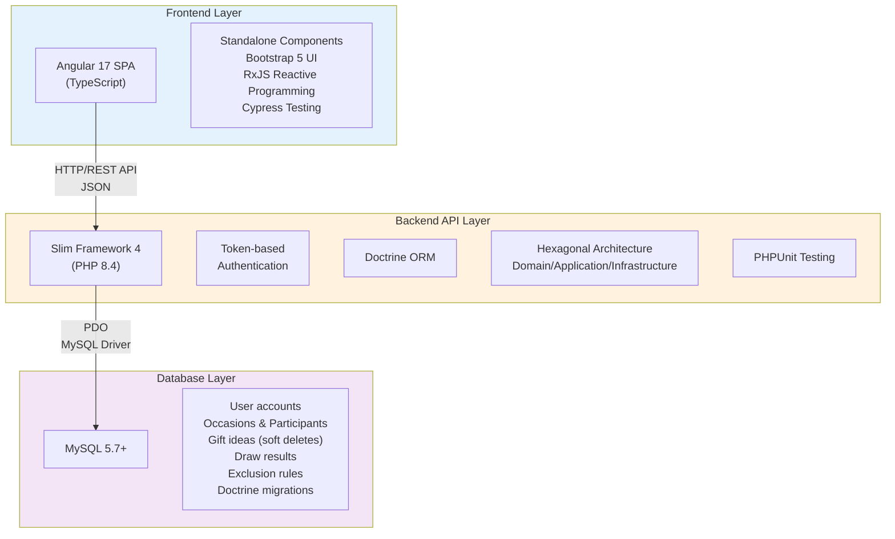

# Tkdo - Gift Drawing Application

**Tkdo** is a web application for organizing gift exchanges among family and friends. It manages occasions (birthdays, holidays, etc.), participants, gift idea lists, and random draw assignments to determine who gives gifts to whom.


## Table of Contents

- [Overview](#overview)
- [Key Features](#key-features)
- [Architecture](#architecture)
- [Technology Stack](#technology-stack)
- [Getting Started](#getting-started)
- [Documentation](#documentation)
- [Project Status](#project-status)

## Overview

Tkdo simplifies gift exchanges by:

1. **Managing occasions** - Create events (Christmas, birthdays, etc.) with dates and participants
2. **Organizing participants** - Add family members or friends to each occasion
3. **Collecting gift ideas** - Each participant can suggest gift ideas for others
4. **Performing draws** - Automatically and randomly assign who gives to whom, with exclusion rules
5. **Sending notifications** - Email participants about draws, new ideas, and updates

The application ensures fairness with exclusion rules (e.g., prevent spouses from drawing each other) and maintains gift idea privacy (you can't see ideas others suggested for you until after the occasion).

## Key Features

### For Regular Users

- **User Account Management**

  - Personal profile with name, email, and password
  - Customizable notification preferences (instant, daily digest, or none)
  - Secure authentication with token-based sessions

- **Occasion Participation**

  - View upcoming and past occasions you're part of
  - See other participants in each occasion
  - Automatic display of next upcoming occasion at login

- **Gift Ideas Management**

  - Add gift ideas for other participants
  - Edit or delete your own ideas
  - View ideas others suggested (except ideas for you)
  - Soft delete (ideas marked deleted, not removed from database)

- **Draw Results**

  - See who you should give a gift to (after draw is performed)
  - Cannot see who draws you (keeps the surprise)

- **Email Notifications**
  - Account creation confirmation
  - Password reset instructions
  - New occasion participation alerts
  - Draw result notifications
  - Gift idea additions/deletions (configurable: instant, daily, or off)

### For Administrators

- **User Management**

  - Create user accounts
  - View and modify user profiles
  - Reset user passwords
  - (Planned: Disable user accounts)

- **Occasion Management**

  - Create occasions with dates
  - Add participants to occasions
  - Modify occasion details
  - View all occasions in the system

- **Exclusion Management**

  - Define who cannot draw whom (e.g., couples, siblings)
  - View and create exclusions for each occasion

- **Draw Management**

  - Trigger automatic random draw generation
  - Draw algorithm respects exclusions
  - (Planned: Cancel draws, remove participants/occasions)

- **Command-Line API Access**
  - All admin operations accessible via curl with authentication tokens
  - Detailed in admin guide and API reference

## Architecture

Tkdo follows a modern three-tier web architecture:



### Architecture Principles

**Frontend:**

- **Single Page Application** - Fast, responsive user experience
- **Component-based** - Reusable, testable UI components
- **Interceptors** - Handle authentication tokens and development mocking
- **Routing** - Client-side navigation without full page reloads

**Backend:**

- **Hexagonal Architecture** - Clear separation of concerns:
  - **Domain** (`Dom`) - Business logic and entities
  - **Application** (`Appli`) - Controllers, services, use cases
  - **Infrastructure** (`Infra`) - Database, external services
- **REST API** - Standard HTTP methods and JSON responses
- **Middleware** - Authentication, error handling, logging
- **Dependency Injection** - PHP-DI for loose coupling

**Database:**

- **Relational Model** - Normalized schema with foreign keys
- **Migrations** - Version-controlled schema changes with Doctrine
- **Soft Deletes** - Gift ideas marked as deleted but preserved
- **Fixtures** - Test data and initial admin account setup

## Technology Stack

### Frontend

| Technology        | Version | Purpose                   |
| ----------------- | ------- | ------------------------- |
| **Angular**       | 17.3    | Web framework             |
| **TypeScript**    | 5.4     | Programming language      |
| **Bootstrap**     | 5.3     | UI framework and styling  |
| **RxJS**          | 7.8     | Reactive programming      |
| **Cypress**       | latest  | E2E and component testing |
| **Jasmine/Karma** | 5.1/6.4 | Unit testing              |

### Backend

| Technology              | Version | Purpose                    |
| ----------------------- | ------- | -------------------------- |
| **PHP**                 | 8.4     | Programming language       |
| **Slim Framework**      | 4.10    | Micro web framework        |
| **Doctrine ORM**        | 2.17    | Object-relational mapping  |
| **Doctrine Migrations** | 3.4     | Database schema versioning |
| **Firebase JWT**        | 6.4     | Token-based authentication |
| **Monolog**             | 2.9     | Logging                    |
| **PHP-DI**              | 7.0     | Dependency injection       |
| **PHPUnit**             | 11.5    | Testing framework          |
| **PHPStan**             | 2.1     | Static analysis            |

### Database

| Technology | Version | Purpose             |
| ---------- | ------- | ------------------- |
| **MySQL**  | 5.7+    | Relational database |

### Development & Deployment

| Technology         | Version    | Purpose                       |
| ------------------ | ---------- | ----------------------------- |
| **Docker**         | latest     | Development environment       |
| **Docker Compose** | latest     | Multi-container orchestration |
| **Apache**         | 2.4+       | Production web server         |
| **Node.js**        | latest LTS | Frontend build tools          |
| **Composer**       | latest     | PHP dependency management     |
| **npm**            | latest     | JavaScript package manager    |

## Getting Started

### Prerequisites

- Docker and Docker Compose (development)
- Apache 2.4+ with mod_rewrite (production)
- PHP 8.4 with extensions: dom, mbstring, pdo_mysql, zip (production)
- MySQL 5.7+ (production)

### Quick Start (Development)

1. Clone the repository
2. Set up environment variables in `.env` (if needed)
3. Start the development environment:
   ```bash
   docker compose up -d front
   ./npm install
   ./npm run build
   ```
4. Access the application at http://localhost:8080

For detailed setup instructions, see:

- [Development Setup Guide](dev-setup.md)
- [Apache Deployment Guide](deployment-apache.md)

### First Admin Account

After setup, create an admin account:

```bash
./composer console -- fixtures --admin-email admin@example.com
```

Default credentials: `admin` / `admin` (change password immediately!)

## Documentation

### User Documentation

- [User Guide](user-guide.md) - For regular users
- [Administrator Guide](admin-guide.md) - For administrators
- [Email Notifications Reference](notifications.md)

### Developer Documentation

- [Development Environment Setup](dev-setup.md)
- [Frontend Development Guide](frontend-dev.md)
- [Backend/API Development Guide](backend-dev.md)
- [Database Documentation](database.md)
- [Testing Guide](testing.md)
- [API Reference](api-reference.md)
- [Architecture & Design Decisions](architecture.md)
- [Contributing Guidelines](CONTRIBUTING.md)

### Deployment Documentation

- [Apache Deployment Guide](deployment-apache.md)
- [Environment Variables Reference](environment-variables.md)
- [Troubleshooting Guide](troubleshooting.md)

## Project Status

**Current Version:** 1.4.3 (April 2025)

### Recent Changes

- PHP 8.4 and Slim 4.10 upgrade
- Security fixes for frontend dependencies
- Bug fixes for notification system

### Upcoming Features

See [BACKLOG.md](../../BACKLOG.md) for planned features and improvements, including:

- Angular 20+ upgrade
- MySQL 8 migration
- Enhanced participant management
- Gift idea commenting system
- Comprehensive English documentation

### Contributing

Contributions are welcome! This project follows:

- Conventional Commits for commit messages
- PSR standards for PHP code
- Angular style guide for TypeScript
- Test-driven development practices

See [Contributing Guidelines](CONTRIBUTING.md) for details.

## License

This project is open source. License details to be determined.

## Support

- **Issues:** Report bugs and request features on the project repository
- **Questions:** Check the documentation or ask in discussions

## Screenshots

<table>
<tr>
  <td width="20%"><br><sub>Login</sub></td>
  <td width="20%"><br><sub>Occasion View</sub></td>
  <td width="20%"><br><sub>Gift Ideas List</sub></td>
  <td width="20%"><br><sub>Gift Ideas (cont.)</sub></td>
  <td width="20%"><br><sub>Navigation Menus</sub></td>
</tr>
</table>

---

**Tkdo** - Making gift exchanges simple and fun!
