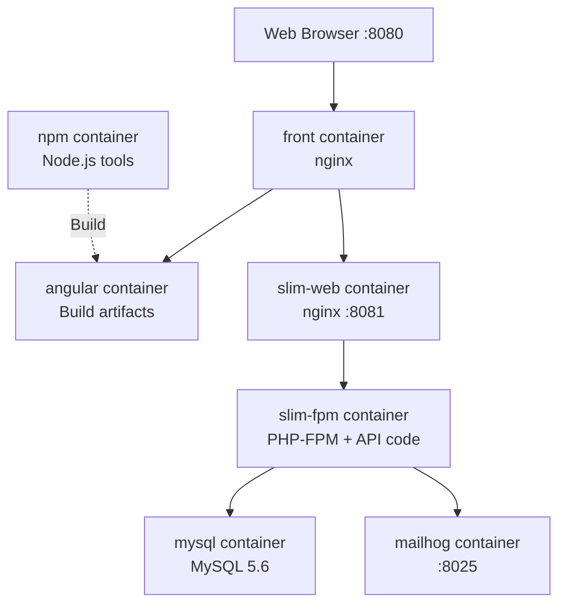

# Development Environment Setup

This guide will help you set up your local development environment for Tkdo.

## Table of Contents

- [Prerequisites](#prerequisites)
- [Environment Configuration](#environment-configuration)
- [Starting the Development Environment](#starting-the-development-environment)
- [Accessing the Application](#accessing-the-application)
- [Viewing Logs](#viewing-logs)
- [Docker Services Overview](#docker-services-overview)
- [Stopping the Environment](#stopping-the-environment)
- [Troubleshooting](#troubleshooting)

## Prerequisites

Before setting up the development environment, ensure you have the following installed:

### Required Software

| Software               | Version  | Purpose                                          |
|------------------------|----------|--------------------------------------------------|
| **Docker**             | Latest   | Containerization platform                        |
| **Docker Compose**     | Plugin   | Multi-container Docker applications              |

### User Permissions

Your user account must be a member of the `docker` group to run Docker commands without `sudo`:

```bash
# Check if you're in the docker group
groups | grep docker

# If not, add yourself (requires admin rights)
sudo usermod -aG docker $USER

# Log out and log back in for changes to take effect
```

**Verification:**

```bash
# This should work without sudo
docker ps
```

## Environment Configuration

The development environment uses environment variables to configure services. These are defined in a `.env` file at the project root.

### User and Group IDs

If your user ID (`id -u`) and group ID (`id -g`) are different from 1000, you need to configure them in `.env`:

**Check your IDs:**

```bash
id -u  # User ID
id -g  # Group ID
```

**If different from 1000, create/edit `.env` at project root:**

```bash
# .env file at project root
DEV_UID=YOUR_USER_ID
DEV_GID=YOUR_GROUP_ID
```

**Why this matters:** Docker containers need to run with your user/group IDs to ensure file permissions are correct. Without this, files created by containers might not be accessible to you, or vice versa.

### API Environment Variables

The API uses environment variables defined in `api/.env`. The defaults are suitable for development, but you can override them if needed.

**Key variables:**

```bash
# Database configuration (handled by docker-compose)
MYSQL_DATABASE=tkdo
MYSQL_HOST=mysql
MYSQL_USER=tkdo
MYSQL_PASSWORD=mdptkdo
MYSQL_PORT=3306

# Application URLs
TKDO_BASE_URI=http://localhost:8080
TKDO_MAILER_FROM=noreply@localhost

# Development mode flag
TKDO_DEV_MODE=1
```

**Note:** In development, MySQL runs in a Docker container. The connection details are automatically configured in `docker-compose.yml`.

## Starting the Development Environment

The development environment uses Docker Compose to orchestrate multiple services (frontend, backend, database, mailserver).

### Initial Setup

**1. Start the environment:**

```bash
docker compose up -d front
```

**What this does:**
- Downloads and builds all Docker images (first time only)
- Starts MySQL database
- Starts MailHog (email testing tool)
- Starts PHP-FPM backend
- Starts nginx web server for API
- Builds Angular frontend
- Starts nginx web server for full application

The `-d` flag runs containers in detached mode (background).

**2. Install frontend dependencies:**

```bash
./npm install
```

**3. Install backend dependencies:**

```bash
./composer install
```

**4. Build the frontend:**

```bash
./npm run build
```

**Wait for completion:** The initial build can take several minutes. You'll see output indicating compilation progress.

**5. Initialize the database (first time only):**

First, create the database schema:

```bash
./doctrine migrations:migrate
```

Then populate with initial data:

```bash
./console fixtures --admin-email admin@localhost
```

**What these commands do:**
- `migrations:migrate` - Creates all database tables and schema
- `fixtures` - Populates database with test data and test user accounts

**Development test accounts created:**
- `alice` / `mdpalice` (administrator)
- `bob` / `mdpbob`
- `charlie` / `mdpcharlie`
- `david` / `mdpdavid`
- `eve` / `mdpeve`

**Note:** These are development-only credentials. In production mode, fixtures creates a single `admin` / `admin` account instead.

### Subsequent Starts

After the initial setup, you only need:

```bash
docker compose up -d front
```

Dependencies and builds are preserved between sessions.

## Accessing the Application

Once the environment is running:

**Full application (frontend + API):**
- URL: http://localhost:8080
- This is the main development URL

**API only:**
- URL: http://localhost:8081
- Direct access to the backend API

**Email testing (MailHog):**
- URL: http://localhost:8025
- View all emails sent by the application
- Useful for testing notifications

**Test user credentials:**

Created when you run the `fixtures` command (see [Initial Setup](#initial-setup)):
- Administrator: `alice` / `mdpalice`
- Regular users: `bob` / `mdpbob`, `charlie` / `mdpcharlie`, `david` / `mdpdavid`, `eve` / `mdpeve`

**Note:** These are test accounts for development only.

## Viewing Logs

Docker Compose collects logs from all services. To view them:

**Follow all logs in real-time:**

```bash
docker compose logs -f
```

**View logs for a specific service:**

```bash
docker compose logs -f slim-fpm  # Backend PHP logs
docker compose logs -f mysql     # Database logs
docker compose logs -f front     # Frontend nginx logs
```

**View recent logs without following:**

```bash
docker compose logs --tail=100
```

**Exit log viewing:** Press `Ctrl+C`

## Docker Services Overview

Understanding the Docker Compose services:



### Service Descriptions

| Service      | Purpose                                      | Exposed Port  |
|--------------|----------------------------------------------|---------------|
| **front**    | Main nginx server serving the full app       | 8080          |
| **angular**  | Builds Angular application                   | -             |
| **slim-web** | nginx server for API                         | 8081          |
| **slim-fpm** | PHP-FPM running the Slim Framework API       | -             |
| **mysql**    | MySQL 5.6 database                           | -             |
| **mailhog**  | Email testing server                         | 8025          |
| **npm**      | Node.js tools (npm, ng, cypress, npx)        | -             |
| **php-cli**  | PHP CLI tools (composer, doctrine, console)  | -             |

### Tool Containers

The `npm` and `php-cli` containers are **not always running**. They're used on-demand when you execute scripts:

**Frontend tools** (via `npm` container):
- `./npm` - Node package manager
- `./ng` - Angular CLI
- `./npx` - Execute npm packages
- `./cypress` - Cypress test runner

**Backend tools** (via `php-cli` container with profile `tools`):
- `./composer` - PHP dependency manager
- `./doctrine` - Doctrine ORM CLI
- `./console` - Application console commands

**Note:** These scripts automatically start the appropriate container, run the command, and stop the container.

## Stopping the Environment

**Stop all services:**

```bash
docker compose down
```

**Stop and remove volumes (⚠️ deletes database data):**

```bash
docker compose down -v
```

**Stop but keep containers for faster restart:**

```bash
docker compose stop
```

**Resume stopped containers:**

```bash
docker compose start
```

## Troubleshooting

### Port Already in Use

**Problem:** Error like "bind: address already in use" for port 8080, 8081, or 8025

**Solution:**

1. Check what's using the port:
   ```bash
   sudo lsof -i :8080
   # or
   sudo netstat -tulpn | grep 8080
   ```

2. Stop the conflicting service or change Tkdo's ports in `docker-compose.yml`:
   ```yaml
   front:
     ports:
       - "8090:80"  # Change from 8080 to 8090
   ```

### Permission Denied Errors

**Problem:** Cannot write files or "permission denied" errors

**Cause:** UID/GID mismatch between your user and Docker containers

**Solution:**

1. Verify your IDs:
   ```bash
   echo "UID: $(id -u), GID: $(id -g)"
   ```

2. Set them in `.env` at project root:
   ```bash
   DEV_UID=your_uid_here
   DEV_GID=your_gid_here
   ```

3. Rebuild containers:
   ```bash
   docker compose down
   docker compose build
   docker compose up -d front
   ```

### Database Connection Errors

**Problem:** API cannot connect to database

**Diagnostics:**

1. Check if MySQL is running:
   ```bash
   docker compose ps mysql
   ```

2. View MySQL logs:
   ```bash
   docker compose logs mysql
   ```

3. Wait for MySQL to be healthy:
   ```bash
   # MySQL health check can take 30 seconds
   docker compose ps mysql
   # Status should show "healthy"
   ```

**Solution:** If MySQL fails to start, check:
- Disk space: `df -h`
- Port 3306 not in use: `sudo lsof -i :3306`
- Restart the environment: `docker compose restart mysql`

### Build Failures

**Problem:** Angular build fails with errors

**Common causes and solutions:**

1. **Out of memory:**
   ```bash
   # Increase Node memory limit
   NODE_OPTIONS="--max-old-space-size=4096" ./npm run build
   ```

2. **Corrupted dependencies:**
   ```bash
   # Clean and reinstall
   rm -rf front/node_modules front/package-lock.json
   ./npm install
   ```

3. **TypeScript compilation errors:**
   - Check `front/src/` for syntax errors
   - Ensure all imports are correct
   - Run `./npm run build` to see detailed errors

### Container Won't Start

**Problem:** Docker container exits immediately

**Diagnosis:**

```bash
# View container status
docker compose ps

# Check logs for the failing service
docker compose logs SERVICE_NAME

# Example for slim-fpm
docker compose logs slim-fpm
```

**Common fixes:**

1. Rebuild the container:
   ```bash
   docker compose build SERVICE_NAME
   docker compose up -d SERVICE_NAME
   ```

2. Remove and recreate:
   ```bash
   docker compose down
   docker compose up -d front
   ```

### Scripts Not Executable

**Problem:** `./npm` or `./composer` command fails with "permission denied"

**Solution:**

```bash
# Make scripts executable
chmod +x npm ng npx cypress
chmod +x composer doctrine console

# Verify
ls -la npm composer
```

### MailHog Not Accessible

**Problem:** Cannot access http://localhost:8025

**Check:**

1. Is MailHog running?
   ```bash
   docker compose ps mailhog
   ```

2. Check logs:
   ```bash
   docker compose logs mailhog
   ```

3. Verify port binding:
   ```bash
   docker compose ps
   # Should show "0.0.0.0:8025->8025/tcp" for mailhog
   ```

### Cypress Errors (SYS_ADMIN capability)

**Problem:** Cypress fails with sandbox errors

**Cause:** The `npm` container needs `SYS_ADMIN` capability to run Chrome

**Verify in `docker-compose.yml`:**

```yaml
npm:
  cap_add:
    - SYS_ADMIN
```

**If missing, add it and recreate:**

```bash
docker compose down
docker compose up -d front
```

### Cannot Access Docker Socket

**Problem:** "permission denied" when running Docker commands

**Solution:**

```bash
# Verify docker group membership
groups | grep docker

# If not in group, add and re-login
sudo usermod -aG docker $USER
# Log out and log back in

# Verify docker daemon is running
sudo systemctl status docker
```

### Clean Start (Reset Everything)

If you encounter persistent issues:

```bash
# Stop all containers
docker compose down -v

# Remove all project containers and images
docker compose rm -f
docker system prune -a

# Remove generated files
rm -rf front/node_modules front/dist front/.angular
rm -rf api/vendor

# Start fresh
docker compose up -d front
./npm install
./npm run build
```

**⚠️ Warning:** This deletes all data, including the database. You'll need to reinitialize.

---

## Next Steps

Now that your development environment is running:

- **Frontend Development:** See [Frontend Development Guide](frontend-dev.md)
- **Backend Development:** See [Backend Development Guide](backend-dev.md)
- **Database:** See [Database Documentation](database.md)
- **Testing:** See [Testing Guide](testing.md) *(coming soon)*

---

**Need help?** Check the [Troubleshooting Guide](troubleshooting.md) *(coming soon)* or ask in the project's issue tracker.
