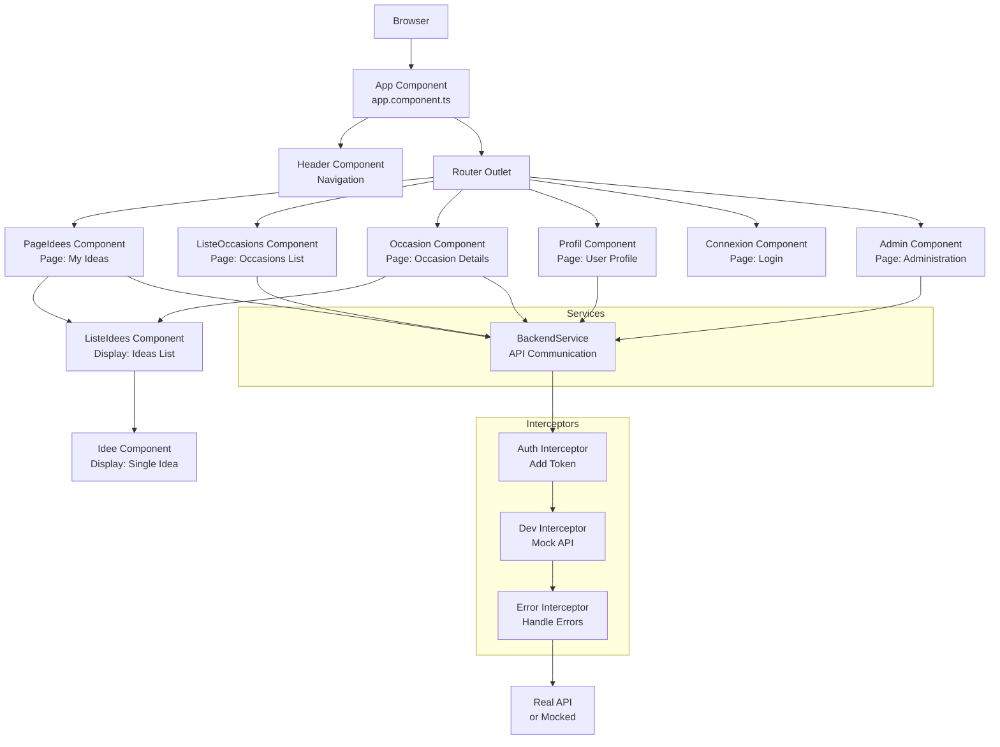
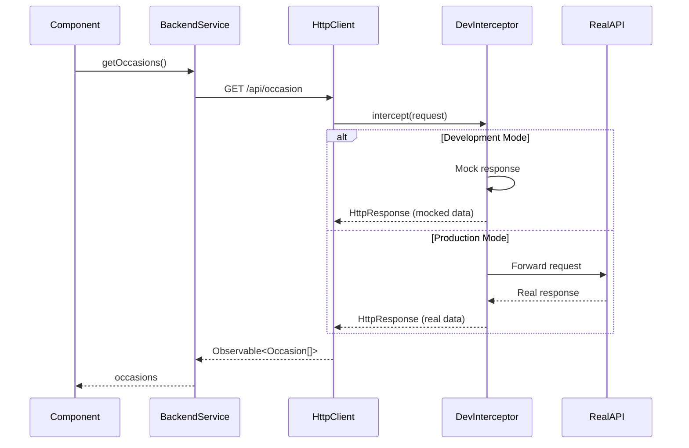

# Frontend Development Guide

This guide covers everything you need to know for developing the Tkdo frontend application.

## Table of Contents

- [Frontend Architecture](#frontend-architecture)
- [Project Structure](#project-structure)
- [Available NPM Scripts](#available-npm-scripts)
- [Development Workflow](#development-workflow)
- [Testing](#testing)
- [Development Server](#development-server)
- [Dev Backend Interceptor](#dev-backend-interceptor)
- [Building for Production](#building-for-production)
- [Upgrade Procedures](#upgrade-procedures)
- [Code Style and Conventions](#code-style-and-conventions)
- [Component Architecture Patterns](#component-architecture-patterns)

## Frontend Architecture

The Tkdo frontend is built with modern Angular practices and architectural decisions.

### Technology Stack

| Technology            | Version  | Purpose                                |
|-----------------------|----------|----------------------------------------|
| **Angular**           | 21.0     | Frontend framework                     |
| **TypeScript**        | 5.9      | Programming language                   |
| **Bootstrap**         | 5.3      | UI framework                           |
| **ng-bootstrap**      | 20.0     | Angular Bootstrap components           |
| **RxJS**              | 7.8      | Reactive programming                   |
| **Moment.js**         | 2.30     | Date manipulation                      |
| **Cypress**           | latest   | E2E and component testing              |
| **Jasmine/Karma**     | 5.1/6.4  | Unit testing                           |

### Architecture Decisions

**Standalone Components (Angular 17-21):**
- All components use the standalone API
- No `NgModule` declarations needed
- Simplified dependency management
- Better tree-shaking and lazy loading

**Routing Strategy:**
- File-based routing in `app.routes.ts`
- Route guards for authentication (`connexion.guard.ts`) and authorization (`admin.guard.ts`)
- Lazy loading not currently used (small app size)

**State Management:**
- Service-based state management (no NgRx/Akita)
- `backend.service.ts` handles all API communication
- Guards manage authentication state

**HTTP Interceptors:**
- `auth-backend.interceptor.ts` - Adds authentication tokens to requests
- `dev-backend.interceptor.ts` - Mocks API responses in development mode
- `erreur-backend.interceptor.ts` - Handles HTTP errors globally



## Project Structure

The frontend code is organized in the `front/` directory:

```
front/
├── src/
│   ├── app/
│   │   ├── admin/                    # Admin page component
│   │   ├── connexion/                # Login page component
│   │   ├── deconnexion/              # Logout component
│   │   ├── header/                   # Navigation header component
│   │   ├── idee/                     # Single idea display component
│   │   ├── liste-idees/              # Ideas list display component
│   │   ├── liste-occasions/          # Occasions list page component
│   │   ├── occasion/                 # Occasion details page component
│   │   ├── page-idees/               # My ideas page component
│   │   ├── profil/                   # Profile page component
│   │   ├── app.component.ts          # Root component
│   │   ├── app.config.ts             # Application configuration
│   │   ├── app.routes.ts             # Route definitions
│   │   ├── backend.service.ts        # API communication service
│   │   ├── *.guard.ts                # Route guards
│   │   ├── *.interceptor.ts          # HTTP interceptors
│   │   └── http-interceptors.ts      # Interceptor providers
│   ├── assets/                       # Static assets
│   ├── environments/                 # Environment configurations
│   ├── index.html                    # HTML entry point
│   ├── main.ts                       # TypeScript entry point
│   └── styles.scss                   # Global styles
├── cypress/                          # Cypress test files
│   ├── e2e/                          # End-to-end tests
│   ├── fixtures/                     # Test data
│   └── support/                      # Test utilities
├── angular.json                      # Angular CLI configuration
├── cypress.config.ts                 # Cypress configuration
├── package.json                      # npm dependencies and scripts
├── tsconfig.json                     # TypeScript configuration
└── version.js                        # Version generation script
```

### Component Organization

Components are organized into two categories:

1. **Page Components**: Full pages that are route targets
   - `page-idees` - My ideas page
   - `liste-occasions` - Occasions list page
   - `occasion` - Occasion details page
   - `profil` - User profile page
   - `connexion` - Login page
   - `admin` - Administration page

2. **Display Components**: Reusable UI components
   - `header` - Navigation header
   - `liste-idees` - Gift ideas list (reused on multiple pages)
   - `idee` - Single gift idea card
   - `deconnexion` - Logout button/link

## Available NPM Scripts

All npm commands must be run through the Docker wrapper script `./npm` from the project root. This ensures consistent Node.js and npm versions.

### Common Scripts

| Script                | Command                  | Description                                        |
|-----------------------|--------------------------|----------------------------------------------------|
| **start**             | `./npm start`            | Start development server on http://localhost:4200  |
| **build**             | `./npm run build`        | Build for production                               |
| **watch**             | `./npm run watch`        | Build and watch for changes (development mode)     |
| **test**              | `./npm test`             | Run all checks: format, lint, and unit tests       |
| **lint**              | `./npm run lint`         | Run ESLint                                         |
| **format**            | `./npm run format`       | Format code with Prettier                          |

### Testing Scripts

| Script                | Command                  | Description                                        |
|-----------------------|--------------------------|----------------------------------------------------|
| **test**              | `./npm test`             | Run format + lint + unit tests (Jasmine/Karma)     |
| **ct**                | `./npm run ct`           | Run component tests (Cypress component testing)    |
| **int**               | `./npm run int`          | Run integration tests (Cypress with dev server)    |
| **e2e**               | `./npm run e2e`          | Run end-to-end tests (Cypress with full stack)     |
| **cypress:open**      | `./npm run cypress:open` | Open Cypress interactive test runner               |
| **cypress:run**       | `./npm run cypress:run`  | Run Cypress tests in headless mode                 |

### Build Scripts

| Script                | Command                       | Description                                   |
|-----------------------|-------------------------------|-----------------------------------------------|
| **build**             | `./npm run build`             | Production build (optimized, hashed)          |
| **build** (dev)       | `./npm run build -- --configuration development` | Development build (source maps)   |
| **watch**             | `./npm run watch`             | Continuous development build                  |

### Utility Scripts

| Script                | Command                  | Description                                        |
|-----------------------|--------------------------|----------------------------------------------------|
| **ng**                | `./ng`                   | Run Angular CLI commands                           |
| **postinstall**       | (automatic)              | Generates version.ts after npm install             |

## Development Workflow

### Setup

Before starting development, ensure the development environment is running (see [Development Setup Guide](dev-setup.md)):

```bash
# Start the full environment
docker compose up -d front

# Install dependencies (if not already done)
./npm install
```

### Daily Workflow

**Option 1: Full stack development (with real backend)**

```bash
# The full stack is already running
# Access at http://localhost:8080
# Frontend: Served by nginx
# Backend: Real PHP API

# Make frontend changes
# Rebuild when ready
./npm run build
```

**Option 2: Frontend-only development (with mocked backend)**

```bash
# Start Angular dev server
./npm start

# Access at http://localhost:4200
# API requests are intercepted and mocked
# Hot reload enabled
```

**Recommended workflow:**
- Use Option 2 (dev server with mocked API) for UI development
- Use Option 1 (full stack) for integration testing and API-dependent features

### Code Changes

1. **Make changes** to TypeScript, HTML, or SCSS files
2. **Check formatting**: `./npm run format`
3. **Run linter**: `./npm run lint`
4. **Run tests**: `./npm test` (or specific test commands)
5. **Test in browser**: Verify changes at appropriate URL
6. **Commit**: Follow project commit conventions

## Testing

The frontend has a comprehensive testing strategy with three test levels.

### Test Types Overview

| Test Type       | Framework           | Purpose                                          | Run With              |
|-----------------|---------------------|--------------------------------------------------|-----------------------|
| **Unit**        | Jasmine/Karma       | Test individual functions and classes            | `./npm test`          |
| **Component**   | Cypress             | Test components in isolation with mocked deps    | `./npm run ct`        |
| **Integration** | Cypress             | Test user flows with mocked API                  | `./npm run int`       |
| **E2E**         | Cypress             | Test complete flows with real backend            | `./npm run e2e`       |

### Unit Tests

**Technology**: Jasmine + Karma

**Location**: `*.spec.ts` files next to the code they test

**Run**:

```bash
./npm test
```

This runs: formatting + linting + unit tests

**Run only unit tests** (skip format/lint):

```bash
./npm run ng test
```

**Current Status**:
> ⚠️ **Known Gap**: Unit tests are currently minimal (mostly component instantiation). Many tests that could be unit tests are currently in integration tests. Future work should move more logic tests to unit level.

**Example unit test** (`backend.service.spec.ts`):

```typescript
import { TestBed } from '@angular/core/testing';
import { BackendService } from './backend.service';

describe('BackendService', () => {
  let service: BackendService;

  beforeEach(() => {
    TestBed.configureTestingModule({});
    service = TestBed.inject(BackendService);
  });

  it('should be created', () => {
    expect(service).toBeTruthy();
  });
});
```

### Component Tests

**Technology**: Cypress Component Testing

**Location**: `*.component.cy.ts` files in component directories

**Run all component tests**:

```bash
./npm run ct
```

**Run specific component tests**:

```bash
./npm run ct -- --spec '**/liste-idees.component.cy.ts'
```

**Interactive mode**:

```bash
./npm run cypress:open
# Select "Component Testing"
```

**Current Status**:
> ⚠️ **Known Gap**: Component tests are currently minimal (mostly component mounting). Many tests that could be component tests are currently in integration tests. Future work should move component behavior tests from integration to component level.

**Example component test** (`app.component.cy.ts`):

```typescript
import { AppComponent } from './app.component';

describe('AppComponent', () => {
  it('mounts', () => {
    cy.mount(AppComponent);
  });
});
```

### Integration Tests

**Technology**: Cypress with Angular Dev Server

**Location**: `cypress/e2e/*.cy.ts` files

**How it works**:
- Starts Angular dev server (`ng serve`)
- API requests are intercepted by `dev-backend.interceptor.ts`
- Tests run against mocked API responses
- Fast execution (no real backend needed)

**Run all integration tests**:

```bash
./npm run int
```

**Run specific integration tests**:

```bash
./npm run int -- --spec '**/liste-idees.cy.ts'
```

**Run specific tests within a file**:

Edit the test file and use:
- `it.only(...)` - Run only this test
- `it.skip(...)` - Skip this test

```typescript
describe('Liste idees', () => {
  it.only('should display ideas', () => {
    // Only this test runs
  });

  it.skip('should add idea', () => {
    // This test is skipped
  });
});
```

**Example integration test**:

```typescript
describe('Login page', () => {
  beforeEach(() => {
    cy.visit('/');
  });

  it('should login with valid credentials', () => {
    cy.get('input[name="identifiant"]').type('alice');
    cy.get('input[name="mdp"]').type('mdpalice');
    cy.get('button[type="submit"]').click();
    cy.url().should('include', '/idee');
  });
});
```

### End-to-End Tests

**Technology**: Cypress with Full Stack

**Location**: Same as integration tests (`cypress/e2e/*.cy.ts`)

**How it works**:
- Runs against the full Docker environment
- Real backend API (PHP + MySQL)
- Real email server (MailHog)
- Test data must be refreshed between runs

**Run e2e tests**:

```bash
# Build frontend first
./npm run build

# Run e2e tests
./npm run e2e
```

**Refresh test data** (required between runs):

```bash
./composer run install-fixtures
```

**Note**: E2E tests use the same test files as integration tests but access the full environment via `http://front` instead of the dev server.

### Test Data

**Development/Integration tests** use mock data from `dev-backend.interceptor.ts`:
- alice / mdpalice (admin)
- bob / mdpbob
- charlie / mdpcharlie
- david / mdpdavid
- eve / mdpeve

**E2E tests** use fixtures from `api/src/Appli/Fixture/`:
- Same usernames and passwords as dev data
- Must be refreshed with `./composer run install-fixtures`

## Development Server

The Angular development server provides hot reload and API mocking for rapid frontend development.

### Starting the Dev Server

```bash
./npm start
```

**What this does:**
- Compiles TypeScript to JavaScript
- Bundles application code
- Serves on http://localhost:4200
- Watches for file changes
- Auto-reloads browser on changes
- Enables source maps for debugging

**Access**:
- Open http://localhost:4200 in your browser
- The app will automatically reload when you save files

### Dev Server vs Full Stack

| Aspect              | Dev Server (`:4200`)           | Full Stack (`:8080`)              |
|---------------------|--------------------------------|-----------------------------------|
| **API**             | Mocked (dev-backend.interceptor) | Real (PHP + MySQL)               |
| **Hot Reload**      | Yes                            | No (must rebuild)                 |
| **Build Speed**     | Fast                           | Slower                            |
| **Email Testing**   | Not available                  | Available (MailHog)               |
| **Best For**        | UI development, rapid iteration | API integration, full flow testing|

### Configuration

**Port and Host**: Configured in `angular.json`:

```json
"serve": {
  "options": {
    "host": "0.0.0.0",
    "proxyConfig": "src/proxy.conf.js"
  }
}
```

**Proxy Configuration** (`src/proxy.conf.js`):
- Used when dev server needs to proxy to real API
- Currently, dev server uses interceptor mocking instead
- Uses environment variable `FRONT_DEV_PORT` (default: 8080) for target port

## Dev Backend Interceptor

The dev backend interceptor (`dev-backend.interceptor.ts`) provides a complete mock backend for frontend development without requiring the API server.

### How It Works



### When It's Active

The interceptor is **only active** when:

1. Running dev server (`./npm start`)
2. Running integration tests (`./npm run int`)

The interceptor is **inactive** when:

3. Building for production (`./npm run build`)
4. Running e2e tests (`./npm run e2e`)
5. Accessing full stack (http://localhost:8080)

### Mock Data

**Users** (defined at top of `dev-backend.interceptor.ts`):

```typescript
const alice: UtilisateurAvecMdp = {
  id: 0,
  identifiant: 'alice',
  mdp: 'mdpalice',
  nom: 'Alice',
  admin: true,
  // ...
};
```

**API Routes Mocked**:
- `POST /api/connexion` - Login
- `DELETE /api/connexion` - Logout
- `GET /api/utilisateur/:id` - Get user
- `PUT /api/utilisateur/:id` - Update user
- `GET /api/occasion` - List occasions
- `GET /api/occasion/:id` - Get occasion
- `GET /api/idee` - List ideas
- `POST /api/idee` - Create idea
- `DELETE /api/idee/:id` - Delete idea

### Modifying Mock Data

To add or modify mock data:

1. Open `front/src/app/dev-backend.interceptor.ts`
2. Find the relevant mock data section (users, occasions, ideas)
3. Add or modify the mock objects
4. Save the file (dev server will auto-reload)

**Example - Add a new test user**:

```typescript
const frank: UtilisateurAvecMdp = {
  id: 5,
  identifiant: 'frank',
  email: 'frank@tkdo.org',
  nom: 'Frank',
  mdp: 'mdpfrank',
  genre: Genre.Masculin,
  admin: false,
  prefNotifIdees: PrefNotifIdees.Quotidienne,
};

// Add to utilisateurs array
const utilisateurs = [alice, bob, charlie, david, eve, frank];
```

## Building for Production

### Standard Production Build

```bash
./npm run build
```

**Output**: `front/dist/tkdo-front/`

**Optimizations applied**:
- Ahead-of-Time (AOT) compilation
- Tree shaking (removes unused code)
- Minification
- Uglification
- Output hashing for cache busting
- Bundle size budgets enforced

**Bundle Size Budgets** (from `angular.json`):

| Type                  | Warning  | Error    |
|-----------------------|----------|----------|
| Initial bundle        | 2 MB     | 5 MB     |
| Component styles      | 6 KB     | 10 KB    |

### Development Build

```bash
./npm run build -- --configuration development
```

**Differences from production**:
- No optimization (faster build)
- No minification
- Source maps included
- No output hashing
- Uses `environment.development.ts`

### Watch Mode

```bash
./npm run watch
```

Continuously builds on file changes (development configuration).

### Build Output

After building, the `dist/tkdo-front/` directory contains:

```
dist/tkdo-front/
├── browser/
│   ├── index.html               # Entry HTML
│   ├── main-[hash].js           # Main application bundle
│   ├── polyfills-[hash].js      # Polyfills
│   ├── styles-[hash].css        # Global styles
│   └── assets/                  # Static assets
└── server/                      # (unused, no SSR)
```

**Deployment**: Copy contents of `dist/tkdo-front/browser/` to web server.

## Upgrade Procedures

The project maintains Angular and dependencies at the latest stable versions using a dedicated upgrade workflow.

### Upgrade Strategy

**Goal**: Keep the project using Angular in the most standard way possible across versions.

**Method**: Maintain a skeleton project on `ngskel` branch with minimal customization, then merge changes to `master`.

### Upgrade Workflow

**When to upgrade**:
- New major Angular version released
- Security vulnerabilities in dependencies
- Need for new framework features

**Process**:

1. **Switch to ngskel branch**:
   ```bash
   git checkout ngskel
   ```

2. **Update Node.js version** in Docker container:
   Edit `front/docker/npm/Dockerfile`:
   ```dockerfile
   FROM node:20-alpine  # Update to latest LTS
   ```

3. **Rebuild npm container**:
   ```bash
   docker compose build npm
   ```

4. **Update Angular** (run in container):
   ```bash
   ./npm install -g @angular/cli@latest
   ./ng update @angular/core @angular/cli
   ```

5. **Initialize new Angular project** (if needed):
   ```bash
   ./init-ng
   ```

   Adapt `./init-ng` script if Angular CLI initialization process changed.

6. **Commit and push ngskel**:
   ```bash
   git add .
   git commit -m "chore: upgrade to Angular X.Y"
   git push origin ngskel
   ```

7. **Merge to master**:
   ```bash
   git checkout master
   git cherry-pick <commit-hash>
   ```

8. **Clean and reinstall dependencies**:
   ```bash
   rm -rf front/node_modules front/package-lock.json
   # Start with ngskel's package.json
   git checkout ngskel -- front/package.json
   # Reinstall everything
   ./npm install
   ```

9. **Resolve conflicts**:
   - Adapt code to new Angular APIs
   - Fix breaking changes
   - Update deprecated patterns
   - Run available Angular migrations: `./ng generate @angular/core:inject`, etc.
   - Update files if APIs changed (e.g., `HttpClientTestingModule` → `provideHttpClientTesting()`)
   - Fix TypeScript/ESLint errors after running migrations
   - Run tests: `./npm test`

10. **Verify everything works**:
    ```bash
    ./npm run lint
    ./npm test
    ./npm run int
    ./npm run build
    ```

**Common Issues During Major Upgrades:**

- **Peer dependency conflicts**: Use `--legacy-peer-deps` flag when installing packages that haven't been updated for the new Angular version yet
- **Multi-version upgrades**: Angular requires upgrading one major version at a time (e.g., v17 → v18 → v19 → v20 → v21)
- **Automatic migrations**: Angular CLI provides automatic migrations (`ng update`) that modify code - review all changes
- **Breaking changes in testing**: Test utilities often change between major versions - check component/unit test files
- **Third-party package compatibility**: Bootstrap wrappers (`@ng-bootstrap`) and linting tools (`@angular-eslint`) may need separate upgrades
- **Deprecated APIs**: Address deprecation warnings immediately as they may be removed in next major version
- **TypeScript version**: Angular upgrades often require TypeScript upgrades - ensure `typescript` package version is compatible

### Dependency Upgrade

**Regular dependencies** (outside major Angular upgrades):

```bash
# Check for outdated packages
./npm outdated

# Update specific package
./npm install package-name@latest

# Update all minor/patch versions
./npm update
```

**Security updates**:

```bash
# Check for vulnerabilities
./npm audit

# Fix automatically
./npm audit fix

# Fix with breaking changes (careful!)
./npm audit fix --force
```

## Code Style and Conventions

### Code Formatting

**Prettier** is used for automatic code formatting.

**Format code**:

```bash
./npm run format
```

**Configuration**: `.prettierrc` (if present) or default Prettier settings.

**What Prettier formats**:
- TypeScript files (`.ts`)
- HTML templates (`.html`)
- SCSS styles (`.scss`)
- JSON, Markdown, etc.

**Note**: Formatting is checked as part of `./npm test`.

### Linting

**ESLint** enforces code quality rules.

**Run linter**:

```bash
./npm run lint
```

**Configuration**: `.eslintrc.json`

**Rules enforced**:
- Angular-specific rules (`@angular-eslint`)
- TypeScript best practices (`@typescript-eslint`)
- Deprecation warnings
- Code quality checks

**Auto-fix** (where possible):

```bash
./npm run lint -- --fix
```

### TypeScript Conventions

**Naming conventions**:
- Classes: `PascalCase` (e.g., `BackendService`, `PageIdeesComponent`)
- Interfaces: `PascalCase` (e.g., `Utilisateur`, `Occasion`)
- Functions/methods: `camelCase` (e.g., `getOccasions`, `handleLogin`)
- Variables: `camelCase` (e.g., `currentUser`, `occasionList`)
- Constants: `UPPER_SNAKE_CASE` (e.g., `API_BASE_URL`)

**File naming**:
- Components: `component-name.component.ts`
- Services: `service-name.service.ts`
- Guards: `guard-name.guard.ts`
- Interceptors: `interceptor-name.interceptor.ts`
- Pipes: `pipe-name.pipe.ts`

**Type annotations**:
- Use explicit types for function parameters and return values
- Use interfaces from `backend.service.ts` for domain models
- Avoid `any` type (use `unknown` if truly dynamic)

### HTML Template Conventions

**Binding syntax**:
- Property binding: `[property]="value"`
- Event binding: `(event)="handler()"`
- Two-way binding: `[(ngModel)]="property"`

**Structural directives**:
- Use `*ngIf`, `*ngFor` for conditionals and loops
- Use `ng-container` for grouping without extra DOM elements

**Accessibility**:
- Use semantic HTML elements
- Add ARIA attributes where needed
- Ensure keyboard navigation works

### SCSS Conventions

**Style organization**:
- Global styles: `src/styles.scss`
- Component styles: Co-located with component (`.component.scss`)

**Bootstrap usage**:
- Prefer Bootstrap classes over custom styles
- Use Bootstrap utilities (spacing, colors, etc.)
- Extend Bootstrap variables in `styles.scss` if needed

**Nesting**:
- Limit nesting to 3 levels maximum
- Use BEM naming for custom components if needed

### Component Structure

**Standard component structure**:

```typescript
import { Component } from '@angular/core';
import { CommonModule } from '@angular/common';
// Other imports...

@Component({
  selector: 'app-component-name',
  standalone: true,
  imports: [CommonModule, /* other imports */],
  templateUrl: './component-name.component.html',
  styleUrls: ['./component-name.component.scss']
})
export class ComponentNameComponent {
  // Properties
  property: Type;

  // Constructor with dependency injection
  constructor(private service: SomeService) {}

  // Lifecycle hooks (in order)
  ngOnInit() {}
  ngOnDestroy() {}

  // Public methods (template API)
  publicMethod() {}

  // Private methods (implementation)
  private privateMethod() {}
}
```

## Component Architecture Patterns

The Tkdo frontend follows clear component patterns to separate concerns and promote reusability.

### Page Components

**Purpose**: Full-page views that are route targets

**Characteristics**:
- Contain business logic
- Communicate with services
- Handle routing and navigation
- Compose display components

**Examples**:
- `PageIdeesComponent` - My ideas page
- `ListeOccasionsComponent` - Occasions list page
- `OccasionComponent` - Occasion details page
- `ProfilComponent` - User profile page

**Pattern**:

```typescript
@Component({
  selector: 'app-page-idees',
  standalone: true,
  imports: [CommonModule, ListeIdeesComponent, HeaderComponent],
  templateUrl: './page-idees.component.html'
})
export class PageIdeesComponent implements OnInit {
  idees: Idee[] = [];

  constructor(private backend: BackendService) {}

  ngOnInit() {
    this.loadIdees();
  }

  private loadIdees() {
    this.backend.getIdees({ /* filters */ }).subscribe(
      idees => this.idees = idees
    );
  }

  handleIdeeDeleted(idee: Idee) {
    // Handle event from child component
    this.loadIdees(); // Refresh
  }
}
```

### Display Components

**Purpose**: Reusable UI components for displaying data

**Characteristics**:
- Receive data via `@Input()`
- Emit events via `@Output()`
- Minimal or no business logic
- No direct service communication (usually)
- Reusable across pages

**Examples**:
- `ListeIdeesComponent` - Display list of ideas
- `IdeeComponent` - Display single idea card
- `HeaderComponent` - Navigation header

**Pattern**:

```typescript
@Component({
  selector: 'app-liste-idees',
  standalone: true,
  imports: [CommonModule, IdeeComponent],
  templateUrl: './liste-idees.component.html'
})
export class ListeIdeesComponent {
  @Input() idees: Idee[] = [];
  @Input() canDelete: boolean = false;
  @Output() ideeDeleted = new EventEmitter<Idee>();

  handleDelete(idee: Idee) {
    // Emit event for parent to handle
    this.ideeDeleted.emit(idee);
  }
}
```

### Communication Patterns

**Parent to Child**: Use `@Input()`

```typescript
// Parent template
<app-liste-idees [idees]="myIdees" [canDelete]="true"></app-liste-idees>

// Child component
@Input() idees: Idee[] = [];
@Input() canDelete: boolean = false;
```

**Child to Parent**: Use `@Output()` with `EventEmitter`

```typescript
// Child component
@Output() ideeDeleted = new EventEmitter<Idee>();

deleteIdee(idee: Idee) {
  this.ideeDeleted.emit(idee);
}

// Parent template
<app-liste-idees (ideeDeleted)="handleDelete($event)"></app-liste-idees>

// Parent component
handleDelete(idee: Idee) {
  // Handle deletion
}
```

**Service Communication**: Use shared services

```typescript
// Inject service in both components
constructor(private backend: BackendService) {}

// Component A: Modify data
this.backend.createIdee(newIdee).subscribe();

// Component B: Refresh data
this.backend.getIdees().subscribe(idees => this.idees = idees);
```

### Composition Example

The occasion page demonstrates good composition:

```
OccasionComponent (page)
├── HeaderComponent (display)
└── ListeIdeesComponent (display)
    └── IdeeComponent (display) [repeated]
```

**OccasionComponent**:
- Fetches occasion data
- Handles idea creation/deletion
- Passes data to child components

**ListeIdeesComponent**:
- Receives ideas array
- Displays list layout
- Emits events for interactions

**IdeeComponent**:
- Receives single idea
- Renders idea card
- Emits delete event

---

## Next Steps

Now that you understand frontend development:

- **Backend Development**: See [Backend Development Guide](backend-dev.md)
- **Database**: See [Database Documentation](database.md)
- **Testing**: See [Testing Guide](testing.md)
- **API Reference**: See [API Reference](api-reference.md)

---

**Need help?** Check the [Troubleshooting Guide](troubleshooting.md) or refer to:
- [Angular Documentation](https://angular.io/docs)
- [Cypress Documentation](https://docs.cypress.io)
- [Bootstrap Documentation](https://getbootstrap.com/docs)
