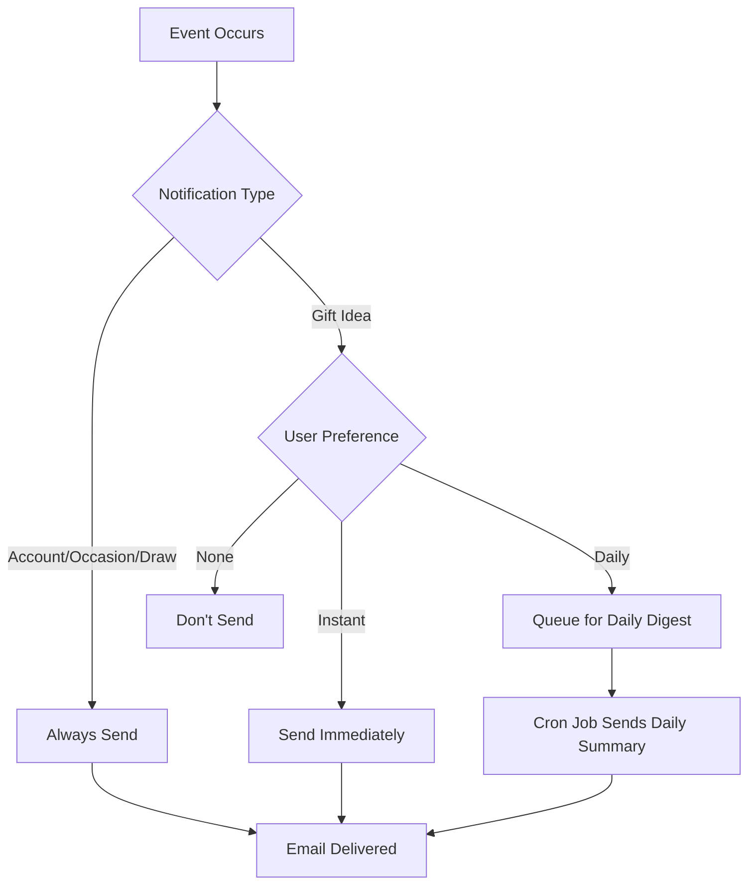
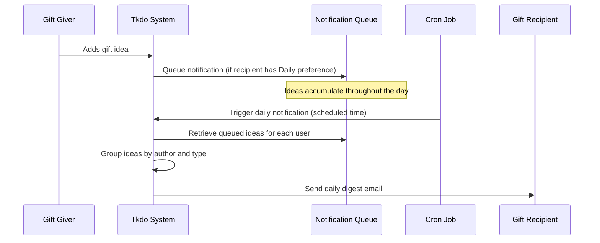

# Email Notifications Reference

This guide covers the email notification system in Tkdo, including all notification types, configuration options, and troubleshooting tips.

## Table of Contents

- [Overview](#overview)
- [Notification Types](#notification-types)
- [Configuring Preferences](#configuring-preferences)
- [Daily Digest Details](#daily-digest-details)
- [Troubleshooting](#troubleshooting)
- [For Administrators](#for-administrators)

## Overview

Tkdo sends email notifications to keep users informed about important events and gift idea updates. The notification system is designed to be flexible, allowing users to choose their preferred level of communication.

**Key features:**
- Token-based authentication for security
- Configurable preferences per user
- Instant notifications for real-time updates
- Daily digest option to reduce email volume
- Automatic handling of gift idea notifications based on occasion timing



## Notification Types

Tkdo sends seven types of email notifications, divided into two categories:

### Account-Related Notifications

These notifications are **always sent** and cannot be disabled. They contain critical account and occasion information.

#### 1. Account Creation

**When sent:** When an administrator creates a new user account

**Purpose:** Welcome the new user and provide login credentials

**Contains:**
- Username (identifiant)
- Initial password
- Link to the application
- Instructions for first login

**What to do:**
- Log in with the provided credentials
- Change your password immediately for security
- Update your profile with your email address

**Example message:**
> **Subject:** Création de votre compte
>
> Bonjour John,
>
> Votre compte Tkdo (tirages cadeaux) vient d'être créé.
>
> Pour accéder à l'application, connectez vous à https://tkdo.example.com
> avec les identifiants suivants :
> - identifiant : john.doe
> - mot de passe : TemporaryPass123

---

#### 2. Password Reset

**When sent:** When an administrator resets your password

**Purpose:** Provide a new temporary password

**Contains:**
- Your username
- New temporary password
- Login instructions

**What to do:**
- Log in with the new password
- Change it immediately to something secure and memorable
- Update your profile if needed

**Security note:** Password reset can only be performed by administrators through the command-line API.

**Example message:**
> **Subject:** Réinitialisation de votre mot de passe
>
> Bonjour John,
>
> Le mot de passe de votre compte Tkdo (tirages cadeaux) a été réinitialisé.
>
> Pour accéder à l'application, connectez vous à https://tkdo.example.com
> avec les identifiants suivants :
> - identifiant : john.doe
> - mot de passe : NewTempPass456

---

#### 3. New Occasion Participation

**When sent:** When an administrator adds you to an occasion

**Purpose:** Inform you about your participation in an upcoming gift exchange

**Contains:**
- Occasion name (e.g., "Noël 2025")
- Occasion date
- Link to view the occasion details

**What to do:**
- Visit the occasion page
- Add gift ideas for yourself
- Check who else is participating
- Wait for the draw to be performed

**Example message:**
> **Subject:** Nouvelle participation à Noël 2025
>
> Bonjour John,
>
> Vous participez à l'occasion 'Noël 2025'.
>
> Pour découvrir les noms des autres participants,
> et commencer à proposer des idées de cadeaux,
> rendez-vous sur https://tkdo.example.com/occasion/123

---

#### 4. Draw Result

**When sent:** When an administrator performs the draw for an occasion you're participating in

**Purpose:** Reveal who you should give a gift to

**Contains:**
- Occasion name
- Link to view the occasion and discover your assignment

**What to do:**
- Click the link to view the occasion page
- Your assignment will be shown on your participant card
- Browse gift ideas for the person you're giving to
- Keep this information confidential (don't reveal your assignment to others)

**Privacy:** You can see who you're giving to, but not who is giving to you. This preserves the surprise!

**Example message:**
> **Subject:** Tirage au sort fait pour Noël 2025
>
> Bonjour John,
>
> Le tirage au sort est fait pour 'Noël 2025' !
>
> Pour découvrir à qui vous aurez le plaisir de faire un cadeau,
> rendez-vous sur https://tkdo.example.com/occasion/123

---

### Gift Idea Notifications

These notifications inform you when gift ideas are added or removed **by other participants**. You receive notifications about ideas suggested for anyone participating in your occasions (**except ideas for yourself** and **except ideas you suggested yourself**). **You can configure how you receive these notifications** in your profile.

#### 5. Gift Idea Creation (Instant)

**When sent:** Immediately when someone else adds a gift idea for another participant in your occasions (if you have instant notifications enabled)

**Purpose:** Real-time notification of new gift suggestions in your occasions

**Contains:**
- Who added the idea
- Who the idea is for
- The gift description
- Which occasion it's for

**Timing:** Only sent for **upcoming occasions** (future date). Past occasion ideas don't trigger notifications.

**Who receives:** All participants in the same occasions **except**:
- The person the idea is for
- The person who added the idea

**Example message:**
> **Subject:** Nouvelle idée de cadeau pour Marie
>
> Bonjour John,
>
> Une nouvelle idée de cadeau a été proposée pour Marie :
>
>   > Livre de recettes italiennes
>
> Pour consulter la liste d'idées de Marie,
> rendez-vous sur https://tkdo.example.com/idee?idUtilisateur=456

---

#### 6. Gift Idea Deletion (Instant)

**When sent:** Immediately when someone deletes a gift idea they suggested for another participant in your occasions (if you have instant notifications enabled)

**Purpose:** Keep you informed when ideas are removed from your occasions

**Contains:**
- Who deleted the idea (the original author)
- Who the idea was for
- The gift description that was removed
- Which occasion it was for

**Timing:** Only sent for **upcoming occasions** (future date). Past occasion ideas don't trigger notifications.

**Who receives:** All participants in the same occasions **except**:
- The person the idea was for
- The person who deleted the idea

**Why this happens:** The author may have:
- Added it by mistake
- Found a better suggestion
- Realized the recipient already has that item
- Decided to give that gift themselves

**Example message:**
> **Subject:** Idée de cadeau supprimée pour Marie
>
> Bonjour John,
>
> L'idée de cadeau pour Marie ci-dessous a été retirée de sa liste :
>
>   > Livre de recettes italiennes
>
> Pour consulter la liste d'idées de Marie,
> rendez-vous sur https://tkdo.example.com/idee?idUtilisateur=456

---

#### 7. Daily Digest

**When sent:** Once per day at a scheduled time (configured by administrator)

**Purpose:** Summarize all gift idea changes from the past 24 hours in a single email

**Contains:**
- List of all ideas added by other participants, grouped by author
- List of all ideas deleted by other participants, grouped by author
- Who each idea is for
- Occasion information for each change

**Timing:** Only includes changes for **upcoming occasions** (future date).

**Who receives:** All participants in the same occasions **except**:
- The person the idea is for
- The person who added/deleted the idea

**Format:** The digest groups changes by the person who made them, making it easy to see everyone's contributions at a glance.

**Example message:**
> **Subject:** Actualités Tkdo
>
> Bonjour John,
>
> Une nouvelle idée de cadeau a été proposée pour Jean :
>
>   > Pull en laine bleu
>
> Pour consulter la liste d'idées de Jean,
> rendez-vous sur https://tkdo.example.com/idee?idUtilisateur=789
>
> De nouvelles idées de cadeaux ont été proposées pour Marie :
>
>   > Livre de recettes italiennes
>   > Coffret de thés
>
> L'idée de cadeau pour Marie ci-dessous a été retirée de sa liste :
>
>   > T-shirt rouge
>
> Pour consulter la liste d'idées de Marie,
> rendez-vous sur https://tkdo.example.com/idee?idUtilisateur=456

---

## Configuring Preferences

You can control how you receive gift idea notifications (types 5, 6, and 7 above). Configure this in your user profile.

### Preference Options

| Preference              | Code | Notifications Received                                    | Best For                                              |
|-------------------------|------|-----------------------------------------------------------|-------------------------------------------------------|
| **Aucune** (None)       | N    | No gift idea notifications                                | Users who prefer to check the app manually            |
| **Instantanée** (Instant) | I    | Immediate email for each idea added or deleted            | Users who want real-time updates                      |
| **Quotidienne** (Daily) | Q    | One daily summary email with all changes                  | Users who want updates without email overload         |

### How to Change Your Preferences

**Via the Web Interface:**

1. Log in to Tkdo
2. Click **Profil** in the top navigation
3. Find **Préférences de notification**
4. Select your preferred option:
   - **N** = Aucune (None)
   - **I** = Instantanée (Instant)
   - **Q** = Quotidienne (Daily)
5. Click **Enregistrer** (Save)
6. A confirmation message appears at the top

**Via API (administrators only):**

```bash
curl -u $TOKEN: -X PUT https://tkdo.example.com/api/utilisateur/$USER_ID \
  -d notifPref=Q
```

Replace:
- `$TOKEN` with the user's authentication token
- `$USER_ID` with the user's ID
- `Q` with the desired preference (N, I, or Q)

### Choosing the Right Preference

**Choose None (N) if:**
- You prefer to check the app on your own schedule
- You don't want any gift idea emails
- You're not actively participating in upcoming occasions

**Choose Instant (I) if:**
- You want to know immediately when ideas are added for others in your occasions
- You actively participate in collaborative gift planning
- You don't mind receiving multiple emails during busy periods
- You want real-time awareness of gift idea activity

**Choose Daily (Q) if:**
- You want to stay informed without email clutter
- You prefer a single summary each day
- You're participating in active occasions but don't need instant updates
- You want a good balance of awareness and convenience

**Recommended:** Daily (Q) provides the best balance for most users.

## Daily Digest Details

### How It Works



### Scheduling

**Timing:** Daily digest emails are sent once per day at a time configured by the administrator.

**Default schedule:** Typically sent in the morning (e.g., 8:00 AM server time) so users can review updates with their morning routine.

**Cron job:** Administrators set up a cron job that runs:
```bash
./console notif -p Q
```

**Finding the schedule:** Contact your administrator to know when daily digests are sent on your instance.

### Content Organization

The daily digest intelligently organizes changes:

**Grouping by author:**
- Changes are grouped by the person who made them
- Authors are listed alphabetically
- Easy to see who's been active

**Separating creations and deletions:**
- Ideas added are listed first
- Ideas deleted are listed separately
- Clear distinction between additions and removals

**Multiple occasions:**
- If you have multiple upcoming occasions, changes for all of them are included
- Each idea shows which occasion it's for

**Empty digests:**
- If no changes occurred in the past 24 hours, no email is sent
- No empty or "nothing to report" emails

### Example Scenarios

**Scenario 1: Single recipient, single idea**
> Une nouvelle idée de cadeau a été proposée pour Marie :
>
>   > Livre de recettes italiennes
>
> Pour consulter la liste d'idées de Marie,
> rendez-vous sur https://tkdo.example.com/idee?idUtilisateur=456

**Scenario 2: Single recipient, multiple ideas**
> De nouvelles idées de cadeaux ont été proposées pour Marie :
>
>   > Livre de recettes italiennes
>   > Pull en laine bleu
>   > Coffret de thés
>
> Pour consulter la liste d'idées de Marie,
> rendez-vous sur https://tkdo.example.com/idee?idUtilisateur=456

**Scenario 3: Multiple recipients with additions and deletions**
> De nouvelles idées de cadeaux ont été proposées pour Jean :
>
>   > Jeu de société Catan
>   > Pull en laine
>
> Pour consulter la liste d'idées de Jean,
> rendez-vous sur https://tkdo.example.com/idee?idUtilisateur=789
>
> Une nouvelle idée de cadeau a été proposée pour Marie :
>
>   > Coffret de thés
>
> Les idées de cadeau pour Marie ci-dessous ont été retirées de sa liste :
>
>   > T-shirt bleu
>   > Écharpe rouge
>
> Pour consulter la liste d'idées de Marie,
> rendez-vous sur https://tkdo.example.com/idee?idUtilisateur=456

## Troubleshooting

### Not Receiving Emails

**Problem:** Expected notifications aren't arriving in your inbox

**Diagnostic steps:**

1. **Check your email address:**
   - Go to **Profil** in the application
   - Verify the email address is correct
   - Look for typos or outdated addresses
   - Update if needed and click **Enregistrer** (Save)

2. **Check spam/junk folder:**
   - Search for emails from Tkdo sender address
   - If found in spam, mark as "Not Spam" or "Not Junk"
   - Add the sender to your contacts or safe senders list
   - Check future emails in inbox

3. **Check notification preferences:**
   - Go to **Profil** → **Préférences de notification**
   - Ensure it's not set to **N** (None)
   - Change to **I** (Instant) or **Q** (Daily) if needed
   - Remember: Account notifications are always sent regardless

4. **For daily digests specifically:**
   - Verify you have **Q** selected
   - Wait until the scheduled send time
   - If no changes occurred, no email is sent (this is normal)
   - Contact administrator to confirm cron job is running

5. **Check email server issues:**
   - Contact your administrator
   - They can check server logs for delivery attempts
   - They can verify SMTP configuration
   - They can test email sending manually

---

### Receiving Too Many Emails

**Problem:** Inbox is flooded with Tkdo notifications

**Solutions:**

1. **Switch to daily digest:**
   - Go to **Profil** → **Préférences de notification**
   - Change from **I** (Instant) to **Q** (Daily)
   - You'll receive one summary email per day instead

2. **Disable gift idea notifications:**
   - Go to **Profil** → **Préférences de notification**
   - Change to **N** (None)
   - You'll still receive critical notifications (account, draw results)
   - Check the app manually for gift idea updates

3. **Create email filters:**
   - Set up rules in your email client
   - Filter Tkdo emails to a dedicated folder
   - Mark as read automatically if desired
   - Review the folder when convenient

---

### Notification Delays

**Problem:** Instant notifications arrive late

**Possible causes:**

1. **Email server delays:**
   - SMTP server processing time
   - Recipient email provider delays
   - Network issues
   - Solution: Wait a few minutes; contact administrator if persistent

2. **Large queue:**
   - During busy periods (many users adding ideas)
   - Server may process emails in batches
   - Solution: Normal behavior; consider switching to daily digest

3. **Email filtering:**
   - Your email provider may delay suspicious emails
   - Greylisting or spam analysis in progress
   - Solution: Add sender to contacts to bypass filters

---

### Wrong Notification Preference

**Problem:** Receiving notifications in unexpected format (instant vs daily)

**Solution:**

1. Verify your current setting:
   - Go to **Profil** → **Préférences de notification**
   - Check which option is selected (N, I, or Q)

2. If it's not what you expected:
   - The setting may have been changed accidentally
   - Change it to your preferred option
   - Click **Enregistrer** (Save)
   - Changes take effect immediately for new notifications

---

### Not Receiving Draw Results

**Problem:** Draw was performed but no notification received

**Diagnostic steps:**

1. **Verify draw was performed:**
   - Log in to the application
   - Go to **Mes occasions**
   - Click on the occasion
   - Check if your card shows "Vous offrez à: [Name]"

2. **Check email address:**
   - Ensure your profile has a valid email
   - Update if necessary

3. **Check spam folder:**
   - Draw result emails might be filtered
   - Search for the occasion name

4. **Contact administrator:**
   - They can resend the notification manually
   - They can verify email delivery logs

**Workaround:** Your draw assignment is always visible on the occasion page in the application, even if the email is lost.

---

### Daily Digest Never Arrives

**Problem:** Selected daily digest but never receiving emails

**Diagnostic steps:**

1. **Verify preference is set:**
   - Go to **Profil** → **Préférences de notification**
   - Confirm **Q** (Quotidienne) is selected
   - Save if needed

2. **Confirm there are changes:**
   - Daily digest is only sent if ideas were added/deleted by others
   - If no changes occur, no email is sent (by design)
   - Test by having someone add an idea for anyone in your occasions

3. **Check timing:**
   - Daily digests are sent at a specific time
   - Wait until after the scheduled send time
   - Ask administrator what time digests are sent

4. **Verify cron job:**
   - Administrator must set up daily cron job
   - Command: `./console notif -p Q`
   - If not configured, daily digests won't work
   - Contact administrator to verify setup

## For Administrators

### Notification System Architecture

**Email sending:**
- Uses configurable SMTP server
- Mailer settings in `api/.env` or environment variables
- From address: `TKDO_MAILER_FROM`

**Instant notifications:**
- Triggered immediately when ideas are created/deleted
- Sent to all occasion participants with preference **I**
- Excludes the person the idea is for
- Excludes the person who created/deleted the idea
- Only for upcoming occasions (future dates)

**Daily digests:**
- Triggered by cron job running `./console notif -p Q`
- Sent to all occasion participants with preference **Q**
- Excludes the person the idea is for
- Excludes the person who created/deleted the idea
- Only includes changes from last 24 hours
- Only for upcoming occasions (future dates)

### Setting Up Daily Notifications

**Cron job configuration:**

```bash
# Send daily digest at 8:00 AM server time
0 8 * * * cd /path/to/tkdo/api && ./console notif -p Q
```

**Testing the command:**

```bash
# Run manually to test
cd api
./console notif -p Q

# Output shows:
# - Number of users processed
# - Number of emails sent
# - Any errors encountered
```

**Troubleshooting cron:**

1. Check cron logs: `grep CRON /var/log/syslog`
2. Verify cron has correct PHP binary path
3. Check file permissions on `./console`
4. Test command manually first
5. Ensure `api/.env` or environment variables are accessible

### Email Configuration

**Required environment variables:**

```bash
# SMTP server settings
TKDO_MAILER_HOST=smtp.example.com
TKDO_MAILER_PORT=587
TKDO_MAILER_USER=noreply@example.com
TKDO_MAILER_PASS=smtp_password
TKDO_MAILER_FROM=noreply@example.com
```

**Testing email delivery:**

Use the manual notification command:
```bash
./console notif -p Q
```

Check server logs for SMTP errors.

### Notification Logs

**Monitoring email delivery:**

- Application logs email sending attempts
- Check `api/logs/` for errors
- SMTP errors are logged
- Failed deliveries are logged

**Common issues:**

- Invalid SMTP credentials
- SMTP server blocking connections
- Recipient email bouncing
- Daily cron job not running

### User Preference Management

**Viewing user preferences:**

```bash
curl -u $ADMIN_TOKEN: https://tkdo.example.com/api/utilisateur/$USER_ID
```

Response includes `notifPref` field (N, I, or Q).

**Changing user preferences:**

```bash
curl -u $ADMIN_TOKEN: -X PUT https://tkdo.example.com/api/utilisateur/$USER_ID \
  -d notifPref=Q
```

**Default preference:** When creating users, set an appropriate default (recommend Q for most users).

---

## Quick Reference

### Notification Types Summary

| Notification Type          | Can Disable? | When Sent                           | Affected by Preference? |
|----------------------------|--------------|-------------------------------------|-------------------------|
| Account Creation           | No           | When account is created             | No                      |
| Password Reset             | No           | When password is reset              | No                      |
| New Occasion Participation | No           | When added to occasion              | No                      |
| Draw Result                | No           | When draw is performed              | No                      |
| Gift Idea Creation         | Yes          | When idea added (upcoming occasions)| Yes (I or Q)            |
| Gift Idea Deletion         | Yes          | When idea deleted (upcoming occasions)| Yes (I or Q)          |
| Daily Digest               | Yes          | Daily at scheduled time             | Yes (Q only)            |

### Preference Codes

| Code | Name                  | Gift Idea Notifications                |
|------|-----------------------|----------------------------------------|
| N    | Aucune (None)         | No notifications                       |
| I    | Instantanée (Instant) | Immediate email for each change        |
| Q    | Quotidienne (Daily)   | One daily summary email                |

### Administrator Commands

```bash
# Send daily digest notifications
./console notif -p Q

# View user preferences (API)
curl -u $TOKEN: https://tkdo.example.com/api/utilisateur/$USER_ID

# Update user preferences (API)
curl -u $TOKEN: -X PUT https://tkdo.example.com/api/utilisateur/$USER_ID -d notifPref=Q
```

---

**Related Documentation:**
- [User Guide](user-guide.md) - Complete guide for regular users
- [Administrator Guide](admin-guide.md) - Complete guide for administrators
- [Environment Variables Reference](environment-variables.md) - Email configuration variables *(coming soon)*
- [Troubleshooting Guide](troubleshooting.md) - General troubleshooting *(coming soon)*
