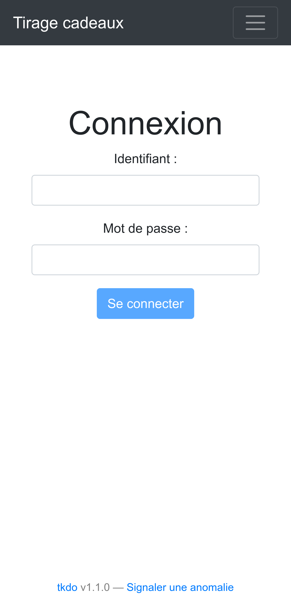
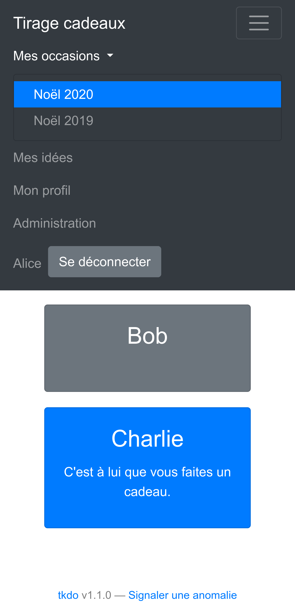
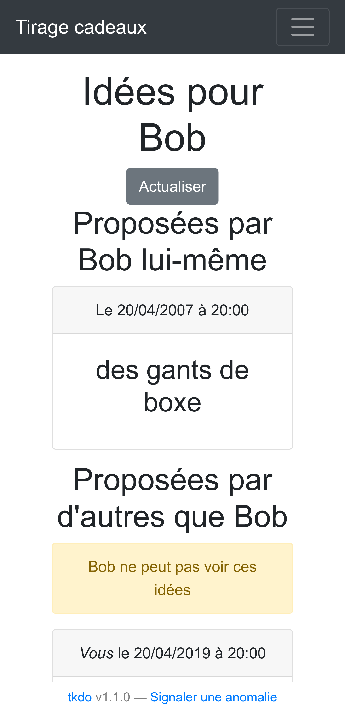
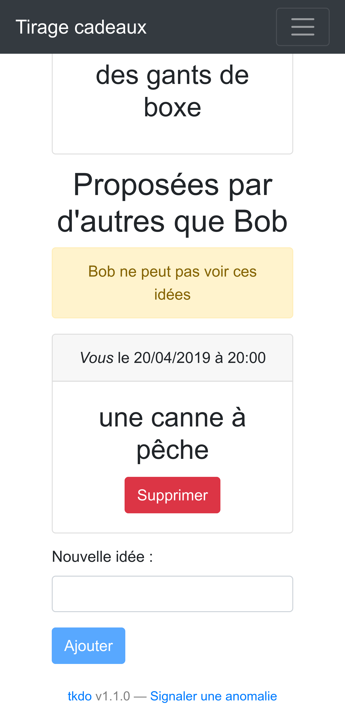

# Tkdo User Guide

This guide covers everything you need to know as a regular user of Tkdo, the gift drawing application. Whether you're joining your first occasion or managing your gift ideas, this guide will help you get started.

## Table of Contents

- [Getting Started](#getting-started)
- [Your Profile](#your-profile)
- [Occasions](#occasions)
- [Gift Ideas](#gift-ideas)
- [Draw Results](#draw-results)
- [Email Notifications](#email-notifications)
- [Tips and Best Practices](#tips-and-best-practices)
- [Troubleshooting](#troubleshooting)

## Getting Started

### First Login

When an administrator creates your account, you'll receive an email with:
- Your username (identifiant)
- Instructions to log in
- A link to the application

**To log in:**

1. Go to the Tkdo application URL
2. Enter your username (identifiant)
3. Enter your password (provided by the administrator or in the email)
4. Click "Connexion" (Login)

**First login checklist:**
- [ ] Log in with provided credentials
- [ ] Update your profile (see [Your Profile](#your-profile))
- [ ] Change your password for security
- [ ] Set your notification preferences
- [ ] Explore your occasions

### Understanding the Interface

After logging in, you'll see:

**Header Navigation:**
- **Mes occasions** - View all occasions you participate in
- **Mes idées** - Quick access to your own gift ideas list
- **Profil** - Update your profile and settings
- **Déconnexion** - Log out

**Main Content:**
- The application automatically displays the next upcoming occasion
- If no upcoming occasions, shows the most recent past occasion
- If no occasions yet, you'll see your gift ideas list

## Your Profile

Your profile contains your personal information and preferences. Access it by clicking **Profil** in the top navigation.

### Profile Information

**Fields you can update:**

- **Identifiant** (Username) - *Read-only, cannot be changed*
- **Nom** (Name) - Your display name (minimum 3 characters)
- **Email** - Your email address for notifications
- **Genre** (Gender) - Masculin (M) or Féminin (F)
- **Préférences de notification** - How you want to receive gift idea notifications

### Changing Your Password

For security, change your password after the first login:

1. Go to **Profil**
2. Scroll to the password section
3. Enter new password (minimum 8 characters)
4. Confirm new password
5. Click **Enregistrer** (Save)

**Password requirements:**
- Minimum 8 characters
- Must match in both fields (password and confirmation)

**Important:** The password fields are independent. You can update your profile information without changing your password, or change only your password without updating other fields.

### Notification Preferences

Choose how you want to be notified about gift ideas:

| Preference                 | Code | Description                                      | Best For                                     |
|----------------------------|------|--------------------------------------------------|----------------------------------------------|
| **Aucune** (None)          | N    | No notifications                                 | If you prefer to check manually              |
| **Instantanée** (Instant)  | I    | Immediate email when ideas are added/deleted     | If you want to stay updated in real-time     |
| **Quotidienne** (Daily)    | Q    | Daily digest email summarizing all changes       | If you want updates without inbox clutter    |

**Daily digest timing:** Daily emails are sent once per day at a scheduled time (configured by your administrator).

### Saving Your Changes

After making changes:
1. Click **Enregistrer** (Save)
2. A success message appears at the top if saved successfully
3. The page automatically scrolls to show the message
4. If there's an error, you'll see an error message with details

**Note:** At least one field must be changed to save (you cannot save without modifications).

## Occasions

Occasions are events where gifts are exchanged (Christmas, birthdays, etc.). You can participate in multiple occasions.

### Viewing Your Occasions

**To see all your occasions:**
1. Click **Mes occasions** in the top navigation
2. You'll see a list of all occasions you participate in, both upcoming and past

**Information shown for each occasion:**
- **Titre** (Title) - Name of the occasion (e.g., "Noël 2025")
- **Date** - When the occasion occurs
- Upcoming occasions are highlighted

**Default view:** The application automatically shows the next upcoming occasion when you log in.

### Occasion Details

When viewing an occasion, you'll see:

**Participants Section:**
- Cards showing all participants
- Your own card is highlighted
- If the draw has been performed, your card shows who you should give a gift to

**Special sorting:** Participants are sorted to show:
1. The person you should give a gift to (after draw)
2. Yourself
3. Other participants (alphabetically)

### Who You're Giving To

After an administrator performs the draw:
- Your participant card shows who you should give a gift to
- Example: "Vous offrez à: Marie" (You're giving to: Marie)
- This information is revealed via email and on the occasion page

**Privacy:** You cannot see who is giving a gift to you - this keeps the surprise!

### Adding Ideas for Participants

Click on any participant's card (except your own) to:
- View existing gift ideas for them
- Add new gift ideas they might like

See [Gift Ideas](#gift-ideas) for detailed instructions.

## Gift Ideas

Gift ideas help everyone know what to give. You can suggest ideas for others and manage your own wish list.

### Your Gift Ideas List

**To view your own ideas:**
1. Click **Mes idées** in the top navigation
2. You'll see all ideas others have suggested for you (across all occasions)

**Information shown:**
- Occasion the idea is for
- Gift description
- Who suggested it (author)
- When it was suggested (date)

**Important:** You can only see ideas others added for you. Ideas you added for others don't appear in "Mes idées".

### Adding Gift Ideas for Others

**To add an idea for someone:**

1. Go to an occasion (via **Mes occasions**)
2. Click on a participant's card (not your own)
3. You'll see their gift ideas list
4. Enter a gift description in the text field
5. Click **Ajouter** (Add)

**Tips for good gift ideas:**
- Be specific: "Livre de recettes italiennes" better than "livre"
- Include details: "T-shirt rouge taille M" better than "vêtement"
- Add links if helpful: "Jeu de société Catan sur Amazon"
- Consider the person's interests and hobbies

### Deleting Gift Ideas

**You can delete ideas that you suggested:**

1. Go to the participant's gift ideas list
2. Find your idea (it shows you as the author)
3. Click the delete/trash icon
4. The idea is removed from the list

**Important limitations:**
- You can only delete ideas you added yourself
- You cannot delete ideas others added for you
- You cannot delete ideas others added for other participants

**Soft delete:** When you delete an idea, it's marked as deleted but preserved in the database for historical tracking.

### Viewing Ideas for Others

**To see what gift ideas exist for someone:**

1. Go to an occasion
2. Click on their participant card
3. View all ideas suggested for them

**Privacy rules:**
- You can see ideas for any participant except yourself
- You can see who suggested each idea
- You cannot see ideas others suggested for you

### Gift Ideas Across Occasions

- Each occasion has its own set of gift ideas
- Ideas for one occasion don't automatically appear in other occasions
- Check "Mes idées" to see all ideas for you across all occasions

## Draw Results

The draw determines who gives gifts to whom. An administrator performs the draw for each occasion.

### How Draws Work

**The draw algorithm:**
1. Randomly assigns each participant to give a gift to another participant
2. Ensures everyone gives to exactly one person
3. Ensures everyone receives from exactly one person
4. Respects exclusion rules (e.g., spouses don't draw each other)
5. Prevents drawing yourself

**Exclusions:** Administrators can define who cannot draw whom (couples, siblings, etc.). The draw algorithm respects these rules.

### Receiving Your Draw Result

**When the draw is performed:**
1. You receive an email notification
2. The email tells you who you should give a gift to
3. Your occasion page updates to show this information

**Example notification:**
> "Le tirage au sort pour Noël 2025 a été effectué. Vous devez faire un cadeau à Marie."

### Viewing Your Assignment

**To see who you're giving to:**
1. Go to the occasion (via **Mes occasions**)
2. Look at your participant card
3. It shows: "Vous offrez à: [Name]"

**Remember:**
- You can see who you're giving to
- You cannot see who is giving to you
- Others cannot see your assignment

### What If There's No Draw Yet?

If no draw has been performed:
- Participant cards don't show assignments
- You can still add and view gift ideas
- Wait for an administrator to perform the draw

## Email Notifications

Tkdo sends emails to keep you updated. Configure your preferences in your profile.

### Types of Notifications

#### Account-Related Notifications
*Always sent, cannot be disabled*

**Account Creation:**
- Sent when an administrator creates your account
- Contains your username and login instructions
- Sent to the email address in your profile

**Password Reset:**
- Sent when an administrator resets your password
- Contains your new temporary password
- Remember to change it after logging in

**New Occasion Participation:**
- Sent when an administrator adds you to an occasion
- Contains the occasion name and date
- Provides a link to view the occasion

**Draw Result:**
- Sent when the draw is performed for an occasion you're in
- Reveals who you should give a gift to
- Important: Save this email or note the information!

#### Gift Idea Notifications
*Configurable in your profile*

These notifications tell you when:
- Someone adds a gift idea for you
- Someone deletes a gift idea they suggested for you

**Notification options:**

**None (Aucune):**
- No notifications about gift ideas
- You'll need to check the app manually

**Instant (Instantanée):**
- Receive an email immediately when an idea is added/deleted
- Good for staying updated in real-time
- May result in many emails during busy periods

**Daily Digest (Quotidienne):**
- Receive one email per day summarizing all changes
- Includes all ideas added and deleted that day
- Sent at a scheduled time (configured by administrator)
- Best balance of staying informed without email overload

### Managing Email Preferences

**To change your notification settings:**
1. Go to **Profil**
2. Find **Préférences de notification**
3. Select your preferred option:
   - **N** = None
   - **I** = Instant
   - **Q** = Daily
4. Click **Enregistrer** (Save)

### Email Delivery Issues

**If you're not receiving emails:**

1. **Check your email address:**
   - Go to **Profil**
   - Verify your email is correct
   - Update if needed and save

2. **Check spam/junk folder:**
   - Tkdo emails might be filtered
   - Add the sender to your contacts
   - Mark as "not spam"

3. **Check notification preferences:**
   - Ensure you haven't set to "None" (N)
   - Change to "Instant" (I) or "Daily" (Q)

4. **Contact administrator:**
   - They can check server email configuration
   - They can verify email delivery status

## Tips and Best Practices

### For Better Gift Exchanges

**Add ideas throughout the year:**
- Don't wait until right before the occasion
- Add ideas as you think of them
- More ideas = more options for gift givers

**Be specific with gift ideas:**
- Include sizes, colors, models
- Add links to products when possible
- Mention where items can be found

**Keep your profile updated:**
- Verify your email address is current
- Update your name if it changes
- Check notification preferences periodically

### For Smooth Collaboration

**Check the app regularly:**
- Even with notifications, check the app periodically
- See if new ideas have been added for participants
- Stay updated on upcoming occasions

**Add multiple gift ideas:**
- Give gift givers options
- Include ideas at different price ranges
- Update if you've already received something

**Respect privacy:**
- Don't ask others who they drew
- Don't reveal who you're giving to (unless agreed)
- Keep draw results confidential

### For Security

**Password security:**
- Use a strong, unique password
- Change the default password immediately
- Don't share your password with others

**Account access:**
- Log out when using shared computers
- Don't save your password on public devices
- Close the browser when done

## Troubleshooting

### Common Issues and Solutions

#### Cannot Log In

**Problem:** Login fails with "connexion impossible" or similar error

**Solutions:**
1. Verify username and password are correct (check for typos)
2. Check caps lock isn't on
3. If forgotten password, contact administrator for reset
4. Clear browser cache and cookies, then try again
5. Try a different browser

#### Session Expired

**Problem:** "Session expirée" message or automatic redirect to login

**Why it happens:** Your session expires after a period of inactivity for security

**Solution:**
1. Simply log in again
2. Your data is safe and preserved

#### Cannot Delete Gift Idea

**Problem:** No delete button or deletion fails

**Possible reasons:**
1. You're trying to delete someone else's idea (only delete your own)
2. The idea was already deleted

**Solution:**
- Only delete ideas you personally suggested
- Navigate to that participant's list to see delete buttons on your ideas

#### Profile Changes Won't Save

**Problem:** "Enregistrement impossible" or changes not persisting

**Solutions:**
1. Check all field validations:
   - Name: minimum 3 characters
   - Email: valid email format (user@domain.com)
   - Password: minimum 8 characters
   - Password confirmation: must match password
2. Make sure you've changed at least one field
3. Check for error messages indicating which field is invalid
4. Try updating fewer fields at once
5. Refresh the page and try again

#### Notifications Not Received

**Problem:** Expected emails aren't arriving

**Solutions:**
1. Verify email address in profile is correct
2. Check spam/junk folder
3. Ensure notification preference isn't set to "None" (N)
4. For daily digest, wait until the scheduled send time
5. Add Tkdo sender email to your contacts
6. Contact administrator if problem persists

#### Draw Assignment Not Showing

**Problem:** Cannot see who you should give a gift to

**Possible reasons:**
1. Draw hasn't been performed yet (wait for administrator)
2. Page needs refresh (F5)
3. You're looking at the wrong occasion

**Solution:**
- Check your email for draw result notification
- Go to the specific occasion via **Mes occasions**
- Look at your participant card for assignment
- Contact administrator if draw should have been done

#### Page Displays Incorrectly

**Problem:** Layout issues, missing buttons, strange formatting

**Solutions:**
1. Clear browser cache and cookies
2. Hard refresh (Ctrl+F5 or Cmd+Shift+R)
3. Update your browser to the latest version
4. Try a different modern browser (Chrome, Firefox, Safari, Edge)
5. Check if JavaScript is enabled in browser settings
6. Disable browser extensions that might interfere

### Getting Help

If you encounter issues not covered here:

1. **Check this guide** thoroughly
2. **Contact your administrator** - they have additional tools and access
3. **Report bugs** - help improve Tkdo by reporting issues to the development team
4. **Document the problem** - note what you were doing, error messages, and steps to reproduce

### Browser Compatibility

Tkdo works best with modern browsers:
- ✅ Chrome/Chromium (latest)
- ✅ Firefox (latest)
- ✅ Safari (latest)
- ✅ Edge (latest)
- ⚠️ Older browsers may have compatibility issues

**Recommendation:** Keep your browser updated for the best experience and security.

---

## Quick Reference

### Navigation Shortcuts

| Menu Item          | Purpose                                        |
|--------------------|------------------------------------------------|
| **Mes occasions**  | View all occasions you participate in          |
| **Mes idées**      | View gift ideas others suggested for you       |
| **Profil**         | Update your information and settings           |
| **Déconnexion**    | Log out of the application                     |

### Notification Codes

| Code   | Setting                  | Behavior                              |
|--------|--------------------------|---------------------------------------|
| **N**  | Aucune (None)            | No gift idea notifications            |
| **I**  | Instantanée (Instant)    | Immediate email for each change       |
| **Q**  | Quotidienne (Daily)      | One daily summary email               |

### What You Can and Cannot See

| Item                 | Can See                                    | Cannot See                              |
|----------------------|--------------------------------------------|-----------------------------------------|
| **Your profile**     | ✅ All your information                    | ❌ Others' private info                 |
| **Your occasions**   | ✅ Occasions you're in                     | ❌ Other people's occasions             |
| **Draw results**     | ✅ Who you give to                         | ❌ Who gives to you                     |
| **Gift ideas**       | ✅ Ideas for others                        | ❌ Ideas others added for you           |
| **Participants**     | ✅ All participants in your occasions      | ❌ Participants in other occasions      |

---

**Need more help?** Contact your administrator or refer to the [Troubleshooting Guide](troubleshooting.md) _(coming soon)_.

**Happy gift exchanging!**
